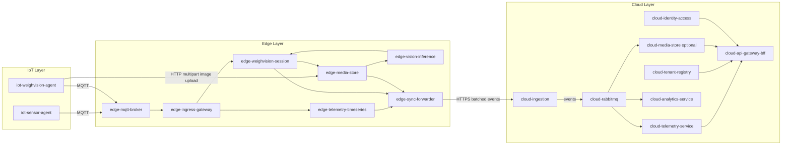

Purpose: Describe the high-level architecture and service responsibilities for the FarmIQ platform.  
Scope: 3-layer logical architecture, core services, responsibilities, and key non-functional requirements.  
Owner: FarmIQ Architecture Team  
Last updated: 2025-12-17  

---

## High-level architecture

FarmIQ is structured as a **three-layer, event-driven platform**:
- **IoT-layer**: Device-side agents responsible for collecting sensor and WeighVision data and pushing it to the edge.
- **Edge-layer**: Local Kubernetes cluster that owns buffering, media, sessions, inference, and reliable sync to the cloud.
- **Cloud-layer**: Multi-tenant SaaS platform with APIs, RabbitMQ-based messaging, analytics, and dashboards.

All APIs follow a common standard:
- Base path **`/api`**.
- Health endpoint **`GET /api/health`**.
- API documentation at **`/api-docs`** (Swagger/OpenAPI).
- Standard error response:  
  `{"error": {"code": "...", "message": "...", "traceId": "..."}}`.
- Request correlation headers: **`x-request-id`** and **`x-trace-id`** propagated across services.

All Node.js services should be built from `boilerplates/Backend-node`.  
All Python services should be built from `boilerplates/Backend-python`.  
The dashboard is built from `boilerplates/Frontend`.

---

## Mermaid architecture diagram

---

## Mermaid conventions

- Always start diagrams with `flowchart LR` or `flowchart TB`.
- Use Mermaid-safe node syntax and quoted labels:
  - `A["some label"]`
  - Use ` ` for line breaks inside labels.
- Avoid parentheses and special characters in unquoted node IDs.
- Wrap subgraph titles in quotes (e.g., `subgraph "Edge Layer"`).

---

## Service responsibilities (summary)

### IoT-layer agents
- **`iot-sensor-agent`**
  - Polls or subscribes to sensor data (weight, temperature, humidity, etc.).
  - Publishes normalized telemetry payloads every minute via MQTT to `edge-ingress-gateway`.
  - Handles basic retry/backoff but offloads persistence to edge.

- **`iot-weighvision-agent`**
  - Manages WeighVision sessions on device.
  - Phase 1: capture image + scale weight as part of a session.
  - Phase 2: scheduled image capture and upload to edge.
  - Publishes all session events via MQTT; uploads images via HTTP multipart to `edge-media-store`.

### Edge-layer services
- **`edge-mqtt-broker`**
  - MQTT endpoint (EMQX/Mosquitto) for IoT devices.
  - Forwards data to `edge-ingress-gateway` via bridge/WebSocket or local subscriptions.

- **`edge-ingress-gateway`** (Node, Backend-node boilerplate)
  - Exposes `/api` for IoT agents (sensor + WeighVision).
  - Normalizes and validates payloads; enforces API standards.
  - Writes telemetry to `edge-telemetry-timeseries` and sessions/media to `edge-weighvision-session` / `edge-media-store` via internal HTTP/gRPC.
  - Adds `x-request-id` and `x-trace-id` if missing.

- **`edge-telemetry-timeseries`** (Node)
  - Owns local telemetry DB tables (`telemetry_raw`, `telemetry_agg`).
  - Provides local APIs for querying recent telemetry (for dashboards on edge or diagnostics).
  - Appends telemetry domain events to `sync_outbox`.

- **`edge-weighvision-session`** (Node)
  - Session owner: maintains `weight_sessions` lifecycle.
  - Associates scale readings, images (from `edge-media-store`), and inference results.
  - Emits `weighvision.session.created` and `weighvision.session.finalized` via outbox.

- **`edge-media-store`** (Node)
  - Media owner at edge; writes image files to PVC path `/data/media/...`.
  - Owns `media_objects` table linking filesystem paths to metadata.
  - Emits `media.stored` events via outbox.

- **`edge-vision-inference`** (Python, Backend-python boilerplate)
  - Runs ML models on stored images.
  - Reads inputs from `edge-media-store`/`edge-weighvision-session`, writes `inference_results`.
  - Emits `inference.completed` events via outbox.
  - If edge RabbitMQ is enabled, it may consume inference jobs from an internal queue.

- **`edge-sync-forwarder`** (Node)
  - Sync owner; single path to cloud.
  - Reads `sync_outbox` and `sync_state`, batches events by tenant, and posts to `cloud-ingestion`.
  - Guarantees at-least-once delivery and idempotent behavior with `event_id` + `tenant_id`.

### Cloud-layer services
- **`cloud-rabbitmq`**
  - Central message broker for cloud events.
  - Hosts exchanges and queues for telemetry, analytics, and media.

- **`cloud-api-gateway-bff`** (Node)
  - Single public HTTP entrypoint (`/api`) for dashboards and external consumers.
  - Routes/aggregates data from `cloud-tenant-registry`, `cloud-telemetry-service`, `cloud-media-store`, and `cloud-analytics-service`.
  - Implements BFF patterns for dashboard UI.

- **`cloud-identity-access`** (Node)
  - Integrates with corporate IdP (OIDC/JWT).
  - Issues JWTs with tenant and role claims for all cloud APIs.

- **`cloud-tenant-registry`** (Node)
  - Master data owner: tenant, farm, barn, batch/species, device.
  - Enforces multi-tenant boundaries and provides lookups by IDs.

- **`cloud-ingestion`** (Node)
  - Cloud ingress owner: only entrypoint for edge sync traffic.
  - Validates payloads, deduplicates by `event_id + tenant_id`, and publishes to RabbitMQ.

- **`cloud-telemetry-service`** (Node)
  - Consumes telemetry events from RabbitMQ.
  - Stores queryable telemetry and exposes telemetry APIs for the BFF.

- **`cloud-analytics-service`** (Python)
  - Consumes telemetry and inference events.
  - Runs anomaly detection, forecasts, and KPI calculations.

- **`cloud-media-store`** (optional)
  - PVC-based cloud image storage (no object storage).
  - Implements retention policies and links to telemetry/session entities.

---

## Non-functional requirements

- **Scalability**
  - All cloud and edge services are stateless (except DBs and PVC-backed storage) and horizontally scalable under Kubernetes.
  - HPA should be configured per service as described in `shared/03-deployment-kubernetes.md`.

- **Offline and intermittent connectivity**
  - Edge services must operate when cloud is unreachable.
  - `edge-telemetry-timeseries`, `edge-weighvision-session`, and `edge-media-store` provide sufficient local buffering until sync resumes.
  - `edge-sync-forwarder` maintains `sync_state` for retrying batches.

- **Observability**
  - Node services: Winston JSON logs → stdout; `dd-trace` for distributed tracing.
  - Python services: JSON structured logs → stdout; `ddtrace` for tracing.
  - Datadog Agent runs as a DaemonSet, collecting logs, metrics, and traces.

- **Security**
  - All communication between edge and cloud is encrypted (HTTPS/TLS).
  - JWT/OIDC integration for cloud APIs; edge cluster access restricted to secure network/VPN.
  - No secrets in code; use Kubernetes Secrets and CI/CD secret stores.

---

## Implementation Notes

- For all Node services, clone `boilerplates/Backend-node` and adapt routing, controllers, and Prisma schema for the specific service domain.
- For Python services, clone `boilerplates/Backend-python` and add FastAPI routers and service classes as needed.
- When adding new services, respect **single domain ownership** and align with the naming rules and API standards in `shared/01-api-standards.md`.
- Cloud RabbitMQ is mandatory; edge RabbitMQ is optional for internal async processing (cloud sync remains outbox-driven).

