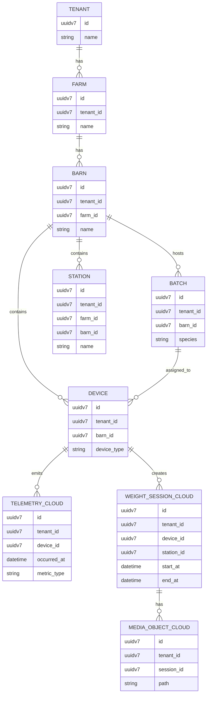

Purpose: Define the FarmIQ multi-tenant domain model and core persistence strategy.  
Scope: Tenant hierarchy, key tables, identifiers, indexing, and retention policies for telemetry and media.  
Owner: FarmIQ Architecture Team  
Last updated: 2025-12-17  

---

## Tenant model overview

FarmIQ is a **multi-tenant** platform with the following canonical hierarchy:

- **Tenant**: A customer organization (e.g., a company).
- **Farm**: A farm site under a tenant.
- **Barn**: A physical barn/building within a farm.
- **Station**: A station within a barn (e.g., WeighVision station).
- **Batch / Species**: A grouping of animals (e.g., production batch) and their species.
- **Device**: A physical device deployed in a barn (e.g., sensor gateway, WeighVision device).

Every resource and event must be scoped by at least `tenant_id`, and typically by `farm_id`, `barn_id`, and `device_id` (and `station_id` for WeighVision flows).

---

## Key entities and IDs

### Identifiers

- All high-write tables MUST use **UUID v7** for primary keys in line with in-house standards.
- Recommended ID fields:
  - `tenant_id`, `farm_id`, `barn_id`, `station_id`, `batch_id`, `device_id`, `session_id`, `event_id`.
- Composite uniqueness where relevant:
  - `(tenant_id, external_reference)` for mapping to external systems.
  - `(tenant_id, device_id, occurred_at)` for telemetry deduplication and indexing.

### Candidate core tables (cloud)

- `tenant`
  - `id (uuidv7, pk)`
  - `name`
  - `status`

- `farm`
  - `id (uuidv7, pk)`
  - `tenant_id (fk tenant.id)`
  - `name`
  - `location`

- `barn`
  - `id (uuidv7, pk)`
  - `tenant_id (fk tenant.id)`
  - `farm_id (fk farm.id)`
  - `name`
  - `type`

- `station`
  - `id (uuidv7, pk)`
  - `tenant_id (fk tenant.id)`
  - `farm_id (fk farm.id)`
  - `barn_id (fk barn.id)`
  - `name`
  - `station_type`

- `batch`
  - `id (uuidv7, pk)`
  - `tenant_id`
  - `farm_id`
  - `barn_id`
  - `species`
  - `start_date`, `end_date`

- `device`
  - `id (uuidv7, pk)`
  - `tenant_id`
  - `farm_id`
  - `barn_id`
  - `device_type` (e.g., sensor-gateway, weighvision)
  - `serial_number`
  - `status`

- `telemetry_cloud`
  - `id (uuidv7, pk)`
  - `tenant_id`, `farm_id`, `barn_id`, `device_id`, `batch_id (nullable)`
  - `occurred_at`
  - `metric_type` (e.g., temperature, humidity, weight)
  - `metric_value`
  - `unit`

- `weight_session_cloud`
  - `id (uuidv7, pk)` (session_id)
  - `tenant_id`, `farm_id`, `barn_id`, `device_id`, `station_id`, `batch_id (nullable)`
  - `status` (created, finalized, cancelled)
  - `start_at`, `end_at`

- `media_object_cloud` (if `cloud-media-store` enabled)
  - `id (uuidv7, pk)`
  - `tenant_id`, `farm_id`, `barn_id`, `device_id`, `session_id`
  - `path` (PVC filesystem path)
  - `mime_type`, `size_bytes`
  - `captured_at`

---

## Indexing and partitioning

- **Indexing**
  - Time-series tables (telemetry, events):
    - Index: `(tenant_id, occurred_at DESC)`.
    - Optional: `(tenant_id, device_id, occurred_at DESC)` for device-scoped queries.
  - Master data:
    - Unique: `(tenant_id, name)` on `farm`, `barn`, `batch` where appropriate.
    - Lookup: `(tenant_id, external_reference)` if integrating external IDs.

- **Partitioning**
  - Telemetry and events should be **time-partitioned** (e.g., monthly partitions on `occurred_at`) to ease archiving.
  - Optionally, partition by `tenant_id` plus time for very large datasets.
  - Use native DB partitioning features (e.g., PostgreSQL `PARTITION BY RANGE (occurred_at)`).

---

## Edge DB schema summary (high-level)

Detailed table-level discussions for edge are in `edge-layer/02-edge-storage-buffering.md`, but the relational intent is:

- `telemetry_raw`
- `telemetry_agg`
- `weight_sessions`
- `media_objects`
- `inference_results`
- `sync_outbox`
- `sync_state`

All tables MUST include `tenant_id` and relevant hierarchy fields (farm/barn/station/device) so that events can be reconciled with cloud master data.

---

## Retention and cleanup policies

### Telemetry data

- **Edge-layer**
  - Retain raw telemetry in `telemetry_raw` for **30–90 days** (configurable) depending on storage sizing.
  - Maintain `telemetry_agg` (e.g., hourly/daily aggregates) for a longer period (6–12 months) to serve local analytics.
  - Schedule nightly cleanup jobs to:
    - Archive or delete partitions older than the configured retention.
    - Ensure synced data is not required locally before removal (consult `sync_state`).

- **Cloud-layer**
  - Raw telemetry retention as per business/compliance (e.g., **2–7 years**).
  - Telemetry may be archived to Betagro datalake in line with technical infrastructure standards.
  - Clean up or archive according to data governance policies.

### Images/media

- **Edge media (`edge-media-store`)**
  - Stored on Kubernetes PVC filesystem (e.g., `/data/media/{tenant}/{farm}/{barn}/{session}/{timestamp}.jpg`).
  - Retention:
    - Short-term by default, e.g., **30–90 days**, configurable by tenant.
    - Cleanup cron job deletes media older than retention threshold if confirmed synced/finalized.

- **Cloud media (`cloud-media-store`, optional)**
  - Also stored on Kubernetes PVC filesystem (no object storage).
  - Retention must be explicitly configured; long-term retention has cost/availability trade-offs:
    - Option A: Full retention for X years.
    - Option B: Keep only derived features/thumbnails and archive full-resolution images offline.
  - Risk: PVC-based media is bound to cluster lifecycle; design backup/restore and datalake archival for critical media.

---

## Mermaid ER diagram (key entities only)

---

## Implementation Notes

- `cloud-tenant-registry` owns all master data tables in this document; other services must not bypass it when mutating master data.
- All events published to RabbitMQ and the edge outbox MUST include the canonical IDs:
  - `tenant_id`, `farm_id`, `barn_id`, `device_id`, and optional `batch_id` and `session_id`.
- Partitioning and retention decisions must be aligned with storage capacity plans and the infrastructure checklist in the GT&D standards.

