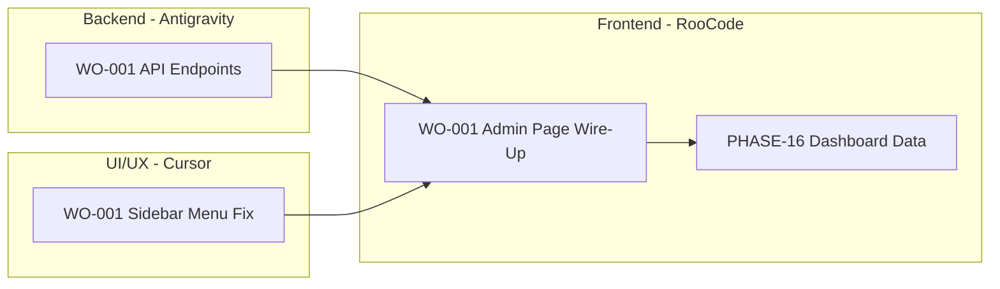

# FarmIQ Work Order Summary

**Created**: 2025-01-28  
**Status**: Active  
**Applications**: admin-web, dashboard-web  

---

## Executive Summary

หลังจากตรวจสอบ `admin-web` และ `dashboard-web` พบปัญหาหลัก:

1. **Admin-Web Sidebar ไม่แสดงเมนูครบ** - มี routes 28+ รายการ แต่ sidebar แสดงเพียง 7 รายการ
2. **Admin pages ไม่แสดงข้อมูลจาก BE** - ไม่มี `adminQueries.ts` (ถูกลบ) และ API hooks
3. **BFF อาจยังไม่มี endpoints สำหรับ Admin** - ต้องตรวจสอบและเพิ่ม
4. **Dashboard-Web บางหน้ายังแสดงข้อมูล mock** - ต้อง wire up กับ real API

---

## Work Order Distribution



---

## Agent Assignments

### 🔵 Antigravity (Backend)

| Work Order | Description | Priority | Effort |
|------------|-------------|----------|--------|
| [WO-001](./Antigravity/WO-001-BACKEND-FRONTEND-INTEGRATION-FIX.md) | สร้าง/ตรวจสอบ Admin API endpoints ใน BFF | P0 | 16h |
| [PHASE-16-BE-INTEGRATION-GAPS.md](./Antigravity/PHASE-16-BE-INTEGRATION-GAPS.md) | เชื่อมต่อ Backend services อื่นๆ | P1 | 34h |

**Key Tasks**:
- `/api/v1/admin/overview` endpoint
- `/api/v1/admin/tenants` endpoint
- `/api/v1/admin/users` endpoint
- Verify Identity routes (RBAC, SCIM, SSO)
- Docker compose verification

---

### 🟠 Cursor (UI/UX)

| Work Order | Description | Priority | Effort |
|------------|-------------|----------|--------|
| [WO-001](./Cursor/WO-001-SIDEBAR-MENU-FIX.md) | แก้ไข Sidebar menu items ให้ครบถ้วน | P0 | 8h |
| [PHASE-16-UI-REDESIGN-PREMIUM.md](./Cursor/PHASE-16-UI-REDESIGN-PREMIUM.md) | ✅ Completed | Done | Done |

**Key Tasks**:
- Update AdminSidebar MENU_ITEMS (เพิ่ม 20+ items)
- Verify Dashboard Sidebar routes
- Test all navigation paths

---

### 🟢 RooCode (Frontend)

| Work Order | Description | Priority | Effort |
|------------|-------------|----------|--------|
| [WO-001](./RooCode/WO-001-ADMIN-PAGE-WIRE-UP-FIX.md) | สร้าง Admin API queries และ wire up pages | P0 | 20h |
| [PHASE-16-FE-DATA-INTEGRATION.md](./RooCode/PHASE-16-FE-DATA-INTEGRATION.md) | เชื่อมต่อ Dashboard pages | P1 | 39h |
| [ADMIN-WEB-PAGE-FIX.md](./RooCode/ADMIN-WEB-PAGE-FIX.md) | (Superseded by WO-001) | - | - |

**Key Tasks**:
- Create `adminQueries.ts` with React Query hooks
- Create `types.ts` for Admin API types
- Verify all 28 admin pages work
- Connect to real API data

---

## Execution Order

```
Phase 1 (Parallel):
  ├── Antigravity: WO-001 (API endpoints)
  └── Cursor: WO-001 (Sidebar menus)

Phase 2 (After Phase 1):
  └── RooCode: WO-001 (Admin page wire-up)

Phase 3 (After Phase 2):
  └── RooCode: PHASE-16-FE-DATA-INTEGRATION (Dashboard data)

Phase 4 (Ongoing):
  └── Antigravity: PHASE-16-BE-INTEGRATION-GAPS (Advanced services)
```

---

## Required Skills Reference

| Category | Skill Path | Used By |
|----------|-----------|---------|
| Frontend React Query | `02-frontend/react-query/SKILL.md` | RooCode |
| TypeScript Types | `02-frontend/typescript-types/SKILL.md` | RooCode |
| Navigation Patterns | `02-frontend/navigation-patterns/SKILL.md` | Cursor |
| Express Proxy | `03-backend-api/express-proxy/SKILL.md` | Antigravity |
| CRUD Patterns | `03-backend-api/crud-patterns/SKILL.md` | Antigravity |
| Docker Compose | `06-devops/docker-compose/SKILL.md` | Antigravity |
| Admin UI Patterns | `17-domain-specific/admin-ui-patterns/SKILL.md` | RooCode |

---

## Success Criteria

When all work orders are complete:

- [ ] Admin-Web sidebar shows all 28+ menu items
- [ ] All admin pages load without errors
- [ ] Admin Overview shows real tenant/farm/device counts
- [ ] Tenants list shows seed data
- [ ] Users list shows seed data
- [ ] Devices list shows online/offline status
- [ ] Dashboard pages show real telemetry/feeding/AI data
- [ ] No console errors on any page
- [ ] Build completes successfully for both apps

---

## Quick Commands

```bash
# Run Admin-Web
cd D:\FarmIQ\FarmIQ_V02\apps\admin-web
npm run dev

# Run Dashboard-Web  
cd D:\FarmIQ\FarmIQ_V02\apps\dashboard-web
npm run dev

# Run Backend (Docker)
cd D:\FarmIQ\FarmIQ_V02\cloud-layer
docker compose up -d

# Check services
docker compose ps
docker compose logs -f cloud-api-gateway-bff
```

---

## Escalation

หากพบปัญหาที่ไม่สามารถแก้ไขได้:

1. **API 404**: ประสานงานกับ Antigravity
2. **TypeScript Error**: ตรวจสอบ types ใน `types.ts`
3. **Build Fail**: ตรวจสอบ import paths
4. **Data Not Showing**: ตรวจสอบ browser Network tab

---

## Related Documents

- [PHASE-16-SUMMARY.md](./PHASE-16-SUMMARY.md) - Phase 16 overview
- [ENTERPRISE-GAP-ANALYSIS-SUMMARY.md](./ENTERPRISE-GAP-ANALYSIS-SUMMARY.md) - Gap analysis
- [SKILLS-INDEX.md](../.agentskills/SKILLS-INDEX.md) - Skills reference

---

## Changelog

| Date | Author | Change |
|------|--------|--------|
| 2025-01-28 | Antigravity Agent | Created summary and all WO-001 work orders |
