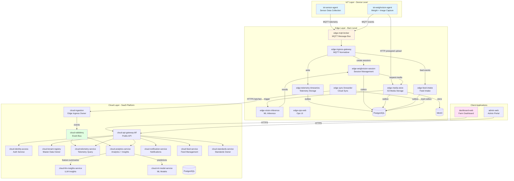
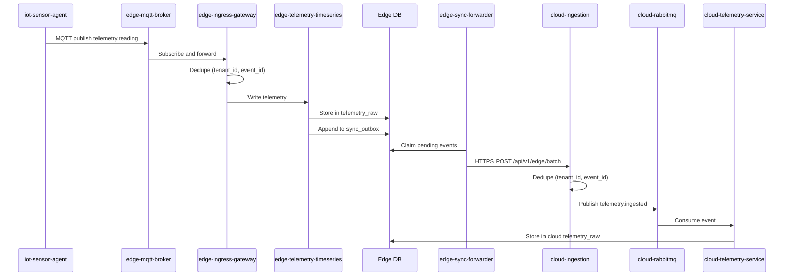
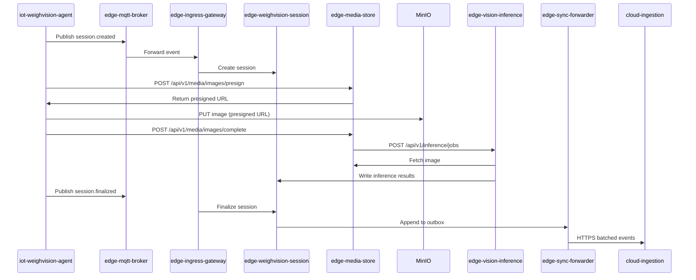
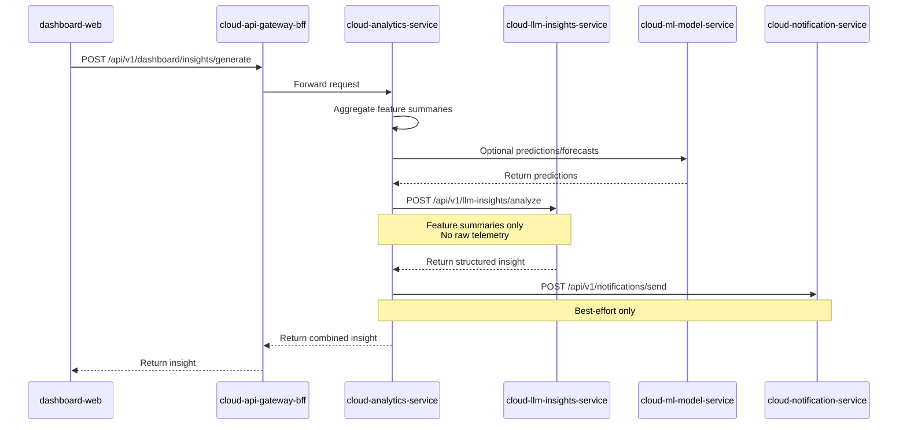
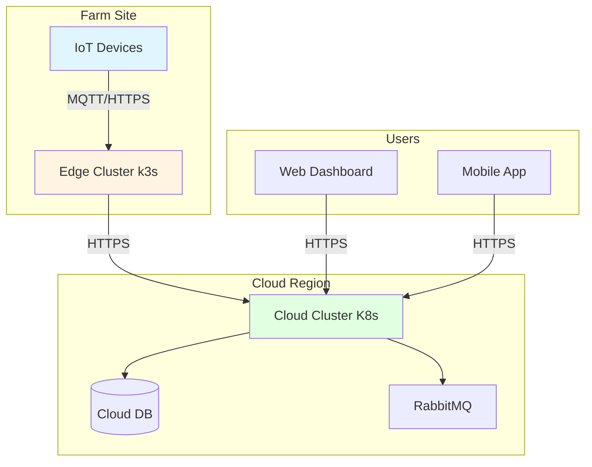

# FarmIQ Architecture Overview

**Purpose**: Comprehensive architecture documentation for the FarmIQ platform  
**Scope**: Three-layer architecture (IoT, Edge, Cloud), service responsibilities, data flows, and integration patterns  
**Owner**: FarmIQ Architecture Team  
**Last updated**: 2026-02-05

---

## Table of Contents

1. [Executive Summary](#1-executive-summary)
2. [System Architecture](#2-system-architecture)
3. [Layer Overview](#3-layer-overview)
4. [Cross-Layer Data Flows](#4-cross-layer-data-flows)
5. [Non-Functional Requirements](#5-non-functional-requirements)
6. [Security & Compliance](#6-security--compliance)
7. [Deployment Architecture](#7-deployment-architecture)

---

## 1. Executive Summary

FarmIQ is a **three-layer, event-driven smart farming platform** designed to provide real-time monitoring, analytics, and insights for livestock operations. The architecture ensures:

- **Offline-first operation** at the edge for critical barn operations
- **Reliable data synchronization** from edge to cloud using outbox pattern
- **Real-time inference** for immediate feedback on weight measurements
- **Multi-tenant SaaS platform** with strong security and RBAC
- **Scalable, cloud-native services** built on Kubernetes

### Key Design Principles

| Principle | Description |
|-----------|-------------|
| **Offline-First** | Edge layer operates independently when cloud is unreachable |
| **Event-Driven** | All data flows use events for loose coupling and reliability |
| **Idempotent Processing** | Duplicate-safe handling at every layer |
| **Multi-Tenant Isolation** | Strict tenant scoping across all services |
| **Observability** | Distributed tracing and structured logging throughout |
| **Stateless Services** | Services scale horizontally; state in DBs and object storage |

---

## 2. System Architecture

### 2.1 Three-Layer Architecture

### 2.2 Layer Responsibilities

| Layer | Primary Responsibility | Key Characteristics |
|-------|----------------------|---------------------|
| **IoT Layer** | Sensor data collection, weight/image capture | Lightweight agents, MQTT-only telemetry, offline buffering |
| **Edge Layer** | Local processing, inference, reliable sync | Kubernetes/k3s, offline-first, S3 media storage |
| **Cloud Layer** | Multi-tenant platform, analytics, APIs | SaaS, RabbitMQ events, RBAC, dashboards |

---

## 3. Layer Overview

### 3.1 IoT Layer

The IoT Layer consists of lightweight agents running on or near physical devices:

| Agent | Purpose | Platform | Key Features |
|-------|---------|----------|--------------|
| `iot-sensor-agent` | Sensor data collection | Embedded C/C++/Rust/Python/Node | 60s sampling, MQTT telemetry, 6h offline buffer |
| `iot-weighvision-agent` | Weight + image capture | Embedded C/C++/Rust/Python/Node | Session-based capture, presigned media upload, 72h offline buffer |

**Communication Patterns:**
- **MQTT (100%)**: All telemetry and events to edge broker
- **HTTP (only)**: Media upload via presigned URLs from `edge-media-store`

**Key Constraints:**
- No external message brokers or in-memory cache at device level
- Store-and-forward buffering must persist across reboot
- TLS 1.2+ required for all connections in production

### 3.2 Edge Layer

The Edge Layer runs on Kubernetes/k3s clusters deployed near barns:

**Business Services:**
| Service | Purpose | Ownership |
|---------|---------|-----------|
| `edge-mqtt-broker` | MQTT message bus for IoT devices | Infrastructure |
| `edge-ingress-gateway` | MQTT normalizer, routes to internal services | Stateless router |
| `edge-telemetry-timeseries` | Telemetry persistence and aggregation | Telemetry owner |
| `edge-weighvision-session` | Session lifecycle owner | Session owner |
| `edge-media-store` | Media owner (S3-compatible storage) | Media owner |
| `edge-vision-inference` | ML inference owner | Inference owner |
| `edge-sync-forwarder` | Sync owner (outbox → cloud) | Sync owner |
| `edge-feed-intake` | Local feed intake management | Feed intake |

**Ops Services:**
| Service | Purpose |
|---------|---------|
| `edge-policy-sync` | Cache cloud config offline |
| `edge-retention-janitor` | Enforce media retention policies |
| `edge-observability-agent` | Aggregate health/status for ops |
| `edge-ops-web` | UI for edge operations |

**Infrastructure:**
- PostgreSQL (single DB for edge services)
- MinIO (S3-compatible object storage)
- Optional Edge RabbitMQ (internal broker for async processing)

### 3.3 Cloud Layer

The Cloud Layer is the central multi-tenant SaaS platform:

**Business Services:**
| Service | Purpose | Ownership |
|---------|---------|-----------|
| `cloud-rabbitmq` | Central event bus for cloud events | Infrastructure |
| `cloud-api-gateway-bff` | Single public API entrypoint and BFF | Aggregation layer |
| `cloud-identity-access` | Authentication and authorization | Auth owner |
| `cloud-tenant-registry` | Master data owner (tenant/farm/barn/batch/device) | Master data owner |
| `cloud-standards-service` | Reference/standard/target master data | Standards owner |
| `cloud-ingestion` | Cloud ingress owner (single entry from edge) | Cloud ingress owner |
| `cloud-telemetry-service` | Telemetry storage and query | Telemetry owner |
| `cloud-analytics-service` | Anomaly/forecast/KPI + insights orchestration | Analytics owner |
| `cloud-llm-insights-service` | Generate structured insights from summaries | LLM insights |
| `cloud-ml-model-service` | Host prediction/forecast models | ML models |
| `cloud-notification-service` | In-app notifications and delivery jobs | Notifications |
| `cloud-feed-service` | Feed master data and intake records | Feed management |
| `cloud-barn-records-service` | Barn records management | Barn records |
| `cloud-media-store` | PVC-based cloud image storage (optional) | Media (optional) |

**Non-negotiable Ownership Guards:**
- **Cloud ingress owner**: `cloud-ingestion` ONLY
- **Multi-tenant master data owner**: `cloud-tenant-registry`

---

## 4. Cross-Layer Data Flows

### 4.1 Telemetry Flow

### 4.2 WeighVision Session Flow

### 4.3 Insights Generation Flow

---

## 5. Non-Functional Requirements

### 5.1 Scalability

| Layer | Scalability Approach |
|-------|---------------------|
| **IoT** | Stateless agents; scale by adding devices |
| **Edge** | Stateless services; HPA on Kubernetes/k3s |
| **Cloud** | Stateless services; HPA on Kubernetes |

### 5.2 Availability

| Component | Target | Notes |
|-----------|--------|-------|
| **Cloud services** | 99.5% uptime | SaaS SLA |
| **Edge services** | Offline operation | Sync when connectivity restored |
| **Telemetry query** | < 500ms | Typical queries |
| **Insight generation** | 8-12s timeout | LLM calls |

### 5.3 Offline & Intermittent Connectivity

| Layer | Offline Capability |
|-------|-------------------|
| **IoT** | 6h telemetry buffer, 72h WeighVision buffer |
| **Edge** | Full operation; outbox retains events for sync |
| **Cloud** | Not applicable (always-on) |

### 5.4 Observability

- **Structured logging**: JSON format to stdout
- **Distributed tracing**: Trace ID propagation across all services
- **Metrics**: Datadog integration for logs, metrics, traces
- **Health checks**: `/api/health` and `/api/ready` on all services

### 5.5 Performance Targets

| Metric | Target |
|--------|--------|
| Telemetry ingestion | < 100ms per message |
| Inference latency | ≤ 15s (p95) |
| API response time | < 200ms for simple queries |
| Sync batch size | 100 events (configurable) |

---

## 6. Security & Compliance

### 6.1 Authentication & Authorization

| Role | Description | Key Permissions |
|------|-------------|-----------------|
| `platform_admin` | System Owner | Manage Tenants, provisioning |
| `tenant_admin` | Farm Owner | Manage Farms, Users, Devices |
| `farm_manager` | Vet / Manager | View all data, acknowledge alerts |
| `house_operator` | Farm Hand | View telemetry, alerts, sessions |
| `viewer` | Auditor / Guest | Read-only access |
| `device_agent` | Machine identity | Device → edge ingestion only |

### 6.2 Data Privacy

- No PII in telemetry, media metadata, or logs
- GDPR/PDPA compliant (only operational farm data)
- Audit logging for all write operations

### 6.3 Encryption

- **In transit**: TLS 1.2+ for all connections
- **At rest**: Per platform policy (DB encryption, S3 encryption)

### 6.4 Tenant Isolation

- All queries scoped by `tenant_id`
- Multi-tenant master data owned by `cloud-tenant-registry`
- RBAC enforced at API gateway level

---

## 7. Deployment Architecture

### 7.1 IoT Layer Deployment

- **Location**: On-device or on gateway devices in barns
- **Platform**: Embedded OS (Linux-based)
- **Networking**: Connects to edge cluster via MQTT/HTTPS

### 7.2 Edge Layer Deployment

- **Location**: Kubernetes/k3s clusters deployed near barns
- **Infrastructure**: 
  - PostgreSQL (single DB instance)
  - MinIO (S3-compatible object storage)
  - Optional Edge RabbitMQ
- **Networking**: Connects to cloud via HTTPS

### 7.3 Cloud Layer Deployment

- **Location**: Cloud provider (AWS/Azure/GCP)
- **Infrastructure**:
  - Kubernetes cluster
  - PostgreSQL (multi-tenant)
  - RabbitMQ (event bus)
  - Optional PVC-based media storage
- **Networking**: Public HTTPS APIs, internal service mesh

### 7.4 Network Topology

---

## Related Documents

- [IoT Layer Architecture](./01-iot-layer.md)
- [Edge Layer Architecture](./02-edge-layer.md)
- [Cloud Layer Architecture](./03-cloud-layer.md)
- [Data Flows](./04-data-flows.md)
- [Security Architecture](./05-security.md)
- [Deployment Architecture](./06-deployment.md)
