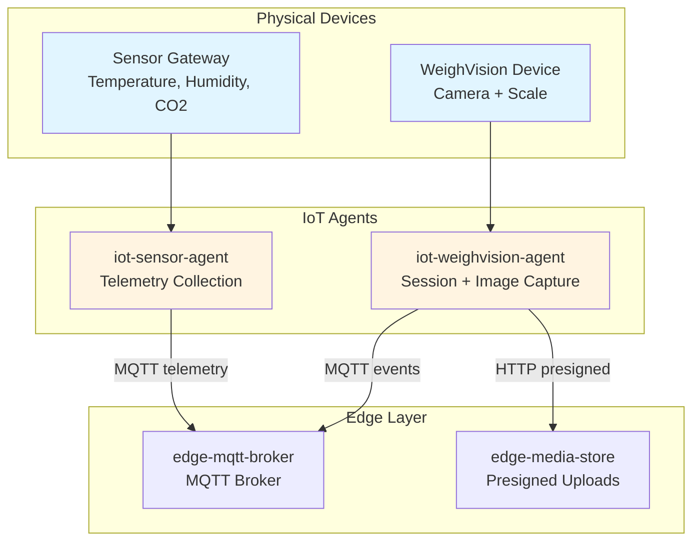

# IoT Layer Architecture

**Purpose**: Detailed architecture for the IoT layer of FarmIQ platform  
**Scope**: IoT agents, communication protocols, and integration with edge layer  
**Owner**: FarmIQ Architecture Team  
**Last updated**: 2026-02-05

---

## Table of Contents

1. [Overview](#1-overview)
2. [Agent Architecture](#2-agent-architecture)
3. [Communication Protocols](#3-communication-protocols)
4. [MQTT & Event Standards](#4-mqtt--event-standards)
5. [Offline Behavior](#5-offline-behavior)
6. [Security & Provisioning](#6-security--provisioning)
7. [Non-Functional Requirements](#7-non-functional-requirements)

---

## 1. Overview

### 1.1 Purpose

The IoT layer consists of lightweight agents that run on or near physical devices and gateways:

- **`iot-sensor-agent`**: Periodically reads sensor data (weight, temperature, humidity, etc.) and publishes telemetry every minute
- **`iot-weighvision-agent`**: Runs on WeighVision devices (camera + scale), manages session-based image + weight capture

### 1.2 Key Characteristics

- **Stateless where possible**: No long-term persistence beyond required offline outbox/buffer
- **Resilient to connectivity loss**: Store-and-forward buffering that persists across reboot
- **Authenticated connections**: Mutual TLS or token-based auth to edge
- **Lightweight logic**: Delegate heavy logic to edge layer

### 1.3 Architecture Diagram



---

## 2. Agent Architecture

### 2.1 iot-sensor-agent

**Purpose**: Run on sensor gateways or devices located in barns, collect telemetry every minute, and push telemetry to edge using MQTT only

#### Data Collection and Scheduling

| Parameter | Value | Notes |
|-----------|-------|-------|
| Sampling interval | 60 seconds (default) | Overridable by configuration |
| Typical metrics | temperature_c, humidity_percent, weight_kg, co2_ppm | Extensible |

**Agent responsibilities:**
- Read from attached sensors (driver-level details are device-specific)
- Validate data ranges locally (drop obviously invalid readings)
- Tag each reading with:
  - `tenant_id`, `farm_id`, `barn_id`, `device_id` (from configuration)
  - `ts` (device or gateway UTC timestamp)

#### MQTT Publishing

**Broker**: `edge-mqtt-broker` on edge cluster

**Topic convention** (authoritative):
```
iot/telemetry/{tenantId}/{farmId}/{barnId}/{deviceId}/{metric}
```

**QoS/Retain**:
- **QoS**: 1 (at-least-once)
- **Retain**: NO

**Example payload**:
```json
{
  "schema_version": "1.0",
  "event_id": "018f1a84-bb0e-7d3f-b2e4-9e8b5f8e0001",
  "trace_id": "trace-id-123",
  "event_type": "telemetry.reading",
  "tenant_id": "018f1a84-bb0e-7d3f-b2e4-9e8b5f8e0002",
  "device_id": "device-sensor-001",
  "ts": "2025-01-01T10:00:00Z",
  "payload": {
    "metric": "temperature",
    "value": 26.4,
    "unit": "C"
  }
}
```

#### Failure Handling

| Scenario | Handling |
|----------|----------|
| Network failure | Retry with exponential backoff |
| MQTT disconnected | Buffer locally (6h OR 360 messages) |
| Connection restored | Replay in chronological order with throttle |

**Offline buffering**:
- Buffer up to configurable limits (guidance: 6 hours OR 360 messages)
- Store as JSONL (append-only) or SQLite depending on device capability
- Drop oldest first when buffer is full

**Replay strategy**:
- Publish buffered messages in chronological order by `ts`
- Backoff + retry with jitter (0-200ms) to prevent thundering herd
- Throttle: max 5 msgs/sec per device
- On successful publish, mark as ACKed locally and safely delete/compact

### 2.2 iot-weighvision-agent

**Purpose**: Run on WeighVision devices (camera + scale), manage weigh sessions that bind image frames with scale weights, and publish all session events to edge via MQTT only

#### Two Phases of Operation

| Phase | Description | Key Features |
|-------|-------------|--------------|
| **Phase 1** | Session-based capture | Image + weight captured together |
| **Phase 2** | Scheduled image capture | Continuous monitoring images |

#### Connectivity and Protocol Choices

FarmIQ enforces **MQTT-only** device→edge ingestion:
- **MQTT (100%)**: All telemetry and session events to edge broker
- **HTTP (only)**: Media upload via presigned URL issued by `edge-media-store`

#### Authoritative MQTT Topic

```
iot/weighvision/{tenantId}/{farmId}/{barnId}/{stationId}/session/{sessionId}/{eventType}
```

#### Phase 1: Session-based Capture

**Flow**:
1. Agent starts a session when an animal is detected on the scale
2. Capture a reference image and a stable weight from the scale
3. Publish a session created event to MQTT
4. Upload associated images via presigned URL (including sessionId and traceId)
5. Publish a weight recorded event to MQTT (one or more times)
6. Publish a session finalized event to MQTT (including image count)

**Session created event**:
```json
{
  "schema_version": "1.0",
  "event_id": "018f1a84-bb0e-7d3f-b2e4-9e8b5f8e0200",
  "trace_id": "trace-id-789",
  "event_type": "weighvision.session.created",
  "tenant_id": "018f1a84-bb0e-7d3f-b2e4-9e8b5f8e0002",
  "device_id": "weighvision-device-001",
  "ts": "2025-01-01T10:05:00Z",
  "payload": {
    "batch_id": "018f1a84-bb0e-7d3f-b2e4-9e8b5f8e0400"
  }
}
```

**Weight recorded event**:
```json
{
  "schema_version": "1.0",
  "event_id": "018f1a84-bb0e-7d3f-b2e4-9e8b5f8e0201",
  "trace_id": "trace-id-789",
  "event_type": "weighvision.weight.recorded",
  "tenant_id": "018f1a84-bb0e-7d3f-b2e4-9e8b5f8e0002",
  "device_id": "weighvision-device-001",
  "ts": "2025-01-01T10:05:10Z",
  "payload": {
    "weight_kg": 120.5
  }
}
```

**Session finalized event**:
```json
{
  "schema_version": "1.0",
  "event_id": "018f1a84-bb0e-7d3f-b2e4-9e8b5f8e0202",
  "trace_id": "trace-id-789",
  "event_type": "weighvision.session.finalized",
  "tenant_id": "018f1a84-bb0e-7d3f-b2e4-9e8b5f8e0002",
  "device_id": "weighvision-device-001",
  "ts": "2025-01-01T10:07:00Z",
  "payload": {
    "image_count": 3
  }
}
```

#### Image Upload (HTTP Only)

**Step 1 (presign)**: `POST /api/v1/media/images/presign` on `edge-media-store`

Request body:
```json
{
  "tenantId": "018f1a84-bb0e-7d3f-b2e4-9e8b5f8e0002",
  "farmId": "farm-001",
  "barnId": "barn-001",
  "deviceId": "weighvision-device-001",
  "stationId": "station-001",
  "sessionId": "session-001",
  "traceId": "trace-id-789",
  "capturedAt": "2025-01-01T10:05:05Z",
  "contentType": "image/jpeg",
  "contentLength": 1024000
}
```

Response:
```json
{
  "upload_url": "https://edge-media-store:3000/presigned/...",
  "media_id": "media-001",
  "expires_at": "2025-01-01T10:20:00Z",
  "method": "PUT",
  "headers": {
    "Content-Type": "image/jpeg"
  }
}
```

**Step 2 (upload)**: `PUT {upload_url}` (binary JPEG/PNG)

**Step 3 (notify)**: Publish `weighvision.image.captured` via MQTT with `media_id`

#### Phase 2: Scheduled Images and Monitoring

In Phase 2, device captures images on a fixed schedule (e.g., every 5-10 minutes) to support group behavior analysis and continuous monitoring.

**Flow**:
1. Agent captures images on schedule (with or without scale readings)
2. Upload images via presigned URL (omit sessionId for monitoring captures)
3. Publish relevant events via MQTT

#### Session Consistency Rules (Phase 1)

**Minimum required event set** for a valid Phase 1 session:
- `weighvision.session.created`
- `weighvision.weight.recorded`
- At least 1 image uploaded (HTTP presigned URL) and referenced by `media_id`

**Reconciliation rules at edge**:
- If an image arrives before `session.created`: Store as unbound media and bind later
- If session events arrive without images for > 10 minutes: Mark session as INCOMPLETE and raise ops alert
- If images are uploaded while MQTT is offline: Device may still upload images via HTTP; session events must be replayed later

#### Offline Buffering

**Buffer limits**:
- **Telemetry**: 6 hours OR 360 messages
- **WeighVision events**: 72 hours OR 10,000 events
- Preserve created/finalized events, drop non-critical first

**Storage options**:
- Append-only JSONL file queue
- Embedded DB (SQLite)

---

## 3. Communication Protocols

### 3.1 Protocol Requirements

FarmIQ enforces **MQTT-only** device→edge ingestion:
- **MQTT (100%)**: All telemetry and session events to edge broker
- **HTTP (only)**: Media upload via presigned URL issued by `edge-media-store`

**No HTTP fallback** for telemetry or events; devices must use MQTT with offline buffering.

### 3.2 API Expectations (HTTP media upload only)

| Endpoint | Method | Description |
|----------|--------|-------------|
| `/api/health` | GET | Health check |
| `/api/v1/media/images/presign` | POST | Get presigned upload URL |
| `/api/v1/media/images/complete` | POST | Confirm upload complete |

**Headers**:
- `x-request-id`: UUID for request correlation
- `x-trace-id`: Trace correlation header

**Error format**:
```json
{
  "error": {
    "code": "VALIDATION_ERROR",
    "message": "farm_id is invalid",
    "traceId": "trace-id-123"
  }
}
```

---

## 4. MQTT & Event Standards

### 4.1 Standard MQTT Envelope Schema

All MQTT messages MUST use this envelope:

```json
{
  "schema_version": "1.0",
  "event_id": "uuid",
  "trace_id": "string",
  "tenant_id": "uuid-v7",
  "device_id": "string",
  "event_type": "string",
  "ts": "ISO-8601",
  "payload": {},
  "content_hash": "string",
  "retry_count": 0,
  "produced_at": "ISO-8601"
}
```

**Required fields**: `event_id`, `trace_id`, `tenant_id`, `device_id`, `event_type`, `ts`, `payload`

**Optional fields**:
- `schema_version`: defaults to "1.0" if omitted
- `content_hash`: optional hash of payload for integrity/debugging
- `retry_count`: optional number of local publish retries
- `produced_at`: optional timestamp when message was produced

### 4.2 Canonical MQTT Topic Patterns

| Topic Type | Pattern | Example |
|------------|---------|---------|
| **Telemetry** | `iot/telemetry/{tenantId}/{farmId}/{barnId}/{deviceId}/{metric}` | `iot/telemetry/tenant-001/farm-001/barn-001/sensor-001/temperature` |
| **Generic events** | `iot/event/{tenantId}/{farmId}/{barnId}/{deviceId}/{eventType}` | `iot/event/tenant-001/farm-001/barn-001/device-001/status` |
| **WeighVision session** | `iot/weighvision/{tenantId}/{farmId}/{barnId}/{stationId}/session/{sessionId}/{eventType}` | `iot/weighvision/tenant-001/farm-001/barn-001/station-001/session-001/created` |
| **Status (retained)** | `iot/status/{tenantId}/{farmId}/{barnId}/{deviceId}` | `iot/status/tenant-001/farm-001/barn-001/device-001` |

### 4.3 Event Types List

| Event Type | Description |
|-----------|-------------|
| `telemetry.reading` | One telemetry sample for a specific metric |
| `sensor.heartbeat` | Device heartbeat event (optional) |
| `device.status` | Latest device status payload (retained) |
| `weighvision.session.created` | WeighVision session started |
| `weighvision.weight.recorded` | A scale weight measurement associated with a session |
| `weighvision.image.captured` | Image capture notification |
| `weighvision.inference.completed` | Inference result computed |
| `weighvision.session.finalized` | Session ended/finalized |

### 4.4 QoS + Retained + LWT Rules

| Message Type | QoS | Retained | Notes |
|--------------|-----|----------|-------|
| **Telemetry readings** | 1 | NO | Every ~1 minute |
| **WeighVision events** | 1 | NO | Must not be lost |
| **Device status/heartbeat** | 1 | YES | Latest state only |
| **LWT (Last Will)** | 1 | YES | Publish "offline" on disconnect |

**Status payload must include**:
- `last_seen_at`
- `firmware_version`
- `ip` (optional)
- `signal_strength` (optional)
- Health flags (`camera_ok`, `scale_ok`, `disk_ok`)

### 4.5 Duplicate Delivery and Idempotency

Every MQTT message MUST include:
- `event_id` (UUID)
- `ts` (ISO-8601 timestamp)
- `trace_id` (correlation ID)

Edge must treat MQTT delivery as **at-least-once** and dedupe on `(tenant_id, event_id)` using an Edge DB TTL cache. Cloud ingestion must also dedupe on `(tenant_id, event_id)` for safety.

---

## 5. Offline Behavior

### 5.1 Local Buffering

If MQTT is disconnected, buffer locally (file queue JSONL or SQLite):

| Data Type | Buffer Limit | Storage |
|-----------|--------------|---------|
| **Telemetry** | 6 hours OR 360 messages | JSONL or SQLite |
| **WeighVision events** | 72 hours OR 10,000 events | JSONL or SQLite |

**Drop policy**: Drop oldest first when buffer is full

### 5.2 Replay Strategy

When connection is restored:
- Publish buffered messages in chronological order by `ts`
- Backoff + retry with jitter (0-200ms) to prevent thundering herd
- Preserve ordering per device/session

**Throttle guidance**:
- **Telemetry**: max 5 msgs/sec per device
- **WeighVision**: max 20 msgs/sec per station
- On successful publish, mark as ACKed locally and safely delete/compact

---

## 6. Security & Provisioning

### 6.1 Device Identity and Provisioning

Each IoT agent/device must be provisioned with:
- `tenant_id`, `farm_id`, `barn_id`, `device_id`
- Edge connection settings (MQTT broker host/port, `edge-media-store` base URL)
- Credentials (per-device certificate for mTLS, or signed device token)

**Provisioning principles**:
- Unique identity per device (no shared credentials)
- Rotation and revocation supported operationally
- Time sync (NTP) recommended to keep timestamps consistent (UTC)

### 6.2 MQTT Security

| Requirement | Specification |
|-------------|---------------|
| **TLS** | TLS 1.2+ REQUIRED in production |
| **Authentication** | Per-device username/password + ACL OR mTLS client certificates |
| **Provisioning** | Allowlist in `edge-ingress-gateway` |

### 6.3 HTTP Security

| Requirement | Specification |
|-------------|---------------|
| **Media upload** | Via presigned URLs (no auth header needed for PUT) |
| **Internal calls** | Cluster-internal HTTP between services |
| **Tenant scoping** | `x-tenant-id` header for all requests |

### 6.4 Data Privacy

- No PII in telemetry, media metadata, or logs
- GDPR/PDPA compliant (only operational farm data)

### 6.5 Audit Logging

- Log actor as `device_agent` for SILO_AUTO
- Log `user_id` for manual/import operations
- Trace ID propagation across all services

---

## 7. Non-Functional Requirements

### 7.1 Performance

| Metric | Target |
|--------|--------|
| Telemetry sampling | 60 seconds per device (configurable) |
| MQTT publish latency | < 100ms typical |
| Image upload | Support up to 10 MB per upload |
| Presign URL expiration | 900 seconds (15 minutes) |

### 7.2 Resource Constraints

| Resource | Constraint |
|----------|------------|
| **Memory** | < 256MB for lightweight agents |
| **Storage** | Minimal local storage for offline buffering |
| **Network** | Support intermittent connectivity |

### 7.3 Reliability

| Requirement | Specification |
|-------------|---------------|
| **Offline buffering** | 6h for telemetry, 72h for WeighVision |
| **Replay** | Preserve chronological ordering on connection restoration |
| **Idempotency** | Include `event_id` in all messages |

### 7.4 Observability

- Device logs should be structured (JSON where feasible)
- Include `trace_id` in all events for correlation
- Log errors with appropriate severity and context

### 7.5 Compatibility

| Protocol | Version |
|----------|---------|
| **MQTT** | 3.1.1+ |
| **HTTP** | 1.1+ |
| **TLS** | 1.2+ |

---

## Related Documents

- [Architecture Overview](./00-overview.md)
- [Edge Layer Architecture](./02-edge-layer.md)
- [Cloud Layer Architecture](./03-cloud-layer.md)
- [Data Flows](./04-data-flows.md)
- [Security Architecture](./05-security.md)
