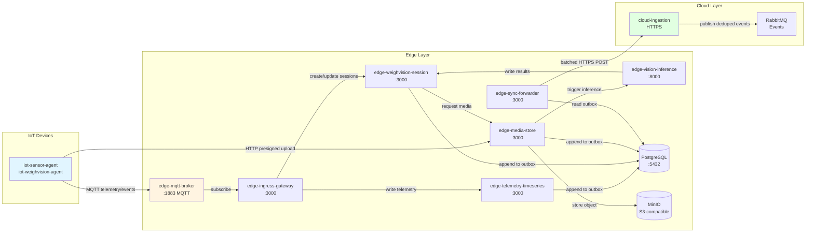
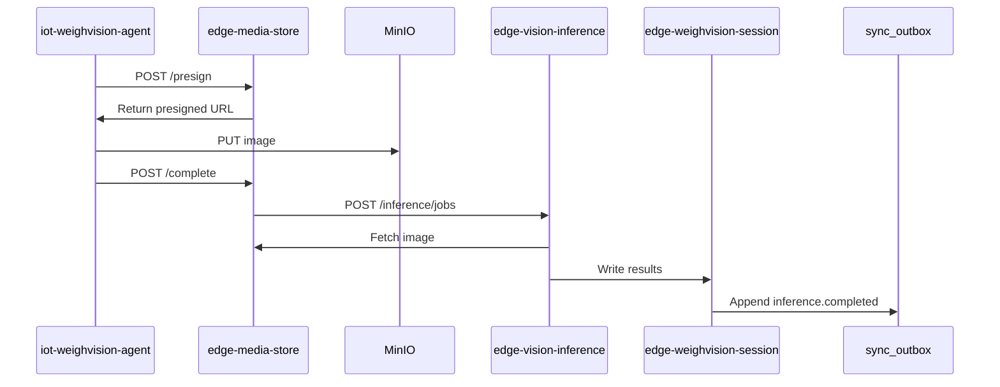
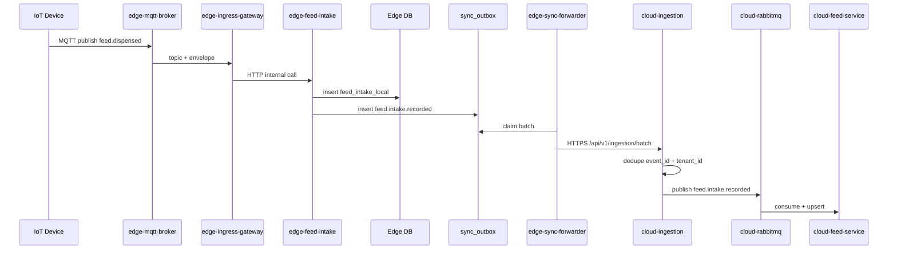

# Edge Layer Architecture

**Purpose**: Detailed architecture for the edge layer of FarmIQ platform  
**Scope**: Edge services, data flows, sync mechanisms, and integration with IoT and cloud layers  
**Owner**: FarmIQ Architecture Team  
**Last updated**: 2026-02-05

---

## Table of Contents

1. [Overview](#1-overview)
2. [Architecture](#2-architecture)
3. [Service Architecture](#3-service-architecture)
4. [Data Requirements](#4-data-requirements)
5. [Sync & Outbox Requirements](#5-sync--outbox-requirements)
6. [MQTT & IoT Integration](#6-mqtt--iot-integration)
7. [Inference Pipeline](#7-inference-pipeline)
8. [Feed Intake](#8-feed-intake)
9. [Non-Functional Requirements](#9-non-functional-requirements)
10. [Operations & Observability](#10-operations--observability)
11. [Backup & Recovery](#11-backup--recovery)

---

## 1. Overview

### 1.1 Purpose

The edge layer runs on Kubernetes/k3s clusters deployed close to barns. It provides:
- **Local buffering** of telemetry and media when cloud is unreachable
- **Real-time inference** on WeighVision sessions for immediate feedback
- **Reliable synchronization** to cloud using outbox pattern with idempotent delivery
- **Offline-first operation** for critical barn operations

### 1.2 Key Characteristics

- Runs on Kubernetes/k3s clusters deployed near barns
- Single PostgreSQL DB instance per edge cluster
- S3-compatible object storage (MinIO for local/edge, AWS S3 for cloud)
- Offline-first design with reliable sync to cloud
- No external in-memory cache/session store for cache/session/streams

### 1.3 Canonical Edge Services (MVP)

**Business Services:**
| Service | Purpose | Platform |
|---------|---------|----------|
| `edge-mqtt-broker` | MQTT message bus for IoT devices | EMQX/Mosquitto |
| `edge-ingress-gateway` | MQTT normalizer, routes to internal services | Node |
| `edge-telemetry-timeseries` | Telemetry persistence and aggregation | Node |
| `edge-weighvision-session` | Session lifecycle owner | Node |
| `edge-media-store` | Media owner (S3-compatible storage) | Node |
| `edge-vision-inference` | ML inference owner | Python |
| `edge-sync-forwarder` | Sync owner (outbox → cloud) | Node |
| `edge-feed-intake` | Local feed intake management | Node |

**Ops/Support Services:**
| Service | Purpose |
|---------|---------|
| `edge-policy-sync` | Cache cloud config offline |
| `edge-retention-janitor` | Enforce media retention policies |
| `edge-observability-agent` | Aggregate health/status for ops |
| `edge-ops-web` | UI for edge operations |

**Infrastructure Components:**
- PostgreSQL (single DB for edge services)
- MinIO (S3-compatible object storage)
- Edge RabbitMQ (optional; internal broker for async processing)

### 1.4 Ownership Guards (Non-negotiable)

| Domain | Owner Service | Tables Owned |
|---------|--------------|--------------|
| Sessions | `edge-weighvision-session` | `weight_sessions` |
| Media | `edge-media-store` | `media_objects` (metadata), S3 objects |
| Inference | `edge-vision-inference` | `inference_results` |
| Sync | `edge-sync-forwarder` | `sync_outbox`, `sync_state`, `sync_outbox_dlq` |
| Telemetry | `edge-telemetry-timeseries` | `telemetry_raw`, `telemetry_agg` |

**Cross-cutting concerns:**
- `edge-ingress-gateway`: Stateless router, writes `ingress_dedupe` table only
- `edge-observability-agent`: Aggregator only, no data ownership
- `edge-ops-web`: UI/proxy layer, no direct DB access

---

## 2. Architecture

### 2.1 Canonical Data Flow

**Primary Flow: MQTT → Ingress → DB → Outbox → Sync → Cloud**



### 2.2 Flow Details

#### 1. Telemetry Ingestion
- IoT devices publish to MQTT topics: `iot/telemetry/{tenantId}/{farmId}/{barnId}/{deviceId}/{metric}`
- `edge-mqtt-broker` receives messages and forwards to `edge-ingress-gateway`
- `edge-ingress-gateway` validates envelope, deduplicates, and writes to `edge-telemetry-timeseries`
- `edge-telemetry-timeseries` stores in PostgreSQL and appends to `sync_outbox`

#### 2. WeighVision Session Flow
- Device captures weight + image, publishes session events to MQTT
- `edge-ingress-gateway` creates/updates session via `edge-weighvision-session`
- Device uploads image via presigned URL to `edge-media-store` (bypasses ingress gateway)
- `edge-media-store` stores in MinIO and triggers `edge-vision-inference`
- `edge-vision-inference` runs ML model and writes results back to session
- Session finalized, events appended to `sync_outbox`

#### 3. Cloud Synchronization
- `edge-sync-forwarder` reads `sync_outbox` (pending rows) with `SELECT FOR UPDATE SKIP LOCKED`
- Batches events by tenant_id to optimize cloud processing
- Sends to `cloud-ingestion` via HTTPS (idempotent via event_id)
- Cloud validates, deduplicates by `(tenant_id, event_id)`, publishes to RabbitMQ
- Edge retries with exponential backoff on failure; after 10 attempts, moves to DLQ

### 2.3 Communication Patterns

| Direction | Protocol | Notes |
|-----------|----------|-------|
| **External → Edge** | MQTT | All device telemetry via `edge-mqtt-broker` |
| **External → Edge** | HTTP | Media uploads via presigned URLs |
| **Internal Edge** | HTTP/gRPC | Inter-service communication |
| **Internal Edge** | DB | Shared PostgreSQL for structured data |
| **Edge → Cloud** | HTTPS Batched | `edge-sync-forwarder` batches events |

---

## 3. Service Architecture

### 3.1 edge-mqtt-broker

**Purpose**: Receive MQTT telemetry from IoT devices and forward to `edge-ingress-gateway`

**Configuration**:
| Parameter | Value |
|-----------|-------|
| MQTT TCP port | 1883 |
| MQTT TLS port | 8883 (production) |
| Protocol | MQTT 3.1.1+ |

**Security**:
- TLS 1.2+ REQUIRED in production
- Device authentication: per-device username/password + ACL OR mTLS client certificates

**Resource Requirements (K8s)**:
| Resource | Request | Limit |
|----------|---------|-------|
| CPU | 200m | 500m |
| Memory | 256Mi | 512Mi |

**DB tables owned**: None

**Outbox events**: None

**PVC usage**: Optional (broker persistence), but avoid heavy retention

### 3.2 edge-ingress-gateway

**Purpose**: Single device-facing MQTT normalizer; validates and routes device data to internal edge services

**Does / does not**:
- **Does**: Consume MQTT topics, validate standard MQTT envelope, enrich `trace_id` if missing, and route to internal edge services
- **Does**: Expose operational and admin HTTP endpoints only
- **Does not**: Own domain tables (routes to owners)
- **Does not**: Receive or proxy image bytes (devices upload directly via presigned URLs)

**MQTT topics consumed** (authoritative patterns):
| Topic Type | Pattern |
|------------|---------|
| Telemetry | `iot/telemetry/{tenantId}/{farmId}/{barnId}/{deviceId}/{metric}` |
| Generic events | `iot/event/{tenantId}/{farmId}/{barnId}/{deviceId}/{eventType}` |
| WeighVision | `iot/weighvision/{tenantId}/{farmId}/{barnId}/{stationId}/session/{sessionId}/{eventType}` |
| Status (retained) | `iot/status/{tenantId}/{farmId}/{barnId}/{deviceId}` |

**Idempotency / duplicate handling** (mandatory):
- Treat MQTT as at-least-once delivery
- Dedupe by `(tenant_id, event_id)` using an Edge DB TTL cache
- Table: `ingress_dedupe(event_id, tenant_id, first_seen_at)`
- Cleanup job drops rows older than TTL (24-72 hours)
- If duplicate detected: skip downstream processing and log lightweight dedupe message

**Validation and security**:
- Validate envelope contains `event_id`, `trace_id`, `tenant_id`, `device_id`, `event_type`, `ts`, `payload`
- Validate required topic segments are present and consistent with provisioning
- If `trace_id` missing, generate and attach before routing
- Never log full payload; log `event_type`, ids, `trace_id`, and payload size only

**Public APIs (device-facing)**:
| Endpoint | Method | Description |
|----------|--------|-------------|
| `/api/health` | GET | Health check |
| `/api/ready` | GET | Checks DB connectivity for dedupe |
| `/api-docs` | GET | API documentation |
| `/api/v1/ingress/stats` | GET | Ingress statistics |

**Internal calls**:
- Writes telemetry to `edge-telemetry-timeseries` (HTTP/gRPC)
- Creates/finalizes sessions via `edge-weighvision-session`
- Does NOT upload media (devices call `edge-media-store` directly)

**DB tables owned**: None (stateless gateway, but uses `ingress_dedupe` table)

**Outbox events**: None (do not emit business events here; route to owners)

**PVC usage**: None

**Resource Requirements (K8s)**:
| Resource | Request | Limit |
|----------|---------|-------|
| CPU | 200m | 1 CPU |
| Memory | 256Mi | 512Mi |

### 3.3 edge-telemetry-timeseries

**Purpose**: Own telemetry persistence and aggregation on edge; provide local telemetry query endpoints

**APIs (internal edge)**:
| Endpoint | Method | Description |
|----------|--------|-------------|
| `/api/health` | GET | Health check |
| `/api/ready` | GET | Checks DB connectivity |
| `/api-docs` | GET | API documentation |
| `/api/v1/telemetry/readings` | POST/GET | Telemetry readings |
| `/api/v1/telemetry/aggregates` | GET | Aggregated telemetry |
| `/api/v1/telemetry/metrics` | GET | Telemetry metrics |

**DB tables owned**:
- `telemetry_raw`
- `telemetry_agg`

**Outbox events written**:
- `telemetry.ingested`
- `telemetry.aggregated` (optional on edge; cloud can also aggregate)

**PVC usage**: Uses DB storage on `edge-db-volume` (if DB is hosted locally on PVC)

**Resource Requirements (K8s)**:
| Resource | Request | Limit |
|----------|---------|-------|
| CPU | 500m | 2 CPU |
| Memory | 512Mi | 2Gi |

### 3.4 edge-weighvision-session

**Purpose**: Own WeighVision session lifecycle and binding between weights, media, and inference results

**APIs (internal edge)**:
| Endpoint | Method | Description |
|----------|--------|-------------|
| `/api/health` | GET | Health check |
| `/api/ready` | GET | Checks DB connectivity |
| `/api-docs` | GET | API documentation |
| `/api/v1/weighvision/sessions` | POST | Create session (internal) |
| `/api/v1/weighvision/sessions/{sessionId}` | GET | Get session (internal) |
| `/api/v1/weighvision/sessions/{sessionId}/attach` | POST | Bind media/inference (internal) |
| `/api/v1/weighvision/sessions/{sessionId}/finalize` | POST | Finalize session (internal) |

**DB tables owned**:
- `weight_sessions`
- `session_weights`
- `session_media_bindings`
- `outbox` (events written by this service)

**Outbox events written**:
- `weighvision.session.created`
- `weighvision.session.finalized`

**PVC usage**: None directly (media stored via `edge-media-store`)

**Resource Requirements (K8s)**:
| Resource | Request | Limit |
|----------|---------|-------|
| CPU | 200m | 1 CPU |
| Memory | 256Mi | 512Mi |

### 3.5 edge-media-store

**Purpose**: Store images in S3-compatible object storage (MinIO or AWS S3) and maintain metadata

**Storage**: Uses S3-compatible storage (MinIO recommended for local/edge deployments, AWS S3 for cloud)

**Object key pattern**:
```
tenants/{tenant_id}/farms/{farm_id}/barns/{barn_id}/devices/{device_id}/images/{year}/{month}/{day}/{id}.{ext}
```

**APIs**:
| Endpoint | Method | Description |
|----------|--------|-------------|
| `/api/health` | GET | Health check |
| `/api/ready` | GET | Checks S3 bucket configuration |
| `/api-docs` | GET | API documentation |
| `/api/v1/media/images/presign` | POST | Get presigned upload URL (device-facing) |
| `/api/v1/media/images/complete` | POST | Confirm upload complete (device-facing) |
| `/api/v1/media/objects/{mediaId}` | GET | Get file bytes from S3 (internal) |
| `/api/v1/media/objects/{mediaId}/meta` | GET | Get metadata JSON (internal) |

**Environment Variables**:
| Variable | Required | Default | Description |
|----------|----------|---------|-------------|
| `MEDIA_BUCKET` | Yes | - | S3 bucket name |
| `MEDIA_ENDPOINT` | Yes | - | S3 endpoint URL |
| `MEDIA_ACCESS_KEY` | Yes | - | S3 access key |
| `MEDIA_SECRET_KEY` | Yes | - | S3 secret key |
| `MEDIA_REGION` | No | `us-east-1` | S3 region |
| `MEDIA_PRESIGN_EXPIRES_IN` | No | 900 | Presign URL expiration (seconds) |
| `MEDIA_MAX_UPLOAD_BYTES` | No | 10485760 | Max upload size (10 MB) |

**DB tables owned**:
- `media_objects` (metadata only; actual files stored in S3)

**Outbox events written**:
- `media.stored`

**Storage**: S3-compatible object storage (not PVC filesystem)

**Resource Requirements (K8s)**:
| Resource | Request | Limit |
|----------|---------|-------|
| CPU | 500m | 2 CPU |
| Memory | 512Mi | 1Gi |

### 3.6 edge-vision-inference

**Purpose**: Run ML inference on images and write results to edge DB

**APIs**:
| Endpoint | Method | Description |
|----------|--------|-------------|
| `/api/health` | GET | Health check |
| `/api/ready` | GET | Checks DB connectivity |
| `/api-docs` | GET | API documentation |
| `/api/v1/inference/jobs` | POST | Submit inference job |
| `/api/v1/inference/jobs/{jobId}` | GET | Get job status |
| `/api/v1/inference/results` | GET | Get inference results |
| `/api/v1/inference/models` | GET | Get available models |

**Current Implementation** (Mode B - Synchronous HTTP POST):
- `edge-media-store` calls `POST /api/v1/inference/jobs` synchronously after storing media
- Service processes job inline and returns result
- Fetches media from `edge-media-store` (internal HTTP) and writes results to DB
- Checks for duplicate `event_id` before processing (idempotency)
- Writes `inference.completed` event to `sync_outbox`

**DB tables owned**:
- `inference_results`

**Outbox events written**:
- `inference.completed`

**PVC usage**: None directly (reads images via `edge-media-store`)

**Resource Requirements (K8s)**:
| Resource | Request | Limit |
|----------|---------|-------|
| CPU | 1 CPU | 4 CPU (or GPU requests) |
| Memory | 1Gi | 4Gi |
| Node affinity | - | MUST schedule to GPU nodes if GPU inference enabled |

### 3.7 edge-sync-forwarder

**Purpose**: Reliably send outbox events to cloud using HTTPS with idempotency

**APIs (internal edge)**:
| Endpoint | Method | Description |
|----------|--------|-------------|
| `/api/health` | GET | Health check |
| `/api/ready` | GET | Checks DB connectivity and cloud endpoint |
| `/api-docs` | GET | API documentation |
| `/api/v1/sync/state` | GET | Get sync state |
| `/api/v1/sync/trigger` | POST | Trigger sync (admin/debug) |
| `/api/v1/sync/outbox` | GET | Get outbox contents (admin/debug) |

**DB tables owned**:
- `sync_outbox` (read/claim/update)
- `sync_state`

**Outbox events written**:
- `sync.batch.sent`
- `sync.batch.acked`

**Claim/Lease Strategy** (for horizontal scaling):
- Use `SELECT ... FOR UPDATE SKIP LOCKED` (PostgreSQL)
- Add columns to `sync_outbox`:
  - `claimed_by` (pod/instance identifier)
  - `claimed_at` (timestamp)
  - `lease_expires_at` (timestamp; default: claimed_at + 5 minutes)

**Claiming process**:
1. Select rows with `status = 'pending'` AND (`claimed_at IS NULL` OR `lease_expires_at < NOW()`) using `FOR UPDATE SKIP LOCKED`
2. Update selected rows: set `status = 'claimed'`, `claimed_by = <instance_id>`, `claimed_at = NOW()`, `lease_expires_at = NOW() + 5 minutes`
3. Process batch and send to cloud
4. On success: update `status = 'sent'` (or `acked` after cloud confirms)
5. On failure: update `status = 'pending'`, clear `claimed_by`, increment `attempt_count`

**Failure Policy**:
| Parameter | Value |
|-----------|-------|
| Max attempts | 10 (configurable) |
| Backoff | Exponential with jitter: `min(2^attempt_count * 1s + jitter(0-1s), 300s)` |
| Mark failed | After max attempts, set `status = 'failed'` and log alert |

**PVC usage**: Uses DB storage on `edge-db-volume` (if DB is hosted locally on PVC)

**Resource Requirements (K8s)**:
| Resource | Request | Limit |
|----------|---------|-------|
| CPU | 200m | 1 CPU |
| Memory | 256Mi | 512Mi |
| HPA | 2-10 replicas | Based on backlog |

### 3.8 edge-feed-intake

**Purpose**: Edge-side intake service that captures SILO_AUTO feed events and local manual/import entries

**Scope**:
- Intake sources: MANUAL, API_IMPORT, SILO_AUTO
- Local validation and dedupe
- Outbox sync to cloud-ingestion

**Non-goals**:
- Feed master data management (cloud-owned)
- KPI computation (cloud-owned)
- Device firmware changes

**DB tables owned**:
- `feed_intake_local`
- `feed_intake_dedupe`
- `silo_weight_snapshot`

**Outbox events written**:
- `feed.intake.recorded`

**Resource Requirements (K8s)**:
| Resource | Request | Limit |
|----------|---------|-------|
| CPU | 200m | 1 CPU |
| Memory | 256Mi | 512Mi |

### 3.9 edge-ops-web

**Purpose**: Provide an ops/FE-friendly UI and a single browser-friendly origin that proxies internal services via `/svc/*`

**Proxy paths**:
| Path | Target Service |
|------|---------------|
| `/svc/ingress/*` | `edge-ingress-gateway` |
| `/svc/telemetry/*` | `edge-telemetry-timeseries` |
| `/svc/weighvision/*` | `edge-weighvision-session` |
| `/svc/media/*` | `edge-media-store` |
| `/svc/vision/*` | `edge-vision-inference` |
| `/svc/sync/*` | `edge-sync-forwarder` |
| `/svc/ops/*` | `edge-observability-agent` |
| `/svc/policy/*` | `edge-policy-sync` |
| `/svc/janitor/*` | `edge-retention-janitor` |
| `/svc/feed/*` | `edge-feed-intake` |

### 3.10 edge-policy-sync

**Purpose**: Cache cloud config offline

**Resource Requirements (K8s)**:
| Resource | Request | Limit |
|----------|---------|-------|
| CPU | 100m | 200m |
| Memory | 128Mi | 256Mi |

### 3.11 edge-retention-janitor

**Purpose**: Enforce media retention policies

**Resource Requirements (K8s)**:
| Resource | Request | Limit |
|----------|---------|-------|
| CPU | 100m | 200m |
| Memory | 128Mi | 256Mi |

### 3.12 edge-observability-agent

**Purpose**: Aggregate health/status for ops

**Resource Requirements (K8s)**:
| Resource | Request | Limit |
|----------|---------|-------|
| CPU | 100m | 200m |
| Memory | 128Mi | 256Mi |

---

## 4. Data Requirements

### 4.1 Database (PostgreSQL)

Single DB instance per edge cluster with tables:

| Table | Purpose |
|-------|---------|
| `telemetry_raw` | Raw telemetry readings |
| `telemetry_agg` | Aggregated telemetry |
| `weight_sessions` | WeighVision sessions |
| `media_objects` | Media metadata |
| `inference_results` | ML inference results |
| `sync_outbox` | Events pending sync |
| `sync_outbox_dlq` | Failed sync events |
| `ingress_dedupe` | MQTT duplicate prevention |
| `feed_intake_local` | Local feed intake records |
| `feed_intake_dedupe` | Feed deduplication |
| `silo_weight_snapshot` | Latest silo weight |

### 4.2 Object Storage (MinIO / S3)

Media storage with path structure:
```
tenants/{tenant_id}/farms/{farm_id}/barns/{barn_id}/devices/{device_id}/images/{year}/{month}/{day}/{id}.{ext}
```

**Note**: Media stored in MinIO, not on PVC filesystem. `edge-media-store` maintains metadata only.

### 4.3 Table Categories

| Category | Tables |
|----------|--------|
| **Master data** | tenants, farms, barns, batches, devices, stations |
| **Operational** | sessions, media objects, inference results, device status |
| **Telemetry/time-series** | raw readings, aggregates, rollups |
| **Idempotency** | dedupe tables for ingress/ingestion/analytics |
| **Integration** | outbox tables for reliable sync |

---

## 5. Sync & Outbox Requirements

### 5.1 sync_outbox State Machine

**State Transitions**:

| From State | To State | Condition |
|------------|----------|-----------|
| `pending` | `claimed` | Row is claimed by a forwarder instance |
| `pending` | `pending` | Retry after failure (attempt_count < max) |
| `pending` | `dlq` | Max attempts exceeded |
| `claimed` | `sending` | Optional intermediate state during HTTP send |
| `claimed` | `acked` | Cloud acknowledged batch successfully |
| `claimed` | `pending` | Retry after failure (attempt_count < max) |
| `claimed` | `dlq` | Max attempts exceeded |
| `sending` | `acked` | Cloud acknowledged batch successfully |
| `sending` | `pending` | Retry after failure (attempt_count < max) |
| `sending` | `dlq` | Max attempts exceeded |

**Terminal States**: `acked`, `dlq`, `failed`

### 5.2 Eligibility Predicate

A row is eligible for claiming if **ALL** of the following are true:

```sql
status IN ('pending', 'claimed')
AND next_attempt_at <= NOW()
AND (claimed_by IS NULL OR lease_expires_at < NOW())
```

**Processing Order**: Rows are processed in `(priority DESC, occurred_at ASC)` order.

### 5.3 Retry & Backoff Policy

**Backoff Calculation**:
```
delay_ms = min(2^attempt_count * base_seconds * 1000 + jitter(0..1s), max_seconds * 1000)
next_attempt_at = NOW() + delay_ms
```

Default: `base_seconds = 1`, `max_seconds = 300` (5 minutes).

### 5.4 Claim/Lease Algorithm

```sql
WITH candidates AS (
  SELECT id
  FROM sync_outbox
  WHERE
    status IN ('pending', 'claimed')
    AND next_attempt_at <= NOW()
    AND (claimed_by IS NULL OR lease_expires_at < NOW())
  ORDER BY priority DESC, occurred_at ASC
  LIMIT $batchSize
  FOR UPDATE SKIP LOCKED
)
UPDATE sync_outbox o
SET
  status = 'claimed',
  claimed_by = $instanceId,
  claimed_at = NOW(),
  lease_expires_at = NOW() + ($leaseSeconds || ' seconds')::interval
FROM candidates c
WHERE o.id = c.id
RETURNING o.*;
```

---

## 6. MQTT & IoT Integration

### 6.1 Canonical MQTT Topic Patterns

| Topic Type | Pattern |
|------------|---------|
| Telemetry | `iot/telemetry/{tenantId}/{farmId}/{barnId}/{deviceId}/{metric}` |
| Generic events | `iot/event/{tenantId}/{farmId}/{barnId}/{deviceId}/{eventType}` |
| WeighVision session | `iot/weighvision/{tenantId}/{farmId}/{barnId}/{stationId}/session/{sessionId}/{eventType}` |
| Status (retained) | `iot/status/{tenantId}/{farmId}/{barnId}/{deviceId}` |

### 6.2 Event Types List

| Event Type | Description |
|-----------|-------------|
| `telemetry.reading` | One telemetry sample for a specific metric |
| `sensor.heartbeat` | Device heartbeat event (optional) |
| `device.status` | Latest device status payload (retained) |
| `weighvision.session.created` | WeighVision session started |
| `weighvision.weight.recorded` | A scale weight measurement |
| `weighvision.image.captured` | Image capture notification |
| `weighvision.inference.completed` | Inference result computed |
| `weighvision.session.finalized` | Session ended/finalized |

### 6.3 QoS + Retained + LWT Rules

| Message Type | QoS | Retained |
|--------------|-----|----------|
| Telemetry | 1 | NO |
| WeighVision events | 1 | NO |
| Device status/heartbeat | 1 | YES |

---

## 7. Inference Pipeline

### 7.1 Pipeline Overview



### 7.2 Pipeline Steps

1. **Media storage (S3)**: `iot-weighvision-agent` uploads images directly to `edge-media-store` via presigned URL flow
2. **Inference job dispatch**: `edge-media-store` calls `POST /api/v1/inference/jobs` synchronously
3. **Inference execution**: `edge-vision-inference` receives jobs, fetches media, runs ML model, stores outputs
4. **Session update and finalization**: `edge-weighvision-session` associates `inference_results` to `weight_sessions`
5. **Sync to cloud**: `edge-sync-forwarder` batches `sync_outbox` rows and posts to `cloud-ingestion`

### 7.3 Latency Targets

| Phase | Target |
|-------|--------|
| Phase 1 (interactive) | End-to-end: ≤ 5-15 seconds |
| Phase 2 (scheduled) | Inference: ≤ 1-5 minutes |

---

## 8. Feed Intake

### 8.1 Architecture and Data Flow



---

## 9. Non-Functional Requirements

### 9.1 Scalability

- All edge services are stateless (except DBs and PVC-backed storage)
- Horizontally scalable under Kubernetes
- HPA should be configured per service

### 9.2 Offline and Intermittent Connectivity

- Edge services must operate when cloud is unreachable
- `edge-telemetry-timeseries`, `edge-weighvision-session`, and `edge-media-store` provide sufficient local buffering
- `edge-sync-forwarder` maintains `sync_state` for retrying batches

### 9.3 Observability

- Node services: Winston JSON logs → stdout; `dd-trace` for distributed tracing
- Python services: JSON structured logs → stdout; `ddtrace` for tracing
- Datadog Agent runs as a DaemonSet

### 9.4 Performance

| Metric | Target |
|--------|--------|
| Telemetry ingestion | < 100ms per message |
| Inference latency | ≤ 15s (p95) for Phase 1 |
| Sync batch size | 100 events (configurable) |
| Outbox claim | Process eligible rows within 5 seconds |

### 9.5 Availability

- Edge services: Operate offline with sync when connectivity restored
- Critical services: Deploy with 2+ replicas for HA

---

## 10. Operations & Observability

### 10.1 Required Alerts

- Outbox backlog size and oldest pending age
- Disk usage thresholds (MinIO + DB volumes)
- Last successful sync timestamp
- S3 storage quota > 75% (warning) / > 90% (critical)
- Inference job failures
- Message processing rate, dedupe hit rate, validation error rate

### 10.2 Health Checks

All services must expose:
- `GET /api/health` - Process alive check
- `GET /api/ready` - Dependency checks (DB, S3, cloud endpoint)

### 10.3 Logging Standards

- JSON structured logging to stdout
- Include `requestId`, `traceId`, `service`, `env`, `version`
- No sensitive PII in logs

---

## 11. Backup & Recovery

### 11.1 Database Backup

| Parameter | Value |
|------------|-------|
| Snapshot Frequency | Daily full backups + continuous WAL archiving (production) |
| Backup Storage | External durable storage (S3-compatible, NFS, or cloud-provider) |
| Retention | 30 days (minimum), 90 days (recommended) |
| RTO | ≤ 5.4 hours per GT&D standards |

### 11.2 Media Object Storage Backup

| Strategy | Description |
|----------|-------------|
| Option A (Recommended) | Snapshot/backup object storage backend (e.g., MinIO PV snapshots) daily |
| Option B | File-level backup to external storage (rsync, tar) |
| Retention | 7-30 days of snapshots |

### 11.3 Multi-day Cloud Outage Recovery

**What is Recoverable**:
- Telemetry data: Fully recoverable (stored in edge DB)
- WeighVision sessions: Fully recoverable (sessions in DB, images in object storage)
- Media files: Fully recoverable (in object storage)

**Recovery Process**:
1. When cloud connectivity restored, `edge-sync-forwarder` automatically resumes batching
2. Cloud deduplicates by `(tenant_id, event_id)` so duplicate sends are safe
3. Monitor outbox backlog reduction and sync success rate

---

## Related Documents

- [Architecture Overview](./00-overview.md)
- [IoT Layer Architecture](./01-iot-layer.md)
- [Cloud Layer Architecture](./03-cloud-layer.md)
- [Data Flows](./04-data-flows.md)
- [Security Architecture](./05-security.md)
