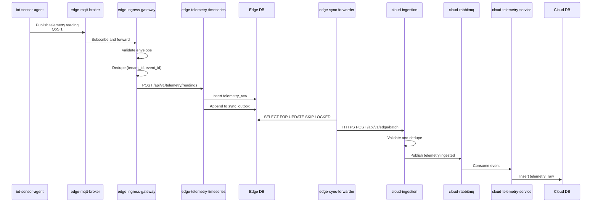
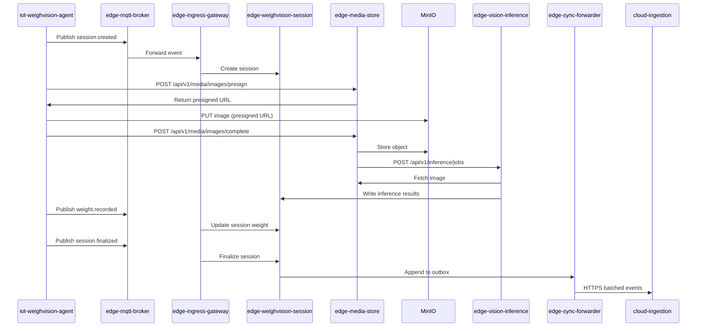
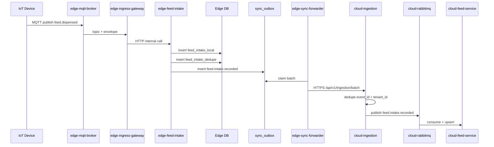
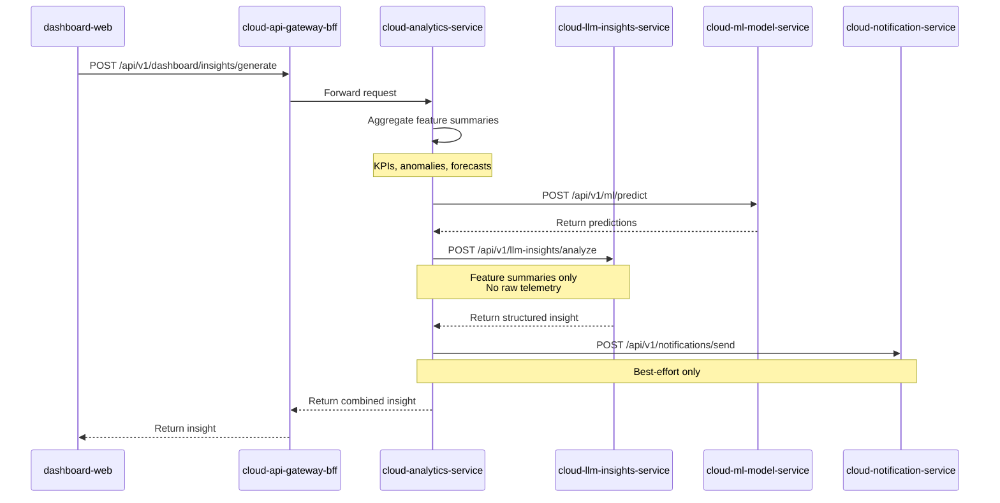
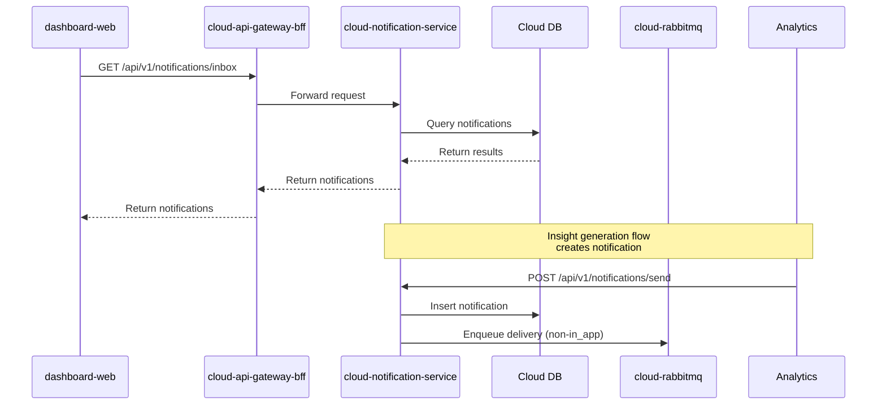
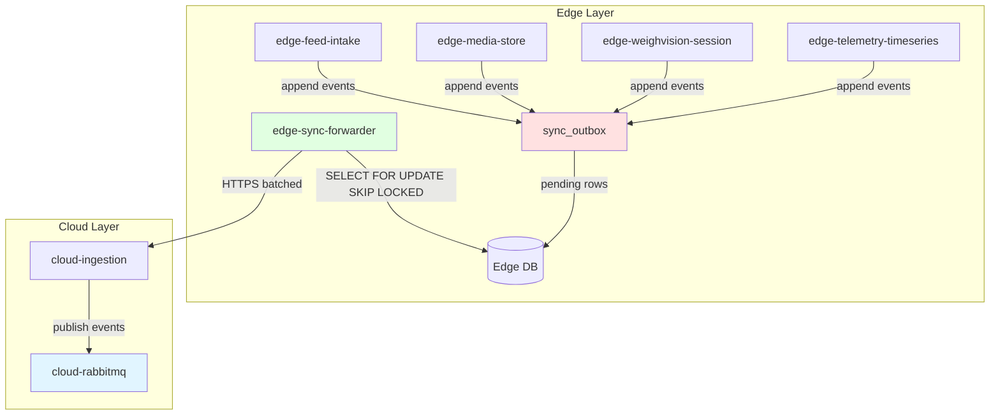

# Data Flows

**Purpose**: Document all critical data flows across the FarmIQ three-layer architecture  
**Scope**: Cross-layer data flows, event patterns, and integration mechanisms  
**Owner**: FarmIQ Architecture Team  
**Last updated**: 2026-02-05

---

## Table of Contents

1. [Overview](#1-overview)
2. [Telemetry Data Flow](#2-telemetry-data-flow)
3. [WeighVision Session Flow](#3-weighvision-session-flow)
4. [Feed Intake Flow](#4-feed-intake-flow)
5. [Insights Generation Flow](#5-insights-generation-flow)
6. [Notification Flow](#6-notification-flow)
7. [Cloud Synchronization Flow](#7-cloud-synchronization-flow)
8. [Event Catalog](#8-event-catalog)

---

## 1. Overview

FarmIQ is an event-driven platform where data flows through three layers:

1. **IoT Layer**: Device agents collect data and publish via MQTT
2. **Edge Layer**: Processes, stores, and syncs data to cloud
3. **Cloud Layer**: Consumes events, provides APIs, analytics, and insights

### 1.1 Flow Principles

| Principle | Description |
|-----------|-------------|
| **Event-Driven** | All data flows use events for loose coupling and reliability |
| **Idempotent** | Duplicate-safe handling at every layer using `(tenant_id, event_id)` |
| **Offline-First** | Edge layer operates independently when cloud is unreachable |
| **Tenant-Scoped** | All data is scoped by tenant_id for multi-tenant isolation |
| **Traced** | All flows propagate trace_id for distributed tracing |

### 1.2 Communication Patterns

| Direction | Protocol | Purpose |
|-----------|----------|---------|
| **IoT → Edge** | MQTT | Telemetry and events |
| **IoT → Edge** | HTTP | Media upload via presigned URLs |
| **Edge Internal** | HTTP/gRPC | Inter-service communication |
| **Edge → Cloud** | HTTPS | Batched event sync |
| **Cloud Internal** | AMQP | RabbitMQ event bus |
| **Client → Cloud** | HTTPS | Dashboard and admin APIs |

---

## 2. Telemetry Data Flow

### 2.1 Flow Diagram



### 2.2 Flow Steps

| Step | Component | Action |
|-------|-----------|--------|
| 1 | `iot-sensor-agent` | Publishes telemetry to MQTT topic: `iot/telemetry/{tenantId}/{farmId}/{barnId}/{deviceId}/{metric}` |
| 2 | `edge-mqtt-broker` | Receives and forwards message to `edge-ingress-gateway` |
| 3 | `edge-ingress-gateway` | Validates envelope, dedupes by `(tenant_id, event_id)`, routes to `edge-telemetry-timeseries` |
| 4 | `edge-telemetry-timeseries` | Stores in `telemetry_raw` table, appends to `sync_outbox` |
| 5 | `edge-sync-forwarder` | Claims pending events from `sync_outbox`, batches by tenant_id |
| 6 | `edge-sync-forwarder` | Sends batched events to `cloud-ingestion` via HTTPS |
| 7 | `cloud-ingestion` | Validates, dedupes by `(tenant_id, event_id)`, publishes to RabbitMQ |
| 8 | `cloud-telemetry-service` | Consumes `telemetry.ingested` event, stores in cloud `telemetry_raw` |

### 2.3 Idempotency Points

| Location | Dedupe Key | Table |
|----------|-------------|--------|
| Edge ingress | `(tenant_id, event_id)` | `ingress_dedupe` |
| Cloud ingestion | `(tenant_id, event_id)` | `ingestion_dedupe` |

### 2.4 MQTT Topic

```
iot/telemetry/{tenantId}/{farmId}/{barnId}/{deviceId}/{metric}
```

### 2.5 Event Payload

```json
{
  "schema_version": "1.0",
  "event_id": "018f1a84-bb0e-7d3f-b2e4-9e8b5f8e0001",
  "trace_id": "trace-id-123",
  "event_type": "telemetry.reading",
  "tenant_id": "018f1a84-bb0e-7d3f-b2e4-9e8b5f8e0002",
  "device_id": "device-sensor-001",
  "ts": "2025-01-01T10:00:00Z",
  "payload": {
    "metric": "temperature",
    "value": 26.4,
    "unit": "C"
  }
}
```

---

## 3. WeighVision Session Flow

### 3.1 Flow Diagram



### 3.2 Flow Steps

| Step | Component | Action |
|-------|-----------|--------|
| 1 | `iot-weighvision-agent` | Detects animal on scale, starts session |
| 2 | `iot-weighvision-agent` | Publishes `session.created` event to MQTT |
| 3 | `edge-ingress-gateway` | Routes to `edge-weighvision-session` to create session |
| 4 | `iot-weighvision-agent` | Requests presigned URL from `edge-media-store` |
| 5 | `edge-media-store` | Returns presigned URL for MinIO upload |
| 6 | `iot-weighvision-agent` | Uploads image to MinIO via PUT |
| 7 | `iot-weighvision-agent` | Notifies `edge-media-store` of upload completion |
| 8 | `edge-media-store` | Stores metadata, triggers `edge-vision-inference` |
| 9 | `edge-vision-inference` | Fetches image, runs ML model, writes results |
| 10 | `iot-weighvision-agent` | Publishes `weight.recorded` event |
| 11 | `iot-weighvision-agent` | Publishes `session.finalized` event |
| 12 | `edge-weighvision-session` | Finalizes session, appends to `sync_outbox` |
| 13 | `edge-sync-forwarder` | Syncs to cloud |

### 3.3 MQTT Topics

```
iot/weighvision/{tenantId}/{farmId}/{barnId}/{stationId}/session/{sessionId}/created
iot/weighvision/{tenantId}/{farmId}/{barnId}/{stationId}/session/{sessionId}/weight.recorded
iot/weighvision/{tenantId}/{farmId}/{barnId}/{stationId}/session/{sessionId}/finalized
```

### 3.4 Event Payloads

**Session Created:**
```json
{
  "schema_version": "1.0",
  "event_id": "018f1a84-bb0e-7d3f-b2e4-9e8b5f8e0200",
  "trace_id": "trace-id-789",
  "event_type": "weighvision.session.created",
  "tenant_id": "018f1a84-bb0e-7d3f-b2e4-9e8b5f8e0002",
  "device_id": "weighvision-device-001",
  "ts": "2025-01-01T10:05:00Z",
  "payload": {
    "batch_id": "018f1a84-bb0e-7d3f-b2e4-9e8b5f8e0400"
  }
}
```

**Weight Recorded:**
```json
{
  "schema_version": "1.0",
  "event_id": "018f1a84-bb0e-7d3f-b2e4-9e8b5f8e0201",
  "trace_id": "trace-id-789",
  "event_type": "weighvision.weight.recorded",
  "tenant_id": "018f1a84-bb0e-7d3f-b2e4-9e8b5f8e0002",
  "device_id": "weighvision-device-001",
  "ts": "2025-01-01T10:05:10Z",
  "payload": {
    "weight_kg": 120.5
  }
}
```

**Session Finalized:**
```json
{
  "schema_version": "1.0",
  "event_id": "018f1a84-bb0e-7d3f-b2e4-9e8b5f8e0202",
  "trace_id": "trace-id-789",
  "event_type": "weighvision.session.finalized",
  "tenant_id": "018f1a84-bb0e-7d3f-b2e4-9e8b5f8e0002",
  "device_id": "weighvision-device-001",
  "ts": "2025-01-01T10:07:00Z",
  "payload": {
    "image_count": 3
  }
}
```

---

## 4. Feed Intake Flow

### 4.1 Flow Diagram



### 4.2 Flow Steps

| Step | Component | Action |
|-------|-----------|--------|
| 1 | IoT Device | Publishes `feed.dispensed` event to MQTT |
| 2 | `edge-mqtt-broker` | Forwards to `edge-ingress-gateway` |
| 3 | `edge-ingress-gateway` | Routes to `edge-feed-intake` |
| 4 | `edge-feed-intake` | Validates, dedupes, stores in `feed_intake_local` |
| 5 | `edge-feed-intake` | Appends `feed.intake.recorded` to `sync_outbox` |
| 6 | `edge-sync-forwarder` | Syncs to cloud |
| 7 | `cloud-ingestion` | Publishes to RabbitMQ |
| 8 | `cloud-feed-service` | Consumes and upserts authoritative records |

### 4.3 MQTT Topic

```
iot/event/{tenantId}/{farmId}/{barnId}/{deviceId}/feed.dispensed
```

---

## 5. Insights Generation Flow

### 5.1 Flow Diagram



### 5.2 Flow Steps

| Step | Component | Action |
|-------|-----------|--------|
| 1 | `dashboard-web` | User requests insight generation |
| 2 | `cloud-api-gateway-bff` | Forwards to `cloud-analytics-service` |
| 3 | `cloud-analytics-service` | Aggregates feature summaries (KPIs, anomalies, forecasts) |
| 4 | `cloud-analytics-service` | Optionally calls `cloud-ml-model-service` for predictions |
| 5 | `cloud-analytics-service` | Calls `cloud-llm-insights-service` with feature summaries |
| 6 | `cloud-llm-insights-service` | Generates structured insight from summaries |
| 7 | `cloud-analytics-service` | (Best-effort) Creates notification via `cloud-notification-service` |
| 8 | `cloud-analytics-service` | Returns combined insight to BFF |
| 9 | `cloud-api-gateway-bff` | Returns insight to dashboard |

### 5.3 Important Guardrails

| Guardrail | Description |
|-----------|-------------|
| **Feature summaries only** | `cloud-llm-insights-service` MUST NOT receive raw telemetry |
| **Tenant scoping** | All requests enforce tenant scope + RBAC |
| **Trace propagation** | All requests propagate `x-request-id` end-to-end |
| **Best-effort notifications** | Notification creation MUST NOT block insight response |

---

## 6. Notification Flow

### 6.1 Flow Diagram



### 6.2 Flow Steps

| Step | Component | Action |
|-------|-----------|--------|
| 1 | `dashboard-web` | Polls inbox every 60s (pauses when hidden) |
| 2 | `cloud-api-gateway-bff` | Forwards to `cloud-notification-service` |
| 3 | `cloud-notification-service` | Queries notifications scoped to user/tenant |
| 4 | `cloud-analytics-service` | (Best-effort) Creates notification after insight generation |
| 5 | `cloud-notification-service` | For non-in_app channels, enqueues via RabbitMQ |

### 6.3 Notification Channels

| Channel | Delivery Method |
|----------|---------------|
| `in_app` | Stored with status `sent` immediately (no queue) |
| `email` | Enqueued via RabbitMQ for delivery job |
| `sms` | Enqueued via RabbitMQ for delivery job |
| `push` | Enqueued via RabbitMQ for delivery job |

---

## 7. Cloud Synchronization Flow

### 7.1 Flow Diagram



### 7.2 Outbox State Machine

| State | Description |
|-------|-------------|
| `pending` | Event waiting to be synced |
| `claimed` | Event claimed by forwarder instance |
| `sending` | Event being sent to cloud |
| `sent` | Successfully sent to cloud |
| `acked` | Cloud acknowledged receipt |
| `dlq` | Max attempts exceeded, moved to dead letter queue |
| `failed` | Terminal failure state |

### 7.3 Claim/Lease Algorithm

```sql
WITH candidates AS (
  SELECT id
  FROM sync_outbox
  WHERE
    status IN ('pending', 'claimed')
    AND next_attempt_at <= NOW()
    AND (claimed_by IS NULL OR lease_expires_at < NOW())
  ORDER BY priority DESC, occurred_at ASC
  LIMIT $batchSize
  FOR UPDATE SKIP LOCKED
)
UPDATE sync_outbox o
SET
  status = 'claimed',
  claimed_by = $instanceId,
  claimed_at = NOW(),
  lease_expires_at = NOW() + ($leaseSeconds || ' seconds')::interval
FROM candidates c
WHERE o.id = c.id
RETURNING o.*;
```

### 7.4 Retry Policy

| Parameter | Value |
|-----------|-------|
| Max attempts | 10 (configurable) |
| Base backoff | 1 second |
| Max backoff | 300 seconds (5 minutes) |
| Jitter | 0-1 second random |

**Backoff calculation:**
```
delay_ms = min(2^attempt_count * base_seconds * 1000 + jitter(0..1s), max_seconds * 1000)
```

---

## 8. Event Catalog

### 8.1 Telemetry Events

| Event Type | Source | Routing Key | Consumer |
|-----------|--------|-------------|-----------|
| `telemetry.reading` | `iot-sensor-agent` | `telemetry.ingested` | `cloud-telemetry-service` |
| `telemetry.aggregated` | `edge-telemetry-timeseries` | `telemetry.aggregated` | `cloud-analytics-service` |

### 8.2 WeighVision Events

| Event Type | Source | Routing Key | Consumer |
|-----------|--------|-------------|-----------|
| `weighvision.session.created` | `iot-weighvision-agent` | `weighvision.session.created` | `cloud-telemetry-service` |
| `weighvision.weight.recorded` | `iot-weighvision-agent` | `weighvision.weight.recorded` | `cloud-telemetry-service` |
| `weighvision.session.finalized` | `iot-weighvision-agent` | `weighvision.session.finalized` | `cloud-telemetry-service`, `cloud-analytics-service` |

### 8.3 Media Events

| Event Type | Source | Routing Key | Consumer |
|-----------|--------|-------------|-----------|
| `media.stored` | `edge-media-store` | `media.stored` | `cloud-media-store` (optional) |

### 8.4 Inference Events

| Event Type | Source | Routing Key | Consumer |
|-----------|--------|-------------|-----------|
| `inference.completed` | `edge-vision-inference` | `inference.completed` | `cloud-analytics-service` |

### 8.5 Feed Events

| Event Type | Source | Routing Key | Consumer |
|-----------|--------|-------------|-----------|
| `feed.intake.recorded` | `edge-feed-intake` | `feed.intake.recorded` | `cloud-feed-service` |

### 8.6 Sync Events

| Event Type | Source | Routing Key | Consumer |
|-----------|--------|-------------|-----------|
| `sync.batch.sent` | `edge-sync-forwarder` | `sync.batch.sent` | Internal monitoring |
| `sync.batch.acked` | `edge-sync-forwarder` | `sync.batch.acked` | Internal monitoring |

---

## Related Documents

- [Architecture Overview](./00-overview.md)
- [IoT Layer Architecture](./01-iot-layer.md)
- [Edge Layer Architecture](./02-edge-layer.md)
- [Cloud Layer Architecture](./03-cloud-layer.md)
- [Security Architecture](./05-security.md)
