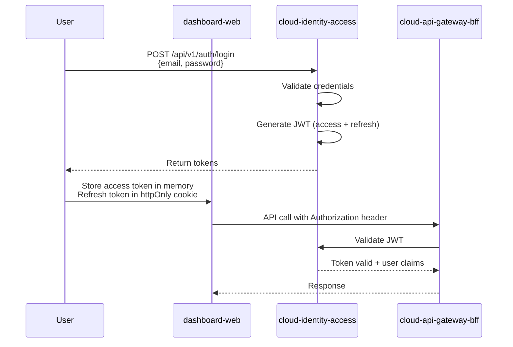
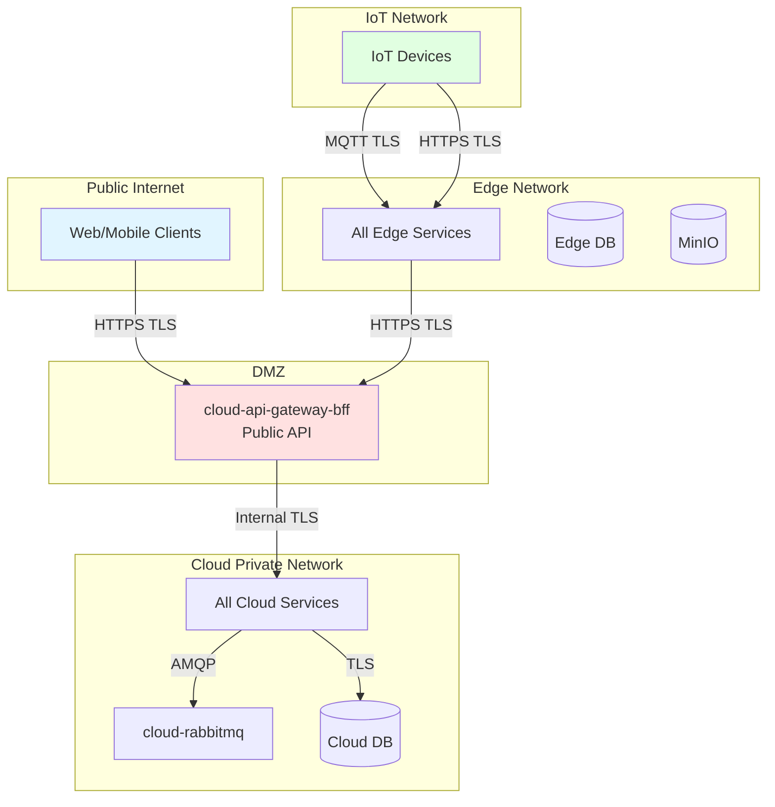

# Security Architecture

**Purpose**: Document security architecture, controls, and compliance requirements for FarmIQ platform  
**Scope**: Authentication, authorization, data protection, and security controls across all layers  
**Owner**: FarmIQ Architecture Team  
**Last updated**: 2026-02-05

---

## Table of Contents

1. [Overview](#1-overview)
2. [Authentication](#2-authentication)
3. [Authorization & RBAC](#3-authorization--rbac)
4. [Network Security](#4-network-security)
5. [Data Security](#5-data-security)
6. [IoT Device Security](#6-iot-device-security)
7. [Audit & Compliance](#7-audit--compliance)
8. [Security Controls](#8-security-controls)

---

## 1. Overview

FarmIQ implements defense-in-depth security across all three layers:

| Layer | Security Focus |
|-------|---------------|
| **IoT Layer** | Device authentication, secure MQTT, TLS |
| **Edge Layer** | Internal service communication, tenant isolation |
| **Cloud Layer** | Multi-tenant isolation, RBAC, API security |

### 1.1 Security Principles

| Principle | Description |
|-----------|-------------|
| **Zero Trust** | All requests are authenticated and authorized |
| **Least Privilege** | Services and users have minimum required permissions |
| **Defense in Depth** | Multiple security controls at each layer |
| **Tenant Isolation** | Strict multi-tenant data separation |
| **Audit Trail** | All write operations are logged with actor and trace ID |

### 1.2 Threat Model

| Threat | Mitigation |
|---------|-------------|
| Unauthorized device access | Device certificates, per-device credentials |
| Data exfiltration | TLS encryption, tenant isolation |
| Privilege escalation | RBAC enforcement, role-based access |
| Replay attacks | Event idempotency, deduplication |
| Insider threats | Audit logging, least privilege access |

---

## 2. Authentication

### 2.1 User Authentication

**Service**: `cloud-identity-access`

**Methods**:
| Phase | Method |
|-------|---------|
| MVP | Email/password with JWT tokens |
| Production | OIDC integration (Azure AD, Google, etc.) |

**Token Flow**:


**JWT Claims**:
```json
{
  "sub": "user-id",
  "tenant_id": "tenant-id",
  "roles": ["tenant_admin"],
  "exp": 1234567890,
  "iat": 1234567890
}
```

**Token Storage**:
| Token | Storage |
|--------|---------|
| Access Token | Memory (React Context / Redux state) |
| Refresh Token | `httpOnly` cookie (preferred) or `localStorage` |

### 2.2 Device Authentication

**Methods**:
| Method | Description |
|--------|-------------|
| **mTLS** | Mutual TLS with per-device client certificates (recommended) |
| **Username/Password + ACL** | Per-device credentials with topic ACLs |

**Provisioning**:
- Each device provisioned with unique identity
- Credentials stored securely (not in code)
- Rotation and revocation supported operationally

### 2.3 Service Authentication

**Internal Communication**:
- HTTP/gRPC between services uses internal service mesh
- No public exposure of internal endpoints
- Service-to-service authentication via service tokens or mTLS

---

## 3. Authorization & RBAC

### 3.1 Role Definitions

| Role | Description | Key Permissions |
|------|-------------|-----------------|
| `platform_admin` | System Owner | Manage Tenants, provisioning, global system health |
| `tenant_admin` | Farm Owner | Manage Farms, Users, Devices, Billing. Full access to own tenant |
| `farm_manager` | Vet / Manager | View all farm data, acknowledge alerts, edit thresholds. No user management |
| `house_operator` | Farm Hand | View telemetry, alerts, and sessions. Read-only mostly |
| `viewer` | Auditor / Guest | Read-only access to specific dashboard pages |
| `device_agent` | Machine identity | Used by edge services and IoT agents (no human UI permissions) |

### 3.2 RBAC Authorization Matrix

| Role | Tenant Registry R | Tenant Registry W | Telemetry R | Telemetry W | WeighVision R | WeighVision W | Media R | Media W | Analytics R | Analytics W |
|---|---:|---:|---:|---:|---:|---:|---:|---:|---:|---:|
| `platform_admin` | ✅ | ✅ | ✅ | ✅ | ✅ | ✅ | ✅ | ✅ | ✅ |
| `tenant_admin` | ✅ | ✅ | ✅ | ✅ | ✅ | ✅ | ✅ | ✅ | ✅ |
| `farm_manager` | ✅ | ⚠️ | ✅ | ❌ | ✅ | ⚠️ | ✅ | ⚠️ | ✅ | ⚠️ |
| `house_operator` | ✅ | ❌ | ✅ | ❌ | ✅ | ⚠️ | ✅ | ⚠️ | ✅ | ❌ |
| `viewer` | ✅ | ❌ | ✅ | ❌ | ✅ | ❌ | ✅ | ❌ | ✅ | ❌ |
| `device_agent` | ❌ | ❌ | ❌ | ✅ | ❌ | ✅ | ❌ | ⚠️ | ❌ |

**Legend:**
- ✅ = Full access
- ⚠️ = Limited access (scoped to assigned resources)
- ❌ = No access

### 3.3 Permission Matrix

| Action | Platform Admin | Tenant Admin | Farm Manager | House Operator | Viewer |
| :--- | :---: | :---: | :---: | :---: | :---: |
| **Create Tenant** | ✅ | ❌ | ❌ | ❌ | ❌ |
| **Create Farm** | ✅ | ✅ | ❌ | ❌ | ❌ |
| **Provision Device** | ✅ | ✅ | ❌ | ❌ | ❌ |
| **Acknowledge Alert** | ✅ | ✅ | ✅ | ❌ | ❌ |
| **View Telemetry** | ✅ | ✅ | ✅ | ✅ | ✅ |
| **Manage Users** | ✅ | ✅ | ❌ | ❌ | ❌ |
| **Send Notifications** | ✅ | ✅ | ✅ | ❌ | ❌ |

### 3.4 Scope Constraints

| Role | Write Scope Constraint |
|------|-------------------|
| `farm_manager` | Limited to assigned farms/barns |
| `house_operator` | Limited to assigned barns/houses and only operational actions |
| `device_agent` | Device → edge ingestion is MQTT-only; only HTTP allowed is media upload via presigned URL |

### 3.5 Enforcement

| Location | Enforcement |
|-----------|-------------|
| **API Gateway** | Tenant scoping, RBAC checks |
| **Service Layer** | Role-based access control |
| **Database** | Row-level security (tenant_id) |
| **Frontend** | Feature flags based on user roles |

### 3.6 Route Guards

```
Level 1: isAuthenticated → Redirect to /login if false
Level 2: hasRole → Redirect to /403 if false
Level 3: hasPermission → Hide/disable features
```

---

## 4. Network Security

### 4.1 TLS Requirements

| Connection | TLS Version | Certificate Type |
|-----------|-------------|-----------------|
| **IoT → Edge (MQTT)** | TLS 1.2+ | Device certificate or username/password |
| **IoT → Edge (HTTP)** | TLS 1.2+ | Server certificate |
| **Edge → Cloud (HTTPS)** | TLS 1.2+ | Mutual TLS or server certificate |
| **Client → Cloud (HTTPS)** | TLS 1.2+ | Server certificate |
| **Internal Services** | TLS 1.2+ (recommended) | Service mesh mTLS |

### 4.2 Network Segmentation



### 4.3 Firewall Rules

| Direction | Rule | Purpose |
|-----------|-------|---------|
| **Inbound to Cloud** | Allow 443/TCP from anywhere | Public API access |
| **Inbound to Edge** | Allow 1883/TCP, 8883/TCP from IoT network | MQTT access |
| **Inbound to Edge** | Allow 443/TCP from IoT network | Media upload |
| **Internal** | Allow all traffic between services | Service communication |
| **Outbound** | Allow required destinations only | Egress filtering |

---

## 5. Data Security

### 5.1 Encryption

| Data State | Encryption Method |
|-----------|-----------------|
| **In Transit** | TLS 1.2+ for all connections |
| **At Rest (DB)** | AES-256 encryption (platform policy) |
| **At Rest (Object Storage)** | S3 server-side encryption |
| **At Rest (PVC)** | Disk encryption (platform policy) |

### 5.2 Tenant Isolation

**Database Level**:
- All tables include `tenant_id` column
- Foreign keys enforce tenant-scoped relationships
- Row-level security (RLS) where applicable

**API Level**:
- All requests scoped by `tenant_id` query parameter or JWT claim
- RBAC enforces tenant-scoped access

**Application Level**:
- Services validate tenant ownership before operations
- Cross-tenant queries are prevented

### 5.3 Data Privacy

| Requirement | Implementation |
|-----------|---------------|
| **No PII in telemetry** | Only operational farm data collected |
| **No PII in media metadata** | Only technical metadata stored |
| **GDPR/PDPA compliance** | Data retention policies, right to deletion |
| **Audit access** | All data access logged with actor and timestamp |

### 5.4 Sensitive Data Handling

| Data Type | Handling |
|-----------|----------|
| **Passwords** | bcrypt hashing, never logged |
| **API Keys** | Secure storage, rotation policy |
| **Device Credentials** | Encrypted at rest, secure provisioning |
| **User Data** | Access logging, data retention policies |

---

## 6. IoT Device Security

### 6.1 Device Identity

| Requirement | Implementation |
|-----------|---------------|
| **Unique identity** | Each device has unique ID and credentials |
| **No shared credentials** | Per-device authentication only |
| **Rotation support** | Credentials can be rotated without re-provisioning |
| **Revocation support** | Compromised devices can be disabled |

### 6.2 MQTT Security

| Control | Implementation |
|---------|---------------|
| **TLS** | TLS 1.2+ required in production |
| **Authentication** | mTLS certificates or username/password |
| **Authorization (ACL)** | Topic-based access control per device |
| **LWT (Last Will)** | Publish "offline" status on disconnect |

### 6.3 Device Provisioning

| Step | Action |
|-------|--------|
| 1 | Generate unique device ID |
| 2 | Create device credentials (certificate or username/password) |
| 3 | Configure device with tenant/farm/barn IDs |
| 4 | Set up ACLs for MQTT topics |
| 5 | Deploy device with secure credentials |

### 6.4 Device Hardening

| Control | Implementation |
|---------|---------------|
| **Firmware updates** | Signed firmware, verification before install |
| **Secure boot** | Bootloader verification |
| **File system** | Read-only where possible |
| **Debug access** | Disabled in production |

---

## 7. Audit & Compliance

### 7.1 Audit Logging

| Event Type | Logged Fields |
|------------|--------------|
| **User login** | user_id, tenant_id, ip, timestamp, result |
| **API access** | user_id, tenant_id, endpoint, method, timestamp, result |
| **Data write** | actor, role, tenant_id, resource_id, action, trace_id |
| **Device events** | device_id, tenant_id, event_type, timestamp |
| **Configuration changes** | actor, resource, old_value, new_value, timestamp |

### 7.2 Audit Storage

| Location | Retention |
|----------|-----------|
| **Cloud audit logs** | 1-7 years (compliance requirement) |
| **Edge audit logs** | 30-90 days (local) |

### 7.3 Compliance Requirements

| Standard | Requirement | Implementation |
|----------|-------------|---------------|
| **GDPR** | Right to deletion, data portability | User deletion API, data export |
| **PDPA** | Data protection, consent | Data classification, access controls |
| **SOC 2** | Access controls, monitoring | RBAC, audit logging |
| **ISO 27001** | ISMS, risk management | Security policies, controls |

---

## 8. Security Controls

### 8.1 Input Validation

| Control | Implementation |
|---------|---------------|
| **API validation** | Zod (Node), Pydantic (Python) |
| **MQTT validation** | Envelope schema validation |
| **SQL injection prevention** | Parameterized queries, ORM usage |
| **XSS prevention** | No `dangerouslySetInnerHTML`, DOMPurify if needed |

### 8.2 Output Encoding

| Control | Implementation |
|---------|---------------|
| **JSON encoding** | Proper JSON serialization |
| **HTML encoding** | Context-aware encoding for web |
| **URL encoding** | Proper URL parameter encoding |

### 8.3 Rate Limiting

| Endpoint | Limit | Purpose |
|----------|--------|---------|
| **Public API** | Per-user limits | Prevent abuse |
| **MQTT** | Per-device limits | Prevent message flooding |
| **Media upload** | 10 MB per file, 10 presigns/min | Prevent storage abuse |

### 8.4 Secrets Management

| Secret | Storage | Rotation |
|--------|---------|----------|
| **Database credentials** | External secret manager (K8s secrets, AWS Secrets Manager) | Quarterly |
| **API keys** | External secret manager | Monthly |
| **Device certificates** | Secure provisioning system | On compromise or annually |
| **JWT signing keys** | External secret manager | Annually |

### 8.5 Monitoring & Alerting

| Metric | Alert Threshold | Response |
|---------|------------------|----------|
| **Failed auth attempts** | > 10/min per IP | Block IP |
| **Failed device auth** | > 5/min per device | Disable device |
| **Unauthorized API access** | > 100/min per tenant | Investigate |
| **Certificate expiration** | < 30 days | Renew certificate |
| **Security events** | Any critical | Immediate notification |

### 8.6 Incident Response

| Phase | Actions |
|-------|---------|
| **Detection** | Automated alerts from monitoring |
| **Containment** | Isolate affected systems, revoke credentials |
| **Eradication** | Remove malware, patch vulnerabilities |
| **Recovery** | Restore from backup, verify integrity |
| **Post-incident** | Root cause analysis, improve controls |

---

## Related Documents

- [Architecture Overview](./00-overview.md)
- [IoT Layer Architecture](./01-iot-layer.md)
- [Edge Layer Architecture](./02-edge-layer.md)
- [Cloud Layer Architecture](./03-cloud-layer.md)
- [Data Flows](./04-data-flows.md)
