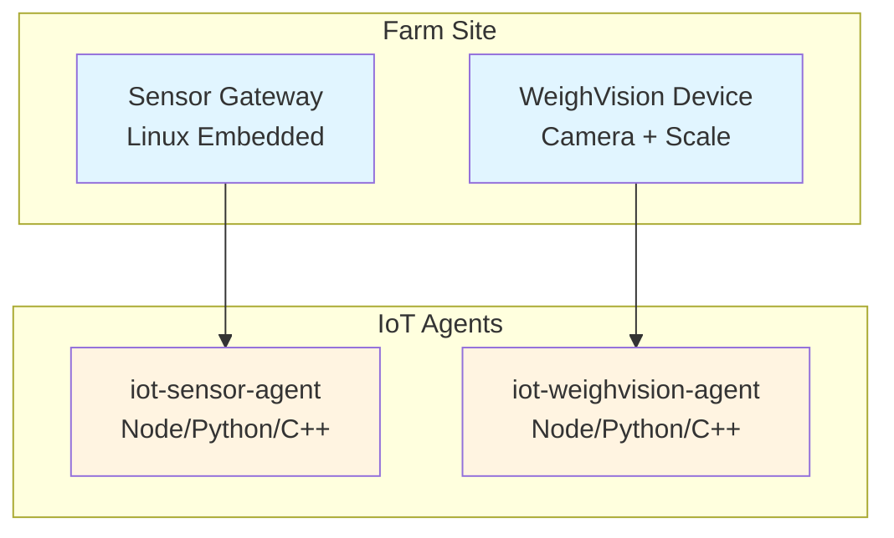
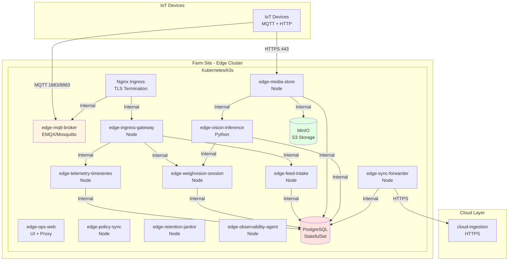
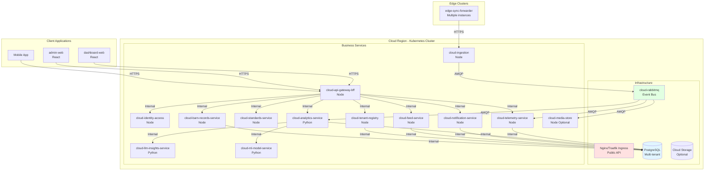
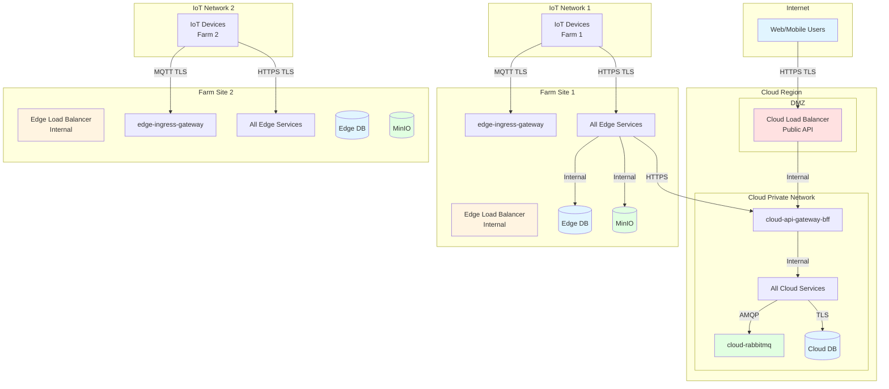

# Deployment Architecture

**Purpose**: Document deployment architecture for FarmIQ platform across all layers  
**Scope**: Kubernetes deployments, infrastructure components, and operational considerations  
**Owner**: FarmIQ Architecture Team  
**Last updated**: 2026-02-05

---

## Table of Contents

1. [Overview](#1-overview)
2. [IoT Layer Deployment](#2-iot-layer-deployment)
3. [Edge Layer Deployment](#3-edge-layer-deployment)
4. [Cloud Layer Deployment](#4-cloud-layer-deployment)
5. [Network Topology](#5-network-topology)
6. [Infrastructure Components](#6-infrastructure-components)
7. [Operational Considerations](#7-operational-considerations)
8. [Scaling Strategy](#8-scaling-strategy)
9. [Disaster Recovery](#9-disaster-recovery)

---

## 1. Overview

FarmIQ is deployed across three distinct environments:

| Layer | Deployment Type | Location | Scale |
|-------|---------------|--------|-------|
| **IoT Layer** | On-device / Gateway devices | Barns / Farms | Distributed |
| **Edge Layer** | Kubernetes/k3s clusters | Near barns (on-premise) | Per-farm or regional |
| **Cloud Layer** | Kubernetes clusters | Cloud provider (AWS/Azure/GCP) | Multi-tenant SaaS |

### 1.1 Deployment Environments

| Environment | Purpose | Isolation |
|-----------|---------|-----------|
| **Development** | Feature development and testing | Separate clusters per layer |
| **Staging** | Pre-production testing | Separate clusters per layer |
| **Production** | Live operations | Separate clusters per layer |

---

## 2. IoT Layer Deployment

### 2.1 Deployment Model

### 2.2 Device Specifications

| Component | Minimum Requirements | Recommended |
|-----------|-------------------|-------------|
| **CPU** | ARM Cortex-A7 or x86 equivalent | ARM Cortex-A53 or better |
| **Memory** | 128MB RAM | 256MB RAM |
| **Storage** | 512MB flash/storage | 1GB+ for offline buffering |
| **Network** | WiFi/Ethernet | WiFi/Ethernet with TLS 1.2+ support |
| **OS** | Embedded Linux (Yocto/Buildroot) | Embedded Linux |

### 2.3 Deployment Process

| Step | Action |
|-------|--------|
| 1 | Flash device firmware with IoT agents |
| 2 | Provision device credentials (certificates or username/password) |
| 3 | Configure tenant/farm/barn/device IDs |
| 4 | Set up MQTT broker connection details |
| 5 | Configure edge-media-store URL for presigned uploads |
| 6 | Verify connectivity to edge cluster |

### 2.4 Configuration Management

| Configuration | Storage | Update Method |
|-------------|--------|---------------|
| **Device IDs** | Config file (YAML/JSON) | Manual provisioning |
| **MQTT connection** | Config file | OTA updates |
| **Edge endpoints** | Config file | OTA updates |
| **Credentials** | Secure storage (TPM/secure element) | Certificate rotation |

---

## 3. Edge Layer Deployment

### 3.1 Deployment Architecture

### 3.2 Infrastructure Components

| Component | Purpose | Specifications |
|-----------|---------|---------------|
| **Kubernetes/k3s** | Container orchestration | k3s v1.28+ or K8s v1.25+ |
| **Ingress Controller** | External access | Nginx/Traefik with TLS termination |
| **PostgreSQL** | Shared database | PostgreSQL 14+, 2-4 vCPU, 8-16GB RAM |
| **MinIO** | S3-compatible object storage | 2-4 vCPU, 8-16GB RAM, 100GB+ storage |
| **Storage** | Persistent volumes | PVC with SSD/NVMe |

### 3.3 Service Deployments

| Service | Replicas | HPA | Resources |
|---------|---------|-----|----------|
| `edge-mqtt-broker` | 2 | Yes (3-10) | 200m/500m CPU, 256Mi/512Mi RAM |
| `edge-ingress-gateway` | 2 | Yes (2-5) | 200m/1 CPU, 256Mi/512Mi RAM |
| `edge-telemetry-timeseries` | 2 | Yes (2-10) | 500m/2 CPU, 512Mi/2Gi RAM |
| `edge-weighvision-session` | 2 | Yes (2-5) | 200m/1 CPU, 256Mi/512Mi RAM |
| `edge-media-store` | 2 | Yes (2-5) | 500m/2 CPU, 512Mi/1Gi RAM |
| `edge-vision-inference` | 2 | Yes (1-4) | 1 CPU/4 CPU, 1Gi/4Gi RAM |
| `edge-sync-forwarder` | 2 | Yes (2-10) | 200m/1 CPU, 256Mi/512Mi RAM |
| `edge-feed-intake` | 2 | Yes (2-5) | 200m/1 CPU, 256Mi/512Mi RAM |
| `edge-ops-web` | 1 | No | 100m/200m CPU, 128Mi/256Mi RAM |
| `edge-policy-sync` | 1 | No | 100m/200m CPU, 128Mi/256Mi RAM |
| `edge-retention-janitor` | 1 | No | 100m/200m CPU, 128Mi/256Mi RAM |
| `edge-observability-agent` | 1 | No | 100m/200m CPU, 128Mi/256Mi RAM |

### 3.4 Storage Requirements

| Component | Size | Type | Retention |
|-----------|------|------|-----------|
| **PostgreSQL PVC** | 50-200GB | SSD/NVMe | 30-90 days telemetry |
| **MinIO PVC** | 100-500GB | SSD/NVMe | 30-90 days media |
| **Logs PVC** | 10-50GB | SSD | 7-30 days |

### 3.5 Deployment Process

| Step | Action |
|-------|--------|
| 1 | Provision k3s cluster on farm hardware |
| 2 | Deploy PostgreSQL StatefulSet with PVC |
| 3 | Deploy MinIO with PVC |
| 4 | Deploy core services with Helm/Kustomize |
| 5 | Configure ingress controller with TLS certificates |
| 6 | Configure HPA rules for scalable services |
| 7 | Set up monitoring (Datadog/Prometheus) |
| 8 | Verify service health and connectivity |

---

## 4. Cloud Layer Deployment

### 4.1 Deployment Architecture

### 4.2 Infrastructure Components

| Component | Purpose | Specifications |
|-----------|---------|---------------|
| **Kubernetes** | Container orchestration | K8s v1.25+ |
| **Ingress Controller** | Public API access | Nginx/Traefik with TLS (Let's Encrypt/managed certs) |
| **PostgreSQL** | Multi-tenant database | PostgreSQL 14+, 4-16 vCPU, 16-64GB RAM, HA setup |
| **RabbitMQ** | Event bus | 2-4 vCPU, 4-8GB RAM, HA cluster |
| **Cloud Storage** | Optional media storage | S3/GS with lifecycle policies |
| **Monitoring** | Observability | Datadog/Prometheus/Grafana |

### 4.3 Service Deployments

| Service | Replicas | HPA | Resources |
|---------|---------|-----|----------|
| `cloud-api-gateway-bff` | 3 | Yes (3-20) | 500m/2 CPU, 512Mi/1Gi RAM |
| `cloud-identity-access` | 2 | Yes (2-5) | 200m/1 CPU, 256Mi/512Mi RAM |
| `cloud-tenant-registry` | 2 | Yes (2-5) | 200m/1 CPU, 256Mi/512Mi RAM |
| `cloud-standards-service` | 2 | Yes (2-5) | 200m/1 CPU, 256Mi/512Mi RAM |
| `cloud-ingestion` | 3 | Yes (3-20) | 500m/2 CPU, 512Mi/1Gi RAM |
| `cloud-telemetry-service` | 3 | Yes (3-20) | 500m/2 CPU, 512Mi/2Gi RAM |
| `cloud-analytics-service` | 2 | Yes (2-10) | 1 CPU/4 CPU, 1Gi/4Gi RAM |
| `cloud-llm-insights-service` | 2 | Yes (2-5) | 1 CPU/4 CPU, 1Gi/4Gi RAM |
| `cloud-ml-model-service` | 2 | Yes (1-5) | 1 CPU/4 CPU, 1Gi/4Gi RAM |
| `cloud-notification-service` | 2 | Yes (2-5) | 200m/1 CPU, 256Mi/512Mi RAM |
| `cloud-feed-service` | 2 | Yes (2-5) | 200m/1 CPU, 256Mi/512Mi RAM |
| `cloud-barn-records-service` | 2 | Yes (2-5) | 200m/1 CPU, 256Mi/512Mi RAM |
| `cloud-media-store` | 2 | Yes (2-5) | 500m/2 CPU, 512Mi/1Gi RAM |
| `cloud-rabbitmq` | 3 | No (manual scaling) | 2 vCPU/4 vCPU, 4Gi/8Gi RAM |

### 4.4 Storage Requirements

| Component | Size | Type | Retention |
|-----------|------|------|-----------|
| **PostgreSQL PVC** | 200GB-2TB | SSD with IOPS optimization | 2-7 years (compliance) |
| **Cloud Storage** | 1-10TB | S3/GS with lifecycle | 30-90 days media (optional) |
| **Logs PVC** | 50-200GB | SSD | 30-90 days |

### 4.5 Deployment Process

| Step | Action |
|-------|--------|
| 1 | Provision Kubernetes cluster in cloud |
| 2 | Deploy PostgreSQL with HA configuration |
| 3 | Deploy RabbitMQ cluster |
| 4 | Deploy core services with Helm/Kustomize |
| 5 | Configure ingress with TLS certificates |
| 6 | Configure HPA rules for all services |
| 7 | Set up monitoring and alerting |
| 8 | Run smoke tests and health checks |
| 9 | Configure DNS and load balancing |
| 10 | Deploy client applications (dashboard, admin) |

---

## 5. Network Topology

### 5.1 Complete Network Diagram

### 5.2 Network Segments

| Segment | CIDR | Purpose |
|---------|--------|---------|
| **Public Internet** | 0.0.0.0/0 | Client access |
| **Cloud DMZ** | 10.0.1.0/24 | Public-facing services |
| **Cloud Private** | 10.0.2.0/24 | Internal cloud services |
| **Edge Network 1** | 192.168.1.0/24 | Farm 1 edge cluster |
| **Edge Network 2** | 192.168.2.0/24 | Farm 2 edge cluster |
| **IoT Network 1** | 192.168.10.0/24 | Farm 1 IoT devices |
| **IoT Network 2** | 192.168.20.0/24 | Farm 2 IoT devices |

### 5.3 Firewall Rules

| Direction | Source | Destination | Port | Protocol | Purpose |
|-----------|--------|-------------|------|----------|
| **Inbound to Cloud** | Internet | Cloud LB | 443/TCP | HTTPS |
| **Inbound to Edge** | IoT Network | Edge Ingress | 1883/TCP | MQTT |
| **Inbound to Edge** | IoT Network | Edge Ingress | 8883/TCP | MQTT TLS |
| **Inbound to Edge** | IoT Network | Edge Services | 443/TCP | Media upload |
| **Internal Cloud** | Cloud Services | Cloud DB | 5432/TCP | PostgreSQL |
| **Internal Cloud** | Cloud Services | RabbitMQ | 5671-5672/TCP | AMQP |
| **Internal Edge** | Edge Services | Edge DB | 5432/TCP | PostgreSQL |
| **Outbound** | All | Internet | 443/TCP | HTTPS |

---

## 6. Infrastructure Components

### 6.1 Kubernetes Components

| Component | Version | Purpose |
|-----------|---------|---------|
| **API Server** | v1.25+ | Kubernetes API |
| **etcd** | 3.5+ | Cluster state store |
| **kube-proxy** | Latest | Service proxy |
| **Container Runtime** | containerd 1.6+ | Container execution |
| **CNI** | Calico/Flannel | Network plugin |

### 6.2 Storage Classes

| Storage Class | Type | Use Case |
|-------------|------|----------|
| **fast-ssd** | SSD with IOPS optimization | Database, high-performance |
| **standard-ssd** | Standard SSD | General workloads |
| **backup** | HDD/Cold storage | Backup archives |

### 6.3 ConfigMaps and Secrets

| Type | Purpose | Example |
|------|---------|---------|
| **ConfigMap** | Application configuration | Service URLs, feature flags |
| **Secret** | Sensitive data | Database credentials, API keys, certificates |

---

## 7. Operational Considerations

### 7.1 Health Checks

| Service | Health Endpoint | Ready Endpoint |
|---------|----------------|----------------|
| All Services | `GET /api/health` | `GET /api/ready` |
| **Health Check** | Process alive | Dependency checks (DB, S3, cloud) |
| **Probe Types** | Liveness probe | Readiness probe |

### 7.2 Monitoring

| Component | Tool | Metrics |
|-----------|------|---------|
| **Cluster** | Prometheus/Datadog | CPU, Memory, Disk, Network |
| **Services** | Datadog APM | Request latency, error rates, throughput |
| **Logs** | Datadog Logs | Structured JSON logs |
| **Alerts** | Datadog/Prometheus Alertmanager | Threshold-based alerts |

### 7.3 Backup Strategy

| Component | Backup Type | Frequency | Retention |
|-----------|-------------|-----------|-----------|
| **Cloud DB** | WAL archiving + snapshots | Continuous + daily | 30 days |
| **Edge DB** | Snapshots | Daily | 30 days |
| **MinIO** | PV snapshots | Daily | 7-30 days |
| **Config** | Git version control | Per change | Indefinite |

### 7.4 Update Strategy

| Component | Strategy | Downtime |
|-----------|----------|-----------|
| **IoT Agents** | OTA firmware updates | Per-device (minimal) |
| **Edge Services** | Rolling updates | Zero downtime |
| **Cloud Services** | Rolling updates | Zero downtime |
| **Database** | Online migrations | Minimal impact |

---

## 8. Scaling Strategy

### 8.1 Horizontal Pod Autoscaler (HPA)

| Service | Min Replicas | Max Replicas | Target Metric |
|---------|---------------|---------------|---------------|
| `cloud-api-gateway-bff` | 3 | 20 | CPU 70% |
| `cloud-ingestion` | 3 | 20 | CPU 70% |
| `cloud-telemetry-service` | 3 | 20 | CPU 70% |
| `edge-sync-forwarder` | 2 | 10 | Outbox backlog > 1000 |
| `edge-telemetry-timeseries` | 2 | 10 | CPU 70% |

### 8.2 Vertical Scaling

| Component | Scaling Approach |
|-----------|-----------------|
| **PostgreSQL** | Read replicas, connection pooling |
| **RabbitMQ** | Queue mirroring, federation |
| **MinIO** | Distributed gateway mode |

### 8.3 Cluster Autoscaler

| Environment | Node Min | Node Max | Scale Metric |
|-----------|----------|----------|-------------|
| **Cloud Production** | 3 | 50 | CPU 70%, Memory 80% |
| **Edge Production** | 1 | 3 | CPU 70%, Memory 80% |

---

## 9. Disaster Recovery

### 9.1 RPO/RTO Targets

| Component | RPO | RTO |
|-----------|------|------|
| **Cloud DB** | 15 minutes | 2-4 hours |
| **Edge DB** | 60 minutes | 2 hours |
| **Configuration** | Real-time | 30 minutes |

### 9.2 Recovery Procedures

| Scenario | Recovery Steps |
|-----------|---------------|
| **Pod failure** | Kubernetes auto-restarts pod |
| **Node failure** | Cluster autoscaler provisions new node |
| **Zone failure** | Multi-zone deployment maintains availability |
| **Region failure** | Failover to DR region |
| **Data corruption** | Restore from backup snapshots |

### 9.3 High Availability Setup

| Component | HA Configuration |
|-----------|-----------------|
| **PostgreSQL** | Primary + standby replicas |
| **RabbitMQ** | Cluster mode (3 nodes) |
| **Kubernetes** | Multi-master control plane |
| **Edge Cluster** | Optional 2-node setup for critical farms |

---

## Related Documents

- [Architecture Overview](./00-overview.md)
- [IoT Layer Architecture](./01-iot-layer.md)
- [Edge Layer Architecture](./02-edge-layer.md)
- [Cloud Layer Architecture](./03-cloud-layer.md)
- [Security Architecture](./05-security.md)
