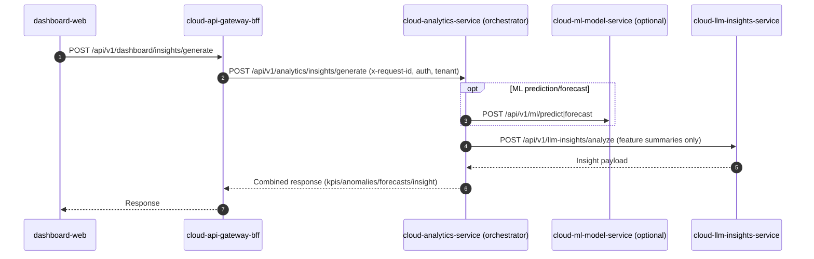

Purpose: Provide an overview of the FarmIQ cloud layer and its core responsibilities.  
Scope: Cloud services, multi-tenant responsibilities, RabbitMQ event bus, and cloud persistence patterns.  
Owner: FarmIQ Cloud Team  
Last updated: 2025-12-27  

---

## Cloud-layer overview

The cloud layer is the central, multi-tenant platform for FarmIQ. It provides:
- Public APIs for dashboards and integrations.
- Multi-tenant master data management (tenant/farm/barn/batch/device).
- Durable telemetry storage and query.
- Analytics and derived KPIs.
- Optional cloud media retention (PVC-based, not object storage).

Key characteristics:
- Kubernetes-based, horizontally scalable stateless services.
- **RabbitMQ** is the cloud event bus (`cloud-rabbitmq`) for internal events.
- Strong security posture via OIDC/JWT + RBAC.

---

## Canonical cloud services (MVP)

Infrastructure:
- `cloud-rabbitmq`

Business services:
- `cloud-api-gateway-bff` (Node)
- `cloud-identity-access` (Node)
- `cloud-tenant-registry` (Node)
- `cloud-standards-service` (Node)
- `cloud-ingestion` (Node)
- `cloud-telemetry-service` (Node)
- `cloud-analytics-service` (Python; insights orchestrator)
- `cloud-llm-insights-service` (Python)
- `cloud-ml-model-service` (optional; Python)
- `cloud-media-store` (optional; PVC-based)

Ownership guards:
- **Cloud ingress owner**: `cloud-ingestion` ONLY.
- **Multi-tenant master data owner**: `cloud-tenant-registry`.

---

## Cloud message flow

1. `edge-sync-forwarder` sends batched events to `cloud-ingestion` over HTTPS.
2. `cloud-ingestion` validates and deduplicates by `(tenant_id, event_id)`.
3. `cloud-ingestion` publishes events to `cloud-rabbitmq`.
4. Consumers (`cloud-telemetry-service`, `cloud-analytics-service`, optional `cloud-media-store`) process events idempotently and write to their owned stores.

---

## Synchronous insight flow (dashboard → orchestrator → ML/LLM)

This flow is **synchronous** and **user-driven** (e.g., a dashboard page requests an "insight" for a time window).

1. `dashboard-web` calls `cloud-api-gateway-bff`.
2. `cloud-api-gateway-bff` calls `cloud-analytics-service` orchestrator endpoints.
3. `cloud-analytics-service` aggregates feature summaries (KPIs/anomalies/forecasts) and:
   - optionally calls `cloud-ml-model-service` (predictions/forecasts), and
   - calls `cloud-llm-insights-service` to generate the final structured insight.
4. `cloud-analytics-service` returns a combined response (KPIs + anomalies + forecasts + insight) to the BFF.

Important guardrails:
- `cloud-llm-insights-service` MUST NOT receive raw telemetry; it only receives **feature summaries** produced by analytics.
- All requests enforce tenant scope + RBAC and propagate `x-request-id` end-to-end.

---

## In-app Notification (MVP) flow

This flow produces in-app dashboard notifications related to insights (and other events).

- **Inbox listing (dashboard)**:
  1. `dashboard-web` calls `cloud-api-gateway-bff`.
  2. `cloud-api-gateway-bff` calls `cloud-notification-service` inbox endpoint to fetch notifications for the current user/roles.
- **Insight → Notification creation (best-effort)**:
  1. `dashboard-web` calls `cloud-api-gateway-bff` to generate an insight.
  2. `cloud-api-gateway-bff` calls `cloud-analytics-service` orchestrator.
  3. `cloud-analytics-service` calls `cloud-llm-insights-service` to generate the insight.
  4. `cloud-analytics-service` (or a worker) calls `cloud-notification-service` to create an in-app notification referencing the insight.

Notes:
- Notification creation is **best-effort** and MUST NOT block the main insight response (do not fail insights when notification creation fails).
- Notification service targets are evaluated against the current user (userId + roles) and optional topic filters (see `cloud-notification-service/openapi.yaml`).

---

## Implementation starting points (boilerplates)

- Node cloud services: `boilerplates/Backend-node`
  - Express + TypeScript
  - Prisma migrations
  - Winston JSON logging
  - Datadog tracing via `dd-trace`
- Python cloud services: `boilerplates/Backend-python`
  - FastAPI + Uvicorn
  - Pydantic models
  - JSON structured logging
- Dashboard: `boilerplates/Frontend`
  - React + Vite + Redux
  - Optional Datadog RUM integration

---

## Implementation Notes

- All cloud HTTP APIs MUST use base path `/api`, include `GET /api/health`, and provide `/api-docs` where applicable.
- No external in-memory cache/session store and no object storage are allowed; any long-term storage must be RDBMS and PVC filesystem.

## Links

- `cloud-layer/01-cloud-services.md`
- `cloud-layer/02-dashboard.md`
- `shared/00-api-catalog.md`

---

## Doc Change Summary (2025-12-27)

- Added the synchronous insight generation flow (BFF → analytics orchestrator → optional ML → LLM insights).
- Added service list entries for `cloud-llm-insights-service` and optional `cloud-ml-model-service`.
- Added the in-app notification flow (BFF inbox via `cloud-notification-service` + best-effort insight-triggered notification creation).

## Next Implementation Steps

1) Implement `cloud-llm-insights-service`.  
2) Add insights orchestrator endpoints to `cloud-analytics-service`.  
3) Add BFF proxy endpoints for dashboard insights.  
4) Implement `cloud-ml-model-service` (optional).  

