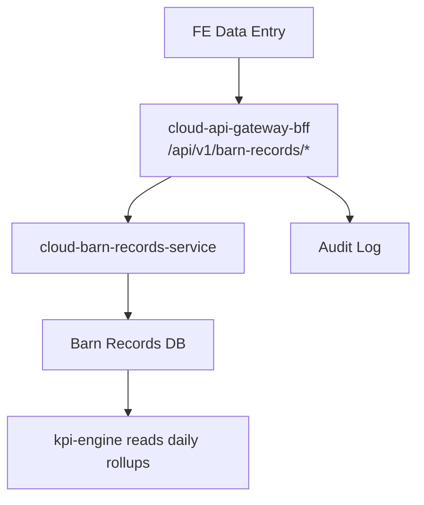

# Cloud Barn Records Service (cloud-barn-records-service)

## Purpose
Define the cloud service that owns barn health, welfare, housing, and genetic records used by operations and KPI adjustments.

## Scope
- Health management records (morbidity, vaccine, treatment, mortality, cull, daily count)
- Welfare indicators (gait, lesion, behavior checks)
- Housing conditions (stocking density, bedding, ventilation, temperature/humidity overrides)
- Genetic factors (strain/breed line per batch)

## Non-goals
- Feed intake records (owned by cloud-feed-service)
- KPI computation logic (owned by kpi-engine)

## Architecture and Data Flow

## Data Model (Cloud DB)

### Table: barn_morbidity_event
| column | type | null | default | constraints | index | description |
|---|---|---|---|---|---|---|
| id | uuidv7 | no | gen_random_uuid() | pk | pk | Morbidity event id |
| tenant_id | uuidv7 | no | none | fk tenant | idx (tenant_id, occurred_at) | Tenant scope |
| farm_id | uuidv7 | no | none | fk farm | idx (tenant_id, farm_id, occurred_at) | Farm scope |
| barn_id | uuidv7 | no | none | fk barn | idx (tenant_id, barn_id, occurred_at) | Barn scope |
| batch_id | uuidv7 | yes | null | fk batch | idx (tenant_id, batch_id, occurred_at) | Batch scope |
| occurred_at | timestamptz | no | none | none | idx (tenant_id, occurred_at desc) | Occurrence time |
| disease_code | text | yes | null | none | idx (tenant_id, disease_code) | Disease code |
| severity | text | yes | null | check in (low, medium, high) | none | Severity |
| animal_count | int | no | none | check >= 0 | none | Affected count |
| notes | text | yes | null | none | none | Notes |
| created_by_user_id | uuidv7 | yes | null | none | idx (tenant_id, created_by_user_id) | Actor id |
| created_at | timestamptz | no | now() | none | idx (tenant_id, created_at desc) | Created time |
| external_ref | text | yes | null | unique (tenant_id, external_ref) | uniq (tenant_id, external_ref) | External reference |
| event_id | uuidv7 | yes | null | unique (tenant_id, event_id) | uniq (tenant_id, event_id) | Event id |

### Table: barn_mortality_event
| column | type | null | default | constraints | index | description |
|---|---|---|---|---|---|---|
| id | uuidv7 | no | gen_random_uuid() | pk | pk | Mortality event id |
| tenant_id | uuidv7 | no | none | fk tenant | idx (tenant_id, occurred_at) | Tenant scope |
| farm_id | uuidv7 | no | none | fk farm | idx (tenant_id, farm_id, occurred_at) | Farm scope |
| barn_id | uuidv7 | no | none | fk barn | idx (tenant_id, barn_id, occurred_at) | Barn scope |
| batch_id | uuidv7 | yes | null | fk batch | idx (tenant_id, batch_id, occurred_at) | Batch scope |
| occurred_at | timestamptz | no | none | none | idx (tenant_id, occurred_at desc) | Occurrence time |
| cause_code | text | yes | null | none | idx (tenant_id, cause_code) | Cause code |
| animal_count | int | no | none | check >= 0 | none | Count |
| disposal_method | text | yes | null | none | none | Disposal method |
| notes | text | yes | null | none | none | Notes |
| created_by_user_id | uuidv7 | yes | null | none | idx (tenant_id, created_by_user_id) | Actor id |
| created_at | timestamptz | no | now() | none | idx (tenant_id, created_at desc) | Created time |
| external_ref | text | yes | null | unique (tenant_id, external_ref) | uniq (tenant_id, external_ref) | External reference |
| event_id | uuidv7 | yes | null | unique (tenant_id, event_id) | uniq (tenant_id, event_id) | Event id |

### Table: barn_cull_event
| column | type | null | default | constraints | index | description |
|---|---|---|---|---|---|---|
| id | uuidv7 | no | gen_random_uuid() | pk | pk | Cull event id |
| tenant_id | uuidv7 | no | none | fk tenant | idx (tenant_id, occurred_at) | Tenant scope |
| farm_id | uuidv7 | no | none | fk farm | idx (tenant_id, farm_id, occurred_at) | Farm scope |
| barn_id | uuidv7 | no | none | fk barn | idx (tenant_id, barn_id, occurred_at) | Barn scope |
| batch_id | uuidv7 | yes | null | fk batch | idx (tenant_id, batch_id, occurred_at) | Batch scope |
| occurred_at | timestamptz | no | none | none | idx (tenant_id, occurred_at desc) | Occurrence time |
| reason_code | text | yes | null | none | idx (tenant_id, reason_code) | Reason code |
| animal_count | int | no | none | check >= 0 | none | Count |
| notes | text | yes | null | none | none | Notes |
| created_by_user_id | uuidv7 | yes | null | none | idx (tenant_id, created_by_user_id) | Actor id |
| created_at | timestamptz | no | now() | none | idx (tenant_id, created_at desc) | Created time |
| external_ref | text | yes | null | unique (tenant_id, external_ref) | uniq (tenant_id, external_ref) | External reference |
| event_id | uuidv7 | yes | null | unique (tenant_id, event_id) | uniq (tenant_id, event_id) | Event id |

### Table: barn_vaccine_event
| column | type | null | default | constraints | index | description |
|---|---|---|---|---|---|---|
| id | uuidv7 | no | gen_random_uuid() | pk | pk | Vaccine event id |
| tenant_id | uuidv7 | no | none | fk tenant | idx (tenant_id, occurred_at) | Tenant scope |
| farm_id | uuidv7 | no | none | fk farm | idx (tenant_id, farm_id, occurred_at) | Farm scope |
| barn_id | uuidv7 | no | none | fk barn | idx (tenant_id, barn_id, occurred_at) | Barn scope |
| batch_id | uuidv7 | yes | null | fk batch | idx (tenant_id, batch_id, occurred_at) | Batch scope |
| occurred_at | timestamptz | no | none | none | idx (tenant_id, occurred_at desc) | Occurrence time |
| vaccine_name | text | no | none | none | idx (tenant_id, vaccine_name) | Vaccine name |
| dose_ml | numeric(8,2) | yes | null | check >= 0 | none | Dose |
| route | text | yes | null | none | none | Route (IM, SC, oral) |
| administered_by | text | yes | null | none | none | Administrator |
| animal_count | int | no | none | check >= 0 | none | Count |
| notes | text | yes | null | none | none | Notes |
| created_at | timestamptz | no | now() | none | idx (tenant_id, created_at desc) | Created time |
| external_ref | text | yes | null | unique (tenant_id, external_ref) | uniq (tenant_id, external_ref) | External reference |
| event_id | uuidv7 | yes | null | unique (tenant_id, event_id) | uniq (tenant_id, event_id) | Event id |

### Table: barn_treatment_event
| column | type | null | default | constraints | index | description |
|---|---|---|---|---|---|---|
| id | uuidv7 | no | gen_random_uuid() | pk | pk | Treatment event id |
| tenant_id | uuidv7 | no | none | fk tenant | idx (tenant_id, occurred_at) | Tenant scope |
| farm_id | uuidv7 | no | none | fk farm | idx (tenant_id, farm_id, occurred_at) | Farm scope |
| barn_id | uuidv7 | no | none | fk barn | idx (tenant_id, barn_id, occurred_at) | Barn scope |
| batch_id | uuidv7 | yes | null | fk batch | idx (tenant_id, batch_id, occurred_at) | Batch scope |
| occurred_at | timestamptz | no | none | none | idx (tenant_id, occurred_at desc) | Occurrence time |
| treatment_name | text | no | none | none | idx (tenant_id, treatment_name) | Treatment name |
| dose_ml | numeric(8,2) | yes | null | check >= 0 | none | Dose |
| route | text | yes | null | none | none | Route |
| duration_days | int | yes | null | check >= 0 | none | Duration |
| animal_count | int | no | none | check >= 0 | none | Count |
| withdrawal_days | int | yes | null | check >= 0 | none | Withdrawal period |
| notes | text | yes | null | none | none | Notes |
| created_at | timestamptz | no | now() | none | idx (tenant_id, created_at desc) | Created time |
| external_ref | text | yes | null | unique (tenant_id, external_ref) | uniq (tenant_id, external_ref) | External reference |
| event_id | uuidv7 | yes | null | unique (tenant_id, event_id) | uniq (tenant_id, event_id) | Event id |

### Table: barn_daily_count
| column | type | null | default | constraints | index | description |
|---|---|---|---|---|---|---|
| id | uuidv7 | no | gen_random_uuid() | pk | pk | Daily count id |
| tenant_id | uuidv7 | no | none | fk tenant | idx (tenant_id, record_date) | Tenant scope |
| farm_id | uuidv7 | no | none | fk farm | idx (tenant_id, farm_id, record_date) | Farm scope |
| barn_id | uuidv7 | no | none | fk barn | idx (tenant_id, barn_id, record_date) | Barn scope |
| batch_id | uuidv7 | yes | null | fk batch | idx (tenant_id, batch_id, record_date) | Batch scope |
| record_date | date | no | none | unique (tenant_id, barn_id, record_date) | uniq (tenant_id, barn_id, record_date) | Record date |
| animal_count | int | no | none | check >= 0 | none | Total count |
| average_weight_kg | numeric(10,3) | yes | null | check >= 0 | none | Average weight |
| mortality_count | int | yes | 0 | check >= 0 | none | Mortality count |
| cull_count | int | yes | 0 | check >= 0 | none | Cull count |
| created_at | timestamptz | no | now() | none | idx (tenant_id, created_at desc) | Created time |
| external_ref | text | yes | null | unique (tenant_id, external_ref) | uniq (tenant_id, external_ref) | External reference |

### Table: barn_welfare_check
| column | type | null | default | constraints | index | description |
|---|---|---|---|---|---|---|
| id | uuidv7 | no | gen_random_uuid() | pk | pk | Welfare check id |
| tenant_id | uuidv7 | no | none | fk tenant | idx (tenant_id, occurred_at) | Tenant scope |
| farm_id | uuidv7 | no | none | fk farm | idx (tenant_id, farm_id, occurred_at) | Farm scope |
| barn_id | uuidv7 | no | none | fk barn | idx (tenant_id, barn_id, occurred_at) | Barn scope |
| batch_id | uuidv7 | yes | null | fk batch | idx (tenant_id, batch_id, occurred_at) | Batch scope |
| occurred_at | timestamptz | no | none | none | idx (tenant_id, occurred_at desc) | Occurrence time |
| gait_score | int | yes | null | check between 0 and 5 | none | Gait score |
| lesion_score | int | yes | null | check between 0 and 5 | none | Lesion score |
| behavior_score | int | yes | null | check between 0 and 5 | none | Behavior score |
| observer | text | yes | null | none | none | Observer name |
| notes | text | yes | null | none | none | Notes |
| created_at | timestamptz | no | now() | none | idx (tenant_id, created_at desc) | Created time |
| external_ref | text | yes | null | unique (tenant_id, external_ref) | uniq (tenant_id, external_ref) | External reference |

### Table: barn_housing_condition
| column | type | null | default | constraints | index | description |
|---|---|---|---|---|---|---|
| id | uuidv7 | no | gen_random_uuid() | pk | pk | Housing condition id |
| tenant_id | uuidv7 | no | none | fk tenant | idx (tenant_id, occurred_at) | Tenant scope |
| farm_id | uuidv7 | no | none | fk farm | idx (tenant_id, farm_id, occurred_at) | Farm scope |
| barn_id | uuidv7 | no | none | fk barn | idx (tenant_id, barn_id, occurred_at) | Barn scope |
| occurred_at | timestamptz | no | none | none | idx (tenant_id, occurred_at desc) | Occurrence time |
| stocking_density | numeric(8,2) | yes | null | check >= 0 | none | Animals per sqm |
| bedding_type | text | yes | null | none | none | Bedding type |
| ventilation_mode | text | yes | null | none | none | Ventilation mode |
| temperature_c | numeric(5,2) | yes | null | none | none | Temperature override |
| humidity_pct | numeric(5,2) | yes | null | check between 0 and 100 | none | Humidity override |
| ammonia_ppm | numeric(8,2) | yes | null | check >= 0 | none | Ammonia reading |
| notes | text | yes | null | none | none | Notes |
| created_at | timestamptz | no | now() | none | idx (tenant_id, created_at desc) | Created time |
| external_ref | text | yes | null | unique (tenant_id, external_ref) | uniq (tenant_id, external_ref) | External reference |

### Table: barn_genetic_profile
| column | type | null | default | constraints | index | description |
|---|---|---|---|---|---|---|
| id | uuidv7 | no | gen_random_uuid() | pk | pk | Genetic profile id |
| tenant_id | uuidv7 | no | none | fk tenant | idx (tenant_id, batch_id) | Tenant scope |
| batch_id | uuidv7 | no | none | fk batch | uniq (tenant_id, batch_id) | Batch scope |
| strain | text | yes | null | none | none | Strain |
| breed_line | text | yes | null | none | none | Breed line |
| supplier | text | yes | null | none | none | Supplier |
| hatch_date | date | yes | null | none | none | Hatch date |
| created_at | timestamptz | no | now() | none | idx (tenant_id, created_at desc) | Created time |
| external_ref | text | yes | null | unique (tenant_id, external_ref) | uniq (tenant_id, external_ref) | External reference |

## API / Contracts Summary
- See `../contracts/barn-records-service.contract.md` for HTTP endpoints and OpenAPI snippets.

## Edge / Cloud Responsibilities
- Edge does not own barn records; all records are cloud-owned.
- Cloud-barn-records-service is the source of truth and emits events to RabbitMQ.

## Security, Compliance, Observability, Operations
- AuthN/AuthZ: JWT/OIDC with RBAC; enforce tenant and barn scope.
- Idempotency: `event_id` or `Idempotency-Key` for creates.
- Audit logging: required on all write endpoints.
- Observability: track create rate per record type, validation errors, and query latency.
- Retention: partition large tables by `occurred_at` or `record_date` monthly.
- GDPR/PDPA: avoid PII and use operational identifiers only.

## Testing and Verification
- Verify unique constraints prevent duplicate daily counts.
- Verify KPI engine reads daily_count and mortality for adjustments.

## Open Questions
1) Are welfare checks required daily or ad-hoc per barn?
2) Should housing conditions allow bulk import from CSV?

## Checklist Counter
- Mermaid: 1/1
- Endpoints Table Rows: 0/0
- DB Column Rows: 118/118
- Examples: 0/0
- Open Questions: 2/2
