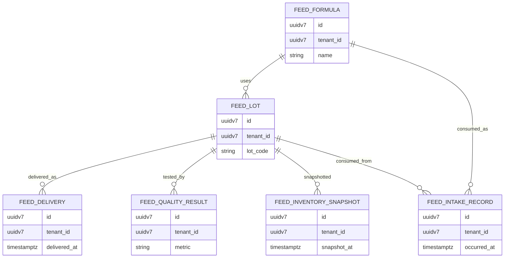

# Cloud Feed Service (cloud-feed-service)

## Purpose
Define the cloud service that owns feed master data and authoritative feed intake records used by the Feeding module and KPI engine.

## Scope
- Feed master data: formulas, lots, deliveries, quality results
- Feed intake records (authoritative, idempotent)
- Feed program and inventory snapshot (optional)

## Non-goals
- Edge ingestion mechanics (see edge feed intake doc)
- KPI computation algorithms (see KPI engine doc)

## Architecture and Data Flow

## Data Model (Cloud DB)

### Table: feed_formula
| column | type | null | default | constraints | index | description |
|---|---|---|---|---|---|---|
| id | uuidv7 | no | gen_random_uuid() | pk | pk | Formula id |
| tenant_id | uuidv7 | no | none | fk tenant | idx (tenant_id, name) | Tenant scope |
| name | text | no | none | unique (tenant_id, name) | uniq (tenant_id, name) | Formula name |
| species | text | yes | null | check in (broiler, layer, swine, fish) | idx (tenant_id, species) | Species applicability |
| phase | text | yes | null | none | idx (tenant_id, phase) | Growth phase |
| energy_kcal_per_kg | numeric(8,2) | yes | null | check >= 0 | none | Energy density |
| protein_pct | numeric(5,2) | yes | null | check between 0 and 100 | none | Protein percentage |
| fiber_pct | numeric(5,2) | yes | null | check between 0 and 100 | none | Fiber percentage |
| fat_pct | numeric(5,2) | yes | null | check between 0 and 100 | none | Fat percentage |
| status | text | no | active | check in (active, inactive) | idx (tenant_id, status) | Status |
| created_at | timestamptz | no | now() | none | idx (tenant_id, created_at desc) | Created time |
| updated_at | timestamptz | no | now() | none | idx (tenant_id, updated_at desc) | Updated time |
| external_ref | text | yes | null | unique (tenant_id, external_ref) | uniq (tenant_id, external_ref) | External reference |

### Table: feed_lot
| column | type | null | default | constraints | index | description |
|---|---|---|---|---|---|---|
| id | uuidv7 | no | gen_random_uuid() | pk | pk | Lot id |
| tenant_id | uuidv7 | no | none | fk tenant | idx (tenant_id, lot_code) | Tenant scope |
| farm_id | uuidv7 | no | none | fk farm | idx (tenant_id, farm_id, received_date) | Farm scope |
| supplier_name | text | yes | null | none | none | Supplier |
| lot_code | text | no | none | unique (tenant_id, lot_code) | uniq (tenant_id, lot_code) | Lot code |
| feed_formula_id | uuidv7 | yes | null | fk feed_formula | idx (tenant_id, feed_formula_id) | Formula link |
| manufacture_date | date | yes | null | none | none | Manufacture date |
| received_date | date | yes | null | none | idx (tenant_id, received_date) | Receipt date |
| quantity_kg | numeric(12,3) | yes | null | check >= 0 | none | Total quantity |
| remaining_kg | numeric(12,3) | yes | null | check >= 0 | none | Remaining quantity |
| status | text | no | active | check in (active, archived) | idx (tenant_id, status) | Status |
| created_at | timestamptz | no | now() | none | idx (tenant_id, created_at desc) | Created time |
| updated_at | timestamptz | no | now() | none | idx (tenant_id, updated_at desc) | Updated time |
| external_ref | text | yes | null | unique (tenant_id, external_ref) | uniq (tenant_id, external_ref) | External reference |

### Table: feed_delivery
| column | type | null | default | constraints | index | description |
|---|---|---|---|---|---|---|
| id | uuidv7 | no | gen_random_uuid() | pk | pk | Delivery id |
| tenant_id | uuidv7 | no | none | fk tenant | idx (tenant_id, delivered_at) | Tenant scope |
| farm_id | uuidv7 | no | none | fk farm | idx (tenant_id, farm_id, delivered_at) | Farm scope |
| barn_id | uuidv7 | yes | null | fk barn | idx (tenant_id, barn_id, delivered_at) | Barn scope |
| feed_lot_id | uuidv7 | no | none | fk feed_lot | idx (tenant_id, feed_lot_id) | Lot reference |
| delivery_ref | text | yes | null | unique (tenant_id, delivery_ref) | uniq (tenant_id, delivery_ref) | Supplier delivery ref |
| delivered_at | timestamptz | no | none | none | idx (tenant_id, delivered_at desc) | Delivery time |
| quantity_kg | numeric(12,3) | no | none | check >= 0 | none | Delivered quantity |
| unit_cost | numeric(12,2) | yes | null | check >= 0 | none | Cost per kg |
| currency | text | yes | null | none | none | Currency code |
| created_at | timestamptz | no | now() | none | idx (tenant_id, created_at desc) | Created time |
| updated_at | timestamptz | no | now() | none | idx (tenant_id, updated_at desc) | Updated time |
| external_ref | text | yes | null | unique (tenant_id, external_ref) | uniq (tenant_id, external_ref) | External reference |

### Table: feed_quality_result
| column | type | null | default | constraints | index | description |
|---|---|---|---|---|---|---|
| id | uuidv7 | no | gen_random_uuid() | pk | pk | Quality result id |
| tenant_id | uuidv7 | no | none | fk tenant | idx (tenant_id, sampled_at) | Tenant scope |
| feed_lot_id | uuidv7 | no | none | fk feed_lot | idx (tenant_id, feed_lot_id) | Lot reference |
| sampled_at | timestamptz | no | none | none | idx (tenant_id, sampled_at desc) | Sample time |
| metric | text | no | none | none | idx (tenant_id, metric) | Metric name |
| value | numeric(12,4) | no | none | check >= 0 | none | Metric value |
| unit | text | yes | null | none | none | Unit of measure |
| method | text | yes | null | none | none | Test method |
| status | text | no | valid | check in (valid, rejected) | idx (tenant_id, status) | Validation status |
| created_at | timestamptz | no | now() | none | idx (tenant_id, created_at desc) | Created time |
| updated_at | timestamptz | no | now() | none | idx (tenant_id, updated_at desc) | Updated time |
| external_ref | text | yes | null | unique (tenant_id, external_ref) | uniq (tenant_id, external_ref) | External reference |

### Table: feed_intake_record
| column | type | null | default | constraints | index | description |
|---|---|---|---|---|---|---|
| id | uuidv7 | no | gen_random_uuid() | pk | pk | Intake record id |
| tenant_id | uuidv7 | no | none | fk tenant | idx (tenant_id, occurred_at desc) | Tenant scope |
| farm_id | uuidv7 | no | none | fk farm | idx (tenant_id, farm_id, occurred_at) | Farm scope |
| barn_id | uuidv7 | no | none | fk barn | idx (tenant_id, barn_id, occurred_at) | Barn scope |
| batch_id | uuidv7 | yes | null | fk batch | idx (tenant_id, batch_id, occurred_at) | Batch scope |
| device_id | uuidv7 | yes | null | fk device | idx (tenant_id, device_id, occurred_at) | Device scope |
| source | text | no | none | check in (MANUAL, API_IMPORT, SILO_AUTO) | idx (tenant_id, source, occurred_at) | Intake source |
| feed_formula_id | uuidv7 | yes | null | fk feed_formula | idx (tenant_id, feed_formula_id) | Formula reference |
| feed_lot_id | uuidv7 | yes | null | fk feed_lot | idx (tenant_id, feed_lot_id) | Lot reference |
| quantity_kg | numeric(12,3) | no | none | check >= 0 | none | Intake quantity |
| occurred_at | timestamptz | no | none | none | idx (tenant_id, occurred_at desc) | Occurrence time |
| created_at | timestamptz | no | now() | none | idx (tenant_id, created_at desc) | Created time |
| ingested_at | timestamptz | yes | null | none | idx (tenant_id, ingested_at desc) | Ingested time |
| event_id | uuidv7 | yes | null | unique (tenant_id, event_id) | uniq (tenant_id, event_id) | Event id (edge) |
| external_ref | text | yes | null | unique (tenant_id, external_ref) | uniq (tenant_id, external_ref) | External reference |
| idempotency_key | text | yes | null | unique (tenant_id, idempotency_key) | uniq (tenant_id, idempotency_key) | HTTP idempotency |
| sequence | int | yes | null | none | idx (tenant_id, barn_id, sequence) | Sequence for dedupe |
| notes | text | yes | null | none | none | Operator notes |
| created_by_user_id | uuidv7 | yes | null | none | idx (tenant_id, created_by_user_id) | Actor id |

### Table: feed_program (optional)
| column | type | null | default | constraints | index | description |
|---|---|---|---|---|---|---|
| id | uuidv7 | no | gen_random_uuid() | pk | pk | Feed program id |
| tenant_id | uuidv7 | no | none | fk tenant | idx (tenant_id, name) | Tenant scope |
| farm_id | uuidv7 | yes | null | fk farm | idx (tenant_id, farm_id) | Farm scope |
| barn_id | uuidv7 | yes | null | fk barn | idx (tenant_id, barn_id) | Barn scope |
| name | text | no | none | unique (tenant_id, name) | uniq (tenant_id, name) | Program name |
| status | text | no | active | check in (active, inactive) | idx (tenant_id, status) | Status |
| start_date | date | yes | null | none | none | Start date |
| end_date | date | yes | null | none | none | End date |
| notes | text | yes | null | none | none | Notes |
| created_at | timestamptz | no | now() | none | idx (tenant_id, created_at desc) | Created time |
| updated_at | timestamptz | no | now() | none | idx (tenant_id, updated_at desc) | Updated time |
| external_ref | text | yes | null | unique (tenant_id, external_ref) | uniq (tenant_id, external_ref) | External reference |

### Table: feed_inventory_snapshot (optional)
| column | type | null | default | constraints | index | description |
|---|---|---|---|---|---|---|
| id | uuidv7 | no | gen_random_uuid() | pk | pk | Snapshot id |
| tenant_id | uuidv7 | no | none | fk tenant | idx (tenant_id, snapshot_at) | Tenant scope |
| farm_id | uuidv7 | yes | null | fk farm | idx (tenant_id, farm_id, snapshot_at) | Farm scope |
| barn_id | uuidv7 | yes | null | fk barn | idx (tenant_id, barn_id, snapshot_at) | Barn scope |
| feed_lot_id | uuidv7 | yes | null | fk feed_lot | idx (tenant_id, feed_lot_id) | Lot reference |
| snapshot_at | timestamptz | no | none | none | idx (tenant_id, snapshot_at desc) | Snapshot time |
| quantity_kg | numeric(12,3) | no | none | check >= 0 | none | Quantity remaining |
| created_at | timestamptz | no | now() | none | idx (tenant_id, created_at desc) | Created time |
| source | text | no | none | check in (MANUAL, SENSOR) | idx (tenant_id, source) | Source |
| external_ref | text | yes | null | unique (tenant_id, external_ref) | uniq (tenant_id, external_ref) | External reference |

## API / Contracts Summary
- See `../contracts/feed-service.contract.md` for HTTP endpoints and OpenAPI snippets.

## Edge / Cloud Responsibilities
- Edge is responsible for capture and outbox sync (see `../edge-layer/edge-feed-intake.md`).
- Cloud-feed-service is the authoritative owner of feed master data and intake records.

## Security, Compliance, Observability, Operations
- AuthN/AuthZ: JWT/OIDC with RBAC; enforce tenant/farm/barn scope.
- Idempotency: `event_id` + `tenant_id` for edge events; `Idempotency-Key` for HTTP writes.
- Validation: reject negative quantities and invalid dates; use Zod schemas.
- Rate limiting: enforce per-user limits; return 429 on breach.
- Observability: track create/update rate, dedupe hits, and query latency.
- Retention: feed_intake_record partitioned by `occurred_at` monthly.
- GDPR/PDPA: no PII; operational data only.

## Testing and Verification
- Sample create via cURL (see contract examples).
- Verify upsert on duplicate `Idempotency-Key` returns same record.
- Verify query with pagination (limit + cursor) returns stable ordering.

## Open Questions
1) Should feed quality results be normalized into a metrics table (wide vs tall)?
2) Is `feed_program` required for MVP or a phase-2 feature?

## Checklist Counter
- Mermaid: 1/1
- Endpoints Table Rows: 0/0
- DB Column Rows: 92/92
- Examples: 0/0
- Open Questions: 2/2
