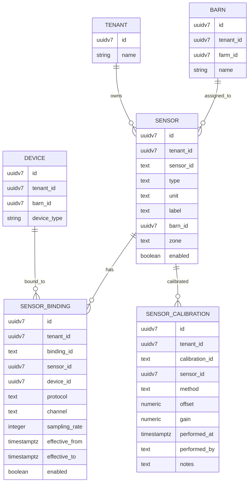
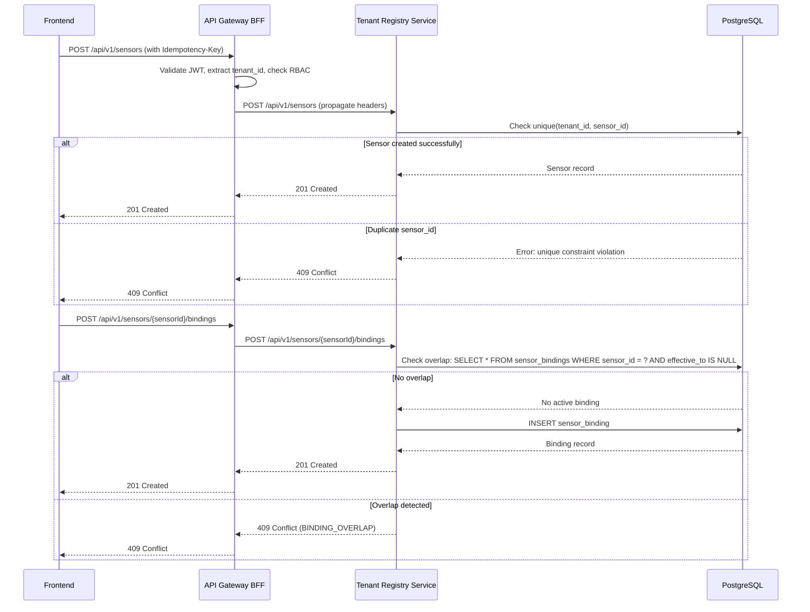
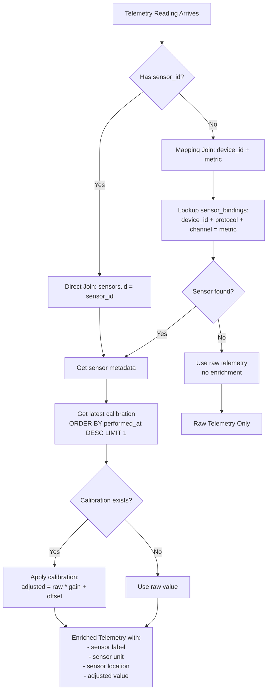

# Cloud Tenant Registry Service

## Purpose
Master data management service for FarmIQ. Owns all master data tables for the tenant hierarchy (Tenant → Farm → Barn → Batch → Device) and provides CRUD operations with proper multi-tenant isolation.

## Scope
- Tenant, Farm, Barn, Batch, Device, Station management
- Sensor module (Phase 1): Sensor catalog, bindings, and calibration tracking

## Non-goals
- Telemetry data storage (owned by `cloud-telemetry-service`)
- Complex sensor fusion or threshold rules (thresholds may reference `cloud-config-rules-service` in future)
- Device firmware updates or device heartbeat tracking (may be in separate device-management service in future)

---

## Architecture and Data Flow

### Service Responsibilities
- **Owns**: Master data tables (tenant, farm, barn, batch, device, station, sensor, sensor_binding, sensor_calibration)
- **Provides**: CRUD APIs with multi-tenant scoping and RBAC enforcement
- **Integrates with**: BFF (all FE requests via BFF), telemetry-service (for sensor enrichment queries)

---

## Sensor Module (Phase 1)

### Overview
The sensor module extends cloud-tenant-registry to track sensor metadata, device bindings, and calibration history. This enables telemetry enrichment and proper sensor lifecycle management.

### Data Model

#### Table: sensors

| column | type | null | default | constraints | index | description |
|---|---|---|---|---|---|---|
| id | uuidv7 | no | gen_random_uuid() | pk | pk | Sensor id |
| tenant_id | uuidv7 | no | none | fk tenant | idx (tenant_id) | Tenant scope |
| sensor_id | text | no | none | unique (tenant_id, sensor_id) | uniq (tenant_id, sensor_id) | Unique sensor identifier (per tenant) |
| type | text | no | none | check in (temperature, humidity, pressure, weight, flow, level, co2, nh3, etc) | idx (tenant_id, type) | Sensor type |
| unit | text | no | none | none | none | Unit (C, F, %, Pa, kg, L/min, ppm, etc) |
| label | text | yes | null | none | idx (tenant_id, label) | Human-readable label |
| barn_id | uuidv7 | yes | null | fk barn | idx (tenant_id, barn_id) | Optional barn assignment |
| zone | text | yes | null | none | idx (tenant_id, barn_id, zone) | Optional zone within barn |
| enabled | boolean | no | true | none | idx (tenant_id, enabled) | Active status |
| created_at | timestamptz | no | now() | none | idx (tenant_id, created_at desc) | Created time |
| updated_at | timestamptz | no | now() | none | idx (tenant_id, updated_at desc) | Updated time |

**Unique Constraints**:
- `unique(tenant_id, sensor_id)`: Sensor identifier must be unique per tenant

**Note**: Label uniqueness per (tenant_id, barn_id, zone) is NOT enforced at DB level to allow flexibility. Application can enforce if needed.

#### Table: sensor_bindings

| column | type | null | default | constraints | index | description |
|---|---|---|---|---|---|---|
| id | uuidv7 | no | gen_random_uuid() | pk | pk | Binding id |
| tenant_id | uuidv7 | no | none | fk tenant | idx (tenant_id) | Tenant scope |
| binding_id | text | no | none | unique (tenant_id, binding_id) | uniq (tenant_id, binding_id) | Unique binding identifier |
| sensor_id | uuidv7 | no | none | fk sensors.id | idx (tenant_id, sensor_id) | Sensor reference |
| device_id | uuidv7 | no | none | fk devices.id | idx (tenant_id, device_id) | Device reference |
| protocol | text | no | none | check in (mqtt, modbus, analog, serial, http) | idx (tenant_id, protocol) | Communication protocol |
| channel | text | yes | null | none | none | Channel/topic/register (protocol-specific) |
| sampling_rate | integer | yes | null | check >= 0 | none | Sampling rate in seconds |
| effective_from | timestamptz | no | now() | none | idx (tenant_id, sensor_id, effective_from desc) | Binding effective start |
| effective_to | timestamptz | yes | null | none | none | Binding effective end (null = active) |
| enabled | boolean | no | true | none | idx (tenant_id, enabled) | Active status |
| created_at | timestamptz | no | now() | none | idx (tenant_id, created_at desc) | Created time |
| updated_at | timestamptz | no | now() | none | idx (tenant_id, updated_at desc) | Updated time |

**Unique Constraints**:
- `unique(tenant_id, binding_id)`: Binding identifier must be unique per tenant

**Overlap Rule** (application-enforced):
- Only one active binding per sensor at a time: `(effective_to IS NULL OR effective_to >= NOW()) AND effective_from <= NOW()`
- Application must check for overlapping effective windows before creating new binding

**Indexes for telemetry join**:
- `idx (tenant_id, device_id)`: Fast lookup by device
- `idx (tenant_id, device_id, protocol, channel)`: Fast lookup by device + protocol + channel (for Option 2 mapping)

#### Table: sensor_calibrations

| column | type | null | default | constraints | index | description |
|---|---|---|---|---|---|---|
| id | uuidv7 | no | gen_random_uuid() | pk | pk | Calibration id |
| tenant_id | uuidv7 | no | none | fk tenant | idx (tenant_id) | Tenant scope |
| calibration_id | text | no | none | unique (tenant_id, calibration_id) | uniq (tenant_id, calibration_id) | Unique calibration identifier |
| sensor_id | uuidv7 | no | none | fk sensors.id | idx (tenant_id, sensor_id, performed_at desc) | Sensor reference |
| method | text | no | none | none | none | Calibration method (e.g., "two-point", "zero-span") |
| offset | numeric(10,4) | no | 0 | none | none | Offset adjustment value |
| gain | numeric(10,4) | no | 1.0 | check > 0 | none | Gain multiplier |
| performed_at | timestamptz | no | now() | none | idx (tenant_id, sensor_id, performed_at desc) | Calibration timestamp |
| performed_by | text | yes | null | none | none | User ID or name who performed calibration |
| notes | text | yes | null | none | none | Optional notes |
| created_at | timestamptz | no | now() | none | idx (tenant_id, created_at desc) | Created time |

**Unique Constraints**:
- `unique(tenant_id, calibration_id)`: Calibration identifier must be unique per tenant

**Indexes**:
- `idx (tenant_id, sensor_id, performed_at desc)`: Fast lookup of calibration history per sensor

---

## ER Diagram



---

## Telemetry Join Strategy

### Problem Statement
Telemetry readings are stored in `cloud-telemetry-service` with fields: `tenant_id`, `device_id`, `metric` (or `metric_type`), `value`, `unit`, `occurred_at`. We need to enrich telemetry with sensor metadata (label, type, unit, location) and calibration adjustments.

### Join Options

#### Option 1: Direct sensor_id in Telemetry (Preferred if telemetry can emit sensor_id)
**If telemetry includes `sensor_id` field**:
- Direct join: `telemetry.sensor_id → sensors.id`
- Use latest calibration: `SELECT * FROM sensor_calibrations WHERE sensor_id = ? ORDER BY performed_at DESC LIMIT 1`
- Apply calibration: `adjusted_value = (raw_value * gain) + offset`

**Advantages**:
- Simple, direct relationship
- No mapping logic needed

**Implementation requirement**:
- Telemetry ingestion must include `sensor_id` in payload (from device or edge gateway)

#### Option 2: Mapping Join via Device + Protocol + Channel (Fallback)
**If telemetry only has `device_id` + `metric`**:
- Map using binding: `telemetry.device_id + telemetry.metric → sensor_bindings.device_id + sensor_bindings.protocol + sensor_bindings.channel → sensor_bindings.sensor_id`
- Mapping rule:
  - MQTT: `channel` matches telemetry topic suffix (e.g., `temperature` in `iot/telemetry/.../device123/temperature`)
  - Modbus: `channel` matches register address as string (e.g., `"40001"`)
  - Analog: `channel` matches pin/channel number as string (e.g., `"A0"`)
  - Serial: `channel` matches serial port identifier (e.g., `"/dev/ttyUSB0"`)

**Mapping Query Example**:
```sql
SELECT s.*, sb.channel
FROM sensors s
JOIN sensor_bindings sb ON s.id = sb.sensor_id
WHERE sb.tenant_id = ?
  AND sb.device_id = ?
  AND sb.protocol = 'mqtt'
  AND sb.channel = ? -- telemetry.metric
  AND sb.enabled = true
  AND (sb.effective_to IS NULL OR sb.effective_to >= ?) -- occurred_at
  AND sb.effective_from <= ? -- occurred_at
ORDER BY sb.effective_from DESC
LIMIT 1
```

**Advantages**:
- Works with existing telemetry schema
- Supports legacy devices

**Disadvantages**:
- Requires mapping logic and protocol-specific channel matching
- Ambiguity if multiple bindings match (use most recent effective binding)

### Recommended Approach
- **Phase 1**: Support Option 2 (mapping join) for backward compatibility
- **Phase 2**: Encourage Option 1 by requiring `sensor_id` in new telemetry ingestion

### Calibration Application
Once sensor is identified (Option 1 or 2), apply latest calibration:
- Fetch: `SELECT * FROM sensor_calibrations WHERE sensor_id = ? AND performed_at <= ? ORDER BY performed_at DESC LIMIT 1`
- Apply: `adjusted_value = ((raw_value * gain) + offset)`
- If no calibration found, use raw value

---

## RBAC Requirements

Based on `docs/06-rbac-authorization-matrix.md`:

| Role | Sensors (R) | Sensors (W) | Bindings (R) | Bindings (W) | Calibrations (R) | Calibrations (W) |
|---|---|---|---|---|---|---|
| `platform_admin` | ✅ | ✅ | ✅ | ✅ | ✅ | ✅ |
| `tenant_admin` | ✅ | ✅ | ✅ | ✅ | ✅ | ✅ |
| `farm_manager` | ✅ | ⚠️ | ✅ | ⚠️ | ✅ | ⚠️ |
| `house_operator` | ✅ | ❌ | ✅ | ❌ | ✅ | ❌ |
| `viewer` | ✅ | ❌ | ✅ | ❌ | ✅ | ❌ |

**Scope constraints (⚠️)**:
- `farm_manager` write scope is limited to assigned farms/barns
- All writes require appropriate tenant scope enforcement

---

## Validation Rules

### Sensor
- `sensor_id`: Required, non-empty, max 255 chars, alphanumeric + dash/underscore only
- `type`: Required, must be one of: temperature, humidity, pressure, weight, flow, level, co2, nh3, o2, ph, conductivity, or other (custom allowed)
- `unit`: Required, non-empty, max 10 chars (e.g., "C", "F", "%", "Pa", "kg", "L/min", "ppm")
- `label`: Optional, max 255 chars
- `barn_id`: Optional, must exist in same tenant if provided
- `zone`: Optional, max 100 chars
- `enabled`: Boolean, default true

### Sensor Binding
- `binding_id`: Required, non-empty, max 255 chars, alphanumeric + dash/underscore only
- `sensor_id`: Required, must exist in same tenant
- `device_id`: Required, must exist in same tenant (from devices table)
- `protocol`: Required, must be one of: mqtt, modbus, analog, serial, http
- `channel`: Optional, max 255 chars (protocol-specific format)
- `sampling_rate`: Optional, integer >= 0 (seconds)
- `effective_from`: Required, timestamp (default now())
- `effective_to`: Optional, timestamp, must be > effective_from if provided
- `enabled`: Boolean, default true
- **Overlap validation**: Application must check no active binding overlaps (effective_to IS NULL OR effective_to >= effective_from) AND effective_from <= (new binding's effective_to OR NOW())

### Sensor Calibration
- `calibration_id`: Required, non-empty, max 255 chars, alphanumeric + dash/underscore only
- `sensor_id`: Required, must exist in same tenant
- `method`: Required, non-empty, max 100 chars (e.g., "two-point", "zero-span", "single-point")
- `offset`: Required, numeric, range -999999.9999 to 999999.9999
- `gain`: Required, numeric, must be > 0, range 0.0001 to 999999.9999
- `performed_at`: Required, timestamp (default now())
- `performed_by`: Optional, max 255 chars (user ID or name)
- `notes`: Optional, max 1000 chars

---

## Idempotency & Deduplication

All POST endpoints support `Idempotency-Key` header per `docs/shared/01-api-standards.md`:

1. **Create Sensor**: `unique(tenant_id, sensor_id)` enforces uniqueness. Same `Idempotency-Key` + same `sensor_id` → returns existing sensor.
2. **Create Binding**: `unique(tenant_id, binding_id)` enforces uniqueness. Same `Idempotency-Key` + same `binding_id` → returns existing binding.
3. **Add Calibration**: `unique(tenant_id, calibration_id)` enforces uniqueness. Same `Idempotency-Key` + same `calibration_id` → returns existing calibration.

**Conflict handling**:
- If `Idempotency-Key` matches but request body differs → 409 Conflict with error code `IDEMPOTENCY_KEY_CONFLICT`
- If unique constraint violation (different key, same unique field) → 409 Conflict with error code `RESOURCE_ALREADY_EXISTS`

---

## Observability Requirements

- **Request ID**: All requests must include `x-request-id` header (propagated from BFF)
- **Trace ID**: All logs must include `traceId` (from `x-trace-id` header or Datadog tracer)
- **Logging**: Winston JSON logs with fields: `requestId`, `traceId`, `service`, `method`, `path`, `statusCode`, `duration_ms`, `tenantId`
- **Metrics**: Track endpoint calls, error rates, query duration (if metrics infrastructure exists)

---

## Open Questions

1. **Threshold Management**: Sensor thresholds (min/max/warn/critical) are currently out of scope. Should these be added to this module or delegated to `cloud-config-rules-service`? **Decision**: Document as future enhancement, reference config-rules-service for now.

2. **Sensor Location Hierarchy**: Should sensors support farm-level assignment (not just barn)? **Decision**: Phase 1 supports barn-level only; farm-level can be added later if needed.

3. **Calibration Expiration**: Should calibrations have expiration dates or validity periods? **Decision**: Phase 1 does not enforce expiration; application logic can query latest calibration.

4. **Binding History**: Should we retain historical bindings after `effective_to` passes? **Decision**: Yes, retain for audit trail; queries filter by effective window.

---

## Sequence Diagrams

### Create Sensor + Binding Flow



### Telemetry Enrichment Flow (Option 2: Mapping Join)



---

## Checklist Counter
- Mermaid diagrams: 3/3
- Endpoint rows: 0/0 (documented in contract doc)
- DB tables documented: 3/3
- DB column rows: 36/36
- Example sets: 0/0 (documented in contract doc)
- Open questions: 4/4

