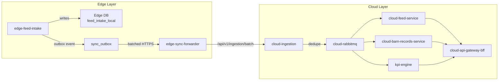
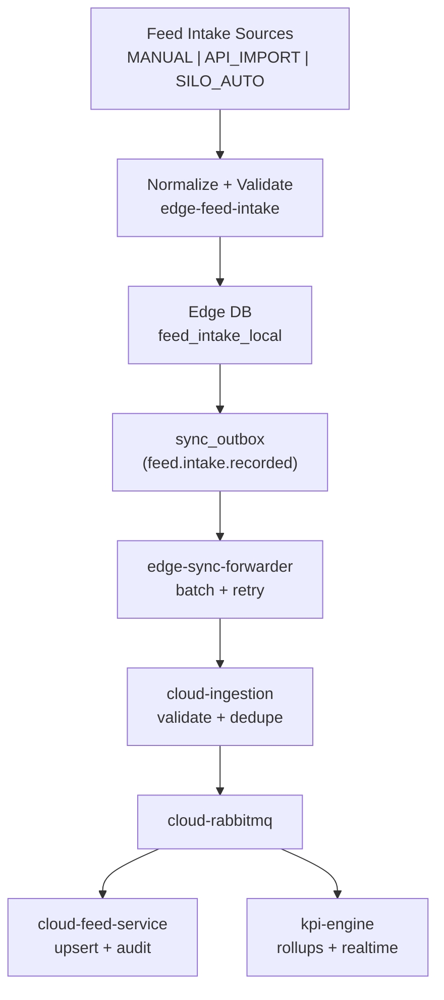

# Feeding Module Overview (Edge + Cloud)

## Purpose
Lock the end-to-end concept, ownership boundaries, and data flow for the Feeding module across edge and cloud layers.

## Scope
- Feed intake ingestion (manual, import, and SILO_AUTO via edge)
- Feed master data (formulas, lots, deliveries, quality results)
- KPI computation inputs and outputs (FCR/ADG/SGR)
- Events and messaging alignment (MQTT + RabbitMQ + outbox)

## Non-goals
- UI implementation details beyond high-level page placement
- Non-feed KPIs and unrelated telemetry pipelines
- Device firmware specifications

## Architecture and Data Flow

## Data Model (High-level)
- Feed entities: `feed_formula`, `feed_lot`, `feed_delivery`, `feed_quality_result`, `feed_intake_record`, optional `feed_inventory_snapshot`, optional `feed_program`.
- Key scoping: `tenant_id`, `farm_id`, `barn_id`, `batch_id`, `device_id` (optional for manual).
- Time semantics:
  - `occurred_at`: when the intake/measurement happened at the barn.
  - `created_at`: when stored in the owning service DB.
  - `ingested_at`: when accepted by cloud-ingestion (for edge events).

## API / Contracts Summary
- Feed service API: `../contracts/feed-service.contract.md`
- Barn records API: `../contracts/barn-records-service.contract.md`
- Event contracts: `../contracts/events-feed-and-barn.contract.md`

## Edge / Cloud Responsibilities
- Edge (`edge-feed-intake`):
  - Accepts SILO_AUTO telemetry (MQTT) and local manual/import inputs.
  - Validates, dedupes locally, stores `feed_intake_local`.
  - Emits `feed.intake.recorded` to outbox for cloud sync.
- Cloud (`cloud-feed-service`):
  - Owns feed master data and authoritative feed intake records.
  - Provides APIs for UI and integrations.
- Cloud (`cloud-barn-records-service`):
  - Owns barn record tables used in KPI adjustments.
- KPI engine (`kpi-engine`):
  - Computes FCR/ADG/SGR and publishes `kpi.daily.updated`.

## Security, Compliance, Observability, Operations
- AuthN/AuthZ: JWT/OIDC, RBAC per `../06-rbac-authorization-matrix.md`.
- Idempotency: use `event_id` + `tenant_id` for dedupe; HTTP idempotency via `Idempotency-Key`.
- Audit logging: record actor, role, traceId, requestId, and entity IDs.
- Observability: Datadog logs/traces/metrics per `../shared/02-observability-datadog.md`.
- Health/Ready: required `/api/health` and `/api/ready` on all services.
- Retention: edge intake retained 30-90 days; cloud per data retention policy.
- GDPR/PDPA: avoid PII in feed and barn records; treat farm/barn metadata as operational data.

## Testing and Verification
- Verify edge ingestion stores `feed_intake_local` and outbox records.
- Verify cloud-ingestion dedupe hits when re-sending same `event_id`.
- Verify KPI rollup produces daily records for a barn/batch.

## Open Questions
1) Should `feed_inventory_snapshot` be mandatory for MVP or optional (current assumption: optional)?
2) Should batch-level consumption be computed from barn-level intake when batch_id is missing?

## Checklist Counter
- Mermaid: 2/2
- Endpoints Table Rows: 0/0
- DB Column Rows: 0/0
- Examples: 0/0
- Open Questions: 2/2
