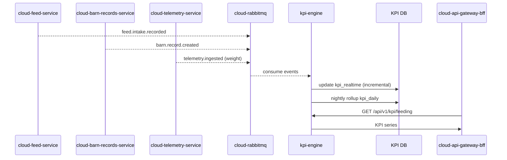

# KPI Engine: FCR / ADG / SGR (kpi-engine)

## Purpose
Define KPI computation for feed conversion and growth metrics using feed intake and barn records.

## Scope
- Daily rollups at 00:00 local time
- Near-real-time incremental updates on new intake or weight data
- KPIs: FCR, ADG, SGR

## Non-goals
- ML forecasting (owned by analytics roadmap)
- UI rendering (owned by dashboard)

## Architecture and Data Flow

## KPI Formulas and Rules
- **FCR (Feed Conversion Ratio)**:
  - `FCR = total_feed_kg / weight_gain_kg`
- **ADG (Average Daily Gain)**:
  - `ADG = (avg_weight_today - avg_weight_prev) / days`
  - For daily rollup, `days = 1`.
- **SGR (Specific Growth Rate)**:
  - `SGR = ((ln(Wt) - ln(W0)) / days) * 100`
  - Use average daily weight (`Wt`) and previous day (`W0`).

### Corner cases
- If `weight_gain_kg <= 0`, set FCR to null and flag `weight_gain_non_positive`.
- If intake is missing for a day, set `intake_missing_flag = true` and omit FCR.
- If animal_count changes (mortality/cull), adjust `weight_gain_kg` by daily count delta.
- For partial-day data, compute `kpi_realtime` only; do not overwrite daily rollup.

## Data Model (KPI DB)

### Table: kpi_daily
| column | type | null | default | constraints | index | description |
|---|---|---|---|---|---|---|
| id | uuidv7 | no | gen_random_uuid() | pk | pk | KPI daily id |
| tenant_id | uuidv7 | no | none | fk tenant | idx (tenant_id, record_date) | Tenant scope |
| farm_id | uuidv7 | no | none | fk farm | idx (tenant_id, farm_id, record_date) | Farm scope |
| barn_id | uuidv7 | no | none | fk barn | idx (tenant_id, barn_id, record_date) | Barn scope |
| batch_id | uuidv7 | yes | null | fk batch | idx (tenant_id, batch_id, record_date) | Batch scope |
| record_date | date | no | none | unique (tenant_id, barn_id, record_date) | uniq (tenant_id, barn_id, record_date) | Date |
| fcr | numeric(10,4) | yes | null | check >= 0 | none | Feed conversion ratio |
| adg_g | numeric(10,3) | yes | null | none | none | Average daily gain (g/day) |
| sgr_pct | numeric(10,4) | yes | null | none | none | Specific growth rate (%) |
| total_feed_kg | numeric(14,3) | yes | null | none | none | Total feed intake |
| weight_gain_kg | numeric(14,3) | yes | null | none | none | Weight gain |
| animal_count | int | yes | null | none | none | Count used |
| mortality_count | int | yes | 0 | none | none | Mortality adjustment |
| intake_missing_flag | boolean | no | false | none | idx (intake_missing_flag) | Missing intake |
| weight_missing_flag | boolean | no | false | none | idx (weight_missing_flag) | Missing weight |
| source_window_start | timestamptz | yes | null | none | none | Start window |
| source_window_end | timestamptz | yes | null | none | none | End window |
| created_at | timestamptz | no | now() | none | idx (tenant_id, created_at desc) | Created time |
| updated_at | timestamptz | no | now() | none | idx (tenant_id, updated_at desc) | Updated time |

### Table: kpi_realtime (optional)
| column | type | null | default | constraints | index | description |
|---|---|---|---|---|---|---|
| id | uuidv7 | no | gen_random_uuid() | pk | pk | KPI realtime id |
| tenant_id | uuidv7 | no | none | fk tenant | idx (tenant_id, as_of_ts) | Tenant scope |
| farm_id | uuidv7 | no | none | fk farm | idx (tenant_id, farm_id, as_of_ts) | Farm scope |
| barn_id | uuidv7 | no | none | fk barn | idx (tenant_id, barn_id, as_of_ts) | Barn scope |
| batch_id | uuidv7 | yes | null | fk batch | idx (tenant_id, batch_id, as_of_ts) | Batch scope |
| as_of_ts | timestamptz | no | none | none | idx (tenant_id, as_of_ts desc) | Timestamp |
| fcr | numeric(10,4) | yes | null | none | none | Realtime FCR |
| adg_g | numeric(10,3) | yes | null | none | none | Realtime ADG |
| sgr_pct | numeric(10,4) | yes | null | none | none | Realtime SGR |
| total_feed_kg | numeric(14,3) | yes | null | none | none | Total feed intake |
| weight_gain_kg | numeric(14,3) | yes | null | none | none | Weight gain |
| animal_count | int | yes | null | none | none | Count |
| source_event_id | uuidv7 | yes | null | none | idx (tenant_id, source_event_id) | Trigger event |
| created_at | timestamptz | no | now() | none | idx (tenant_id, created_at desc) | Created time |

### Table: kpi_compute_state
| column | type | null | default | constraints | index | description |
|---|---|---|---|---|---|---|
| tenant_id | uuidv7 | no | none | pk part | pk (tenant_id, barn_id, batch_id) | Tenant scope |
| barn_id | uuidv7 | no | none | pk part | pk (tenant_id, barn_id, batch_id) | Barn scope |
| batch_id | uuidv7 | yes | null | pk part | pk (tenant_id, barn_id, batch_id) | Batch scope |
| last_daily_run_at | timestamptz | yes | null | none | none | Last daily rollup |
| last_event_id | uuidv7 | yes | null | none | none | Last processed event |
| last_occurred_at | timestamptz | yes | null | none | none | Last occurred_at seen |
| updated_at | timestamptz | no | now() | none | idx (tenant_id, updated_at desc) | Updated time |

## API / Contracts Summary
- KPI read APIs are exposed through BFF and implemented by kpi-engine.
- Documented in `../contracts/feed-service.contract.md` under KPI endpoints.

## Edge / Cloud Responsibilities
- Edge emits intake events; cloud services aggregate and compute KPIs.
- KPI engine consumes RabbitMQ events and writes daily and realtime tables.

## Security, Compliance, Observability, Operations
- AuthN/AuthZ: JWT/OIDC; read-only for `viewer` role.
- Idempotency: event processing uses `event_id` and `kpi_compute_state`.
- Observability: metrics for compute latency, backlog, and missing data flags.
- Rate limiting: apply to KPI query endpoints (429 on abuse).
- Retention: keep `kpi_daily` for multi-year trend analysis; optional `kpi_realtime` 30-90 days.
- GDPR/PDPA: no PII; operational metrics only.

## Testing and Verification
- Verify daily rollup runs at 00:00 local time (tenant time zone).
- Verify KPI outputs for zero/negative gain and missing intake.

## Open Questions
1) Should KPI rollups be computed per barn and per batch, or barn-only for MVP?
2) Should `kpi_realtime` be enabled by default or behind a feature flag?

## Checklist Counter
- Mermaid: 1/1
- Endpoints Table Rows: 0/0
- DB Column Rows: 38/38
- Examples: 0/0
- Open Questions: 2/2
