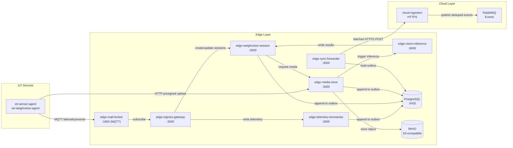

# Edge Layer Overview

**Purpose:** Define the edge layer architecture, core responsibilities, and canonical data flows.
**Scope:** Edge service roles, ownership boundaries, communication patterns, and persistence strategy.
**Owner:** FarmIQ Architecture Team
**Last updated:** 2025-12-31

---

## Edge Layer Purpose

The edge layer runs on k3s/Kubernetes clusters deployed close to barns. It provides:
- **Local buffering** of telemetry and media when cloud is unreachable
- **Real-time inference** on WeighVision sessions for immediate feedback
- **Reliable synchronization** to cloud using outbox pattern with idempotent delivery
- **Offline-first operation** for critical barn operations

---

## Canonical Data Flow

### Primary Flow: MQTT → Ingress → DB → Outbox → Sync → Cloud



### Flow Details

**1. Telemetry Ingestion**
- IoT devices publish to MQTT topics: `iot/telemetry/{tenantId}/{farmId}/{barnId}/{deviceId}/{metric}`
- `edge-mqtt-broker` receives messages and forwards to `edge-ingress-gateway`
- `edge-ingress-gateway` validates envelope, deduplicates, and writes to `edge-telemetry-timeseries`
- `edge-telemetry-timeseries` stores in PostgreSQL and appends to `sync_outbox`

**2. WeighVision Session Flow**
- Device captures weight + image, publishes session events to MQTT
- `edge-ingress-gateway` creates/updates session via `edge-weighvision-session`
- Device uploads image via presigned URL to `edge-media-store` (bypasses ingress gateway)
- `edge-media-store` stores in MinIO and triggers `edge-vision-inference`
- `edge-vision-inference` runs ML model and writes results back to session
- Session finalized, events appended to `sync_outbox`

**3. Cloud Synchronization**
- `edge-sync-forwarder` reads `sync_outbox` (pending rows) with `SELECT FOR UPDATE SKIP LOCKED`
- Batches events by tenant_id to optimize cloud processing
- Sends to `cloud-ingestion` via HTTPS (idempotent via event_id)
- Cloud validates, deduplicates by `(tenant_id, event_id)`, publishes to RabbitMQ
- Edge retries with exponential backoff on failure; after 10 attempts, moves to DLQ

---

## Core Services

### Business Services

| Service | Port | Purpose | Owner |
|----------|-------|---------|--------|
| **edge-mqtt-broker** | 5100 (host) → 1883 (container) | MQTT message bus for IoT devices |
| **edge-ingress-gateway** | 5103 (host) → 3000 (container) | MQTT normalizer, routes to internal services |
| **edge-telemetry-timeseries** | 5104 (host) → 3000 (container) | Telemetry persistence and aggregation |
| **edge-weighvision-session** | 5105 (host) → 3000 (container) | Session lifecycle owner |
| **edge-media-store** | 5106 (host) → 3000 (container) | Media owner (S3-compatible storage) |
| **edge-vision-inference** | 5107 (host) → 8000 (container) | ML inference owner |
| **edge-sync-forwarder** | 5108 (host) → 3000 (container) | Sync owner (outbox → cloud) |
| **edge-feed-intake** | 5112 (host) → 5109 (container) | Local feed intake management |

### Ops/Support Services

| Service | Port | Purpose |
|----------|-------|---------|
| **edge-policy-sync** | 5109 (host) → 3000 (container) | Cache cloud config offline |
| **edge-retention-janitor** | 5114 (host) → 3000 (container) | Enforce media retention policies |
| **edge-observability-agent** | 5111 (host) → 3000 (container) | Aggregate health/status for ops |
| **edge-ops-web** | 5113 (host) → 80 (container) | UI for edge operations |

### Development Infrastructure

| Component | Host Port | Purpose |
|-----------|-----------|---------|
| **PostgreSQL** | 5141 → 5432 | Single relational DB for edge services |
| **MinIO** | 9000 (API), 9001 (Console) | S3-compatible object storage |
| **cloud-ingestion-mock** | internal only | Mock cloud endpoint for testing |

---

## Ownership Guards

**Critical:** Single domain ownership prevents data corruption and race conditions.

| Domain | Owner Service | Tables Owned |
|---------|--------------|--------------|
| Sessions | `edge-weighvision-session` | `weight_sessions` |
| Media | `edge-media-store` | `media_objects` (metadata), S3 objects |
| Inference | `edge-vision-inference` | `inference_results` |
| Sync | `edge-sync-forwarder` | `sync_outbox`, `sync_state`, `sync_outbox_dlq` |
| Telemetry | `edge-telemetry-timeseries` | `telemetry_raw`, `telemetry_agg` |

**Cross-cutting concerns:**
- `edge-ingress-gateway`: Stateless router, writes `ingress_dedupe` table only
- `edge-observability-agent`: Aggregator only, no data ownership
- `edge-ops-web`: UI/proxy layer, no direct DB access

---

## Communication Patterns

### External → Edge
- **MQTT:** All device telemetry via `edge-mqtt-broker` (port 1883, TLS 8883 in production)
- **HTTP Presigned Uploads:** Media uploads go directly to `edge-media-store` (bypasses ingress gateway)

### Internal Edge
- **HTTP:** All inter-service communication via HTTP/gRPC
- **DB:** Shared PostgreSQL for structured data and outbox
- **Message Queue:** Optional edge RabbitMQ for async inference jobs (not yet implemented)

### Edge → Cloud
- **HTTPS Batched:** `edge-sync-forwarder` batches events to `cloud-ingestion`
- **Idempotency:** Cloud deduplicates by `(tenant_id, event_id)`
- **Offline Buffering:** Outbox stores events until connectivity restored

---

## Persistence Strategy

### Database (PostgreSQL)
Single DB instance per edge cluster with tables:
- `telemetry_raw`, `telemetry_agg` - Telemetry storage
- `weight_sessions` - WeighVision sessions
- `media_objects` - Media metadata
- `inference_results` - ML inference results
- `sync_outbox` - Events pending sync
- `sync_outbox_dlq` - Failed sync events
- `ingress_dedupe` - MQTT duplicate prevention

### Object Storage (MinIO / S3)
Media storage with path structure:
```
tenants/{tenant_id}/farms/{farm_id}/barns/{barn_id}/devices/{device_id}/images/{year}/{month}/{day}/{id}.{ext}
```

**Note:** Media stored in MinIO, not on PVC filesystem. `edge-media-store` maintains metadata only.

---

## Offline Behavior

When cloud connectivity is down:
- ✅ Edge continues to ingest MQTT and store locally (DB + MinIO)
- ✅ `sync_outbox` grows with pending events
- ✅ `edge-sync-forwarder` retries with exponential backoff (max 10 attempts)
- ✅ Failed events moved to DLQ for manual recovery

**Required alerts:**
- Outbox backlog size and oldest pending age
- Disk usage thresholds (MinIO + DB volumes)
- Last successful sync timestamp

---

## Security

### MQTT (Production)
- **TLS 1.2+ REQUIRED** on port 8883 (development uses plain 1883)
- **Device Authentication:** Per-device username/password + ACL OR mTLS certificates
- **Topic Authorization:** Devices restricted to `iot/telemetry/{tenantId}/{farmId}/{barnId}/{deviceId}/+`
- **See:** `edge-mqtt-broker/mosquitto.conf` for production configuration

### HTTP (Media Upload)
- **Authentication:** JWT or mTLS on presign endpoint
- **Rate Limiting:** 10 presign requests per minute per device
- **Upload Limits:** 10 MB per image
- **No Logging:** Never log image bytes or full payloads

### Secrets Management
- Store all secrets in Kubernetes Secrets (NOT in env files)
- Rotate secrets quarterly (passwords) or annually (certificates)
- Support rolling rotation without downtime

---

## Operational Readiness

### Health Endpoints
All services expose:
- `GET /api/health` - Liveness (process alive)
- `GET /api/ready` - Readiness (DB + dependencies)
- `GET /api-docs` - OpenAPI/Swagger documentation

### Alert Thresholds

| Metric | Warning | Critical |
|--------|----------|----------|
| Outbox pending rows | > 1,000 | > 10,000 |
| Oldest pending event age | > 1 hour | > 24 hours |
| Media storage usage | > 75% | > 90% |
| DB volume usage | > 80% | > 95% |
| Last successful sync | > 5 minutes | > 1 hour |
| Consecutive sync failures | > 5 | > 10 |

### SLO Targets
- **Availability:** 99.5% uptime per edge cluster
- **Error Rate:** < 0.1% HTTP 5xx errors
- **Inference Latency:** p95 ≤ 15 seconds (upload → result)
- **Data Loss:** Zero loss during outages up to 7 days

---

## Links

- [01-services.md](01-services.md) - Service table with ports, dependencies, endpoints
- [02-setup-run.md](02-setup-run.md) - How to run compose, env vars, troubleshooting
- [03-edge-ops-web.md](03-edge-ops-web.md) - UI usage, profiles, metrics sources
- [Evidence](../progress/edge-compose-verify.md) - Verified compose run results
- [Evidence](../progress/edge-ops-realdata.md) - Real data integration details
