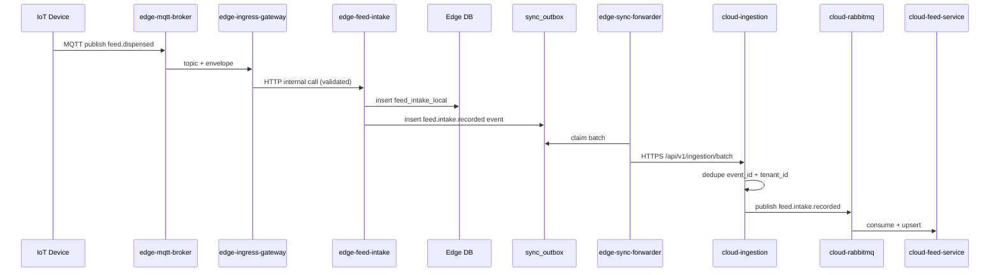

# Edge Feed Intake Service (edge-feed-intake)

## Purpose
Define the edge-side intake service that captures SILO_AUTO feed events and local manual/import entries, stores them locally, and syncs them to the cloud via outbox.

## Scope
- Intake sources: MANUAL, API_IMPORT, SILO_AUTO
- Local validation and dedupe
- Outbox sync to cloud-ingestion

## Non-goals
- Feed master data management (cloud-owned)
- KPI computation (cloud-owned)
- Device firmware changes

## Architecture and Data Flow

## Data Model (Edge DB)

### Table: feed_intake_local
| column | type | null | default | constraints | index | description |
|---|---|---|---|---|---|---|
| id | uuid | no | generated | pk | pk | Local intake record id |
| tenant_id | text | no | none | tenant scope | idx (tenant_id, barn_id, occurred_at desc) | Tenant scope |
| farm_id | text | yes | null | none | none | Farm scope (optional) |
| barn_id | text | no | none | none | idx (tenant_id, barn_id, occurred_at desc) | Barn scope |
| batch_id | text | yes | null | none | none | Batch scope (optional) |
| device_id | text | yes | null | none | idx (tenant_id, device_id, occurred_at desc) | Device scope (SILO / device events) |
| source | text | no | none | e.g., MANUAL, API_IMPORT, SILO_AUTO, MQTT_DISPENSED | none | Intake source |
| feed_formula_id | text | yes | null | none | none | Formula reference (optional) |
| feed_lot_id | text | yes | null | none | none | Lot reference (optional) |
| quantity_kg | numeric(10,3) | no | none | check >= 0 | none | Intake quantity in kg |
| occurred_at | timestamptz | no | none | not null | idx (tenant_id, barn_id, occurred_at desc) | When intake occurred |
| ingested_at | timestamptz | no | now() | none | none | When ingested into edge DB |
| event_id | text | yes | null | unique (tenant_id, event_id) | uniq (tenant_id, event_id) | Event id (when available) |
| external_ref | text | yes | null | unique (tenant_id, external_ref) | uniq (tenant_id, external_ref) | External import id (when available) |
| sequence | int | yes | null | none | none | Optional sequence to preserve ordering |
| notes | text | yes | null | none | none | Optional human/system notes |
| created_at | timestamptz | no | now() | none | none | Local insert time |
| updated_at | timestamptz | no | now() | none | none | Updated time |

### Table: feed_intake_dedupe
| column | type | null | default | constraints | index | description |
|---|---|---|---|---|---|---|
| id | uuid | no | generated | pk | pk | Row id |
| tenant_id | text | no | none | unique(tenant_id, event_id) | uniq (tenant_id, event_id) | Tenant scope |
| event_id | text | no | none | unique(tenant_id, event_id) | uniq (tenant_id, event_id) | Dedup key (event id) |
| external_ref | text | yes | null | none | idx (tenant_id, external_ref) | Optional external import ref |
| device_id | text | yes | null | none | none | Optional device scope |
| processed_at | timestamptz | no | now() | none | none | When this event/ref was processed |
| expires_at | timestamptz | no | none | none | idx (expires_at) | TTL cleanup |

### Table: silo_weight_snapshot
| column | type | null | default | constraints | index | description |
|---|---|---|---|---|---|---|
| id | uuid | no | generated | pk | pk | Row id |
| tenant_id | text | no | none | unique(tenant_id, device_id) | uniq (tenant_id, device_id) | Tenant scope |
| device_id | text | no | none | unique(tenant_id, device_id) | uniq (tenant_id, device_id) | Device scope |
| weight_kg | numeric(10,3) | no | none | check >= 0 | none | Latest known silo weight |
| recorded_at | timestamptz | no | none | not null | idx (tenant_id, device_id, recorded_at desc) | Source timestamp |
| created_at | timestamptz | no | now() | none | none | Local insert time |
| updated_at | timestamptz | no | now() | none | none | Updated time |

### Table: sync_outbox (edge shared)
| column | type | null | default | constraints | index | description |
|---|---|---|---|---|---|---|
| id | uuidv7 | no | gen_random_uuid() | pk | pk | Outbox id |
| tenant_id | uuidv7 | no | none | none | idx (tenant_id, created_at) | Tenant scope |
| event_type | text | no | none | none | idx (event_type, created_at) | e.g., feed.intake.recorded |
| payload | jsonb | no | none | none | gin (payload) | Event payload |
| trace_id | text | yes | null | none | idx (trace_id) | Trace correlation |
| status | text | no | pending | check in (pending, claimed, sent, dlq) | idx (status, created_at) | Sync state |
| created_at | timestamptz | no | now() | none | idx (created_at) | Insert time |
| claim_expires_at | timestamptz | yes | null | none | idx (claim_expires_at) | Lease management |

## API / Contracts Summary
- Event contract: `../contracts/events-feed-and-barn.contract.md`
- Feed service contract: `../contracts/feed-service.contract.md`

## Edge / Cloud Responsibilities
- Edge:
  - Validate and store intake locally; no cloud dependencies.
  - Emit outbox events with `event_id`, `occurred_at`, and `ingested_at` fields.
- Cloud:
  - `cloud-ingestion` dedupes events and publishes to RabbitMQ.
  - `cloud-feed-service` upserts authoritative intake records.

## Security, Compliance, Observability, Operations
- AuthN/AuthZ: device events via MQTT only; edge internal endpoints are cluster-internal.
- Idempotency: `feed_intake_dedupe` and `sync_outbox` ensure at-least-once delivery.
- Audit: log actor as `device_agent` for SILO_AUTO; `user_id` for manual/import.
- Observability: track dedupe hit rate, outbox backlog, intake rate per source.
- Rate limiting: enforce per-device limits on MQTT if configured in broker ACLs.
- GDPR/PDPA: no PII; only operational farm data.

## Testing and Verification
- Simulate duplicate MQTT publish with same `event_id` and verify dedupe.
- Verify `sync_outbox` batch retries without duplicating records in cloud.

Note: The current running schema is defined by Prisma in `edge-layer/edge-feed-intake/prisma/schema.prisma`.

## Open Questions
1) Should edge allow manual entry when cloud is offline, or only via local UI?
2) Should `external_ref` be required for API_IMPORT to guarantee dedupe?

## Checklist Counter
- Mermaid: 1/1
- Endpoints Table Rows: 0/0
- DB Column Rows: 27/27
- Examples: 0/0
- Open Questions: 2/2
