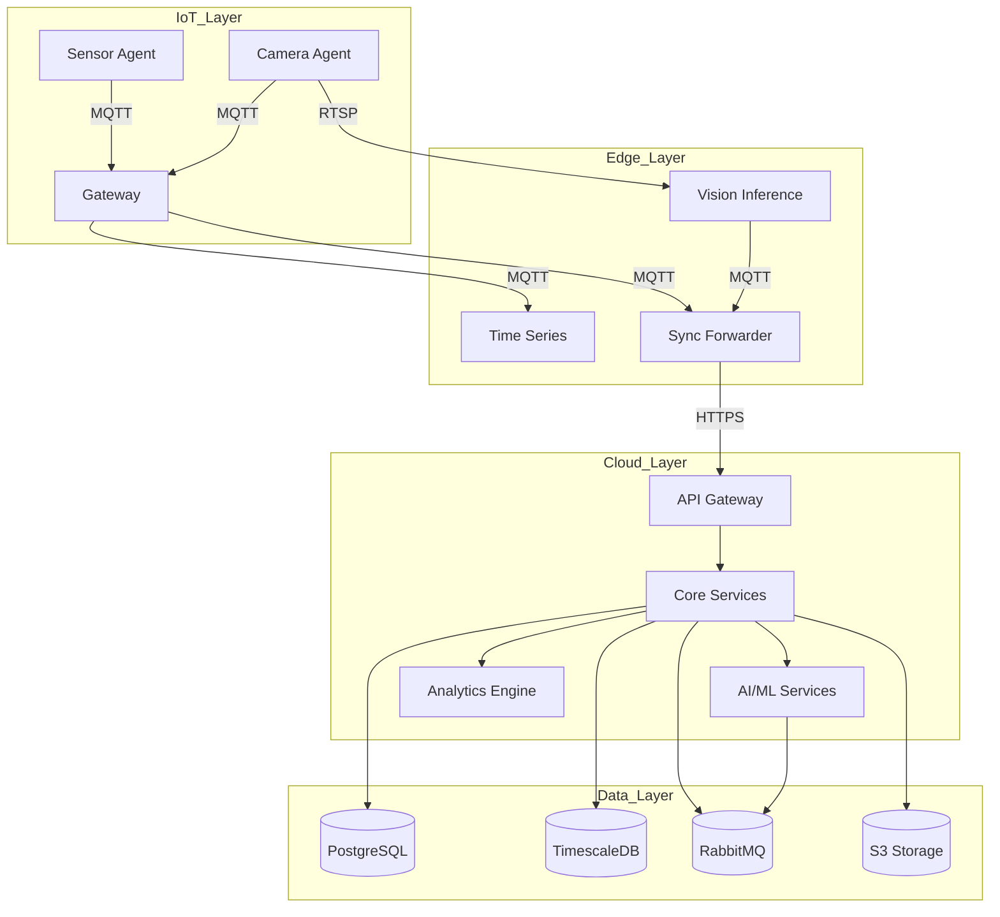
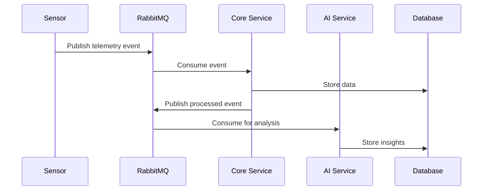
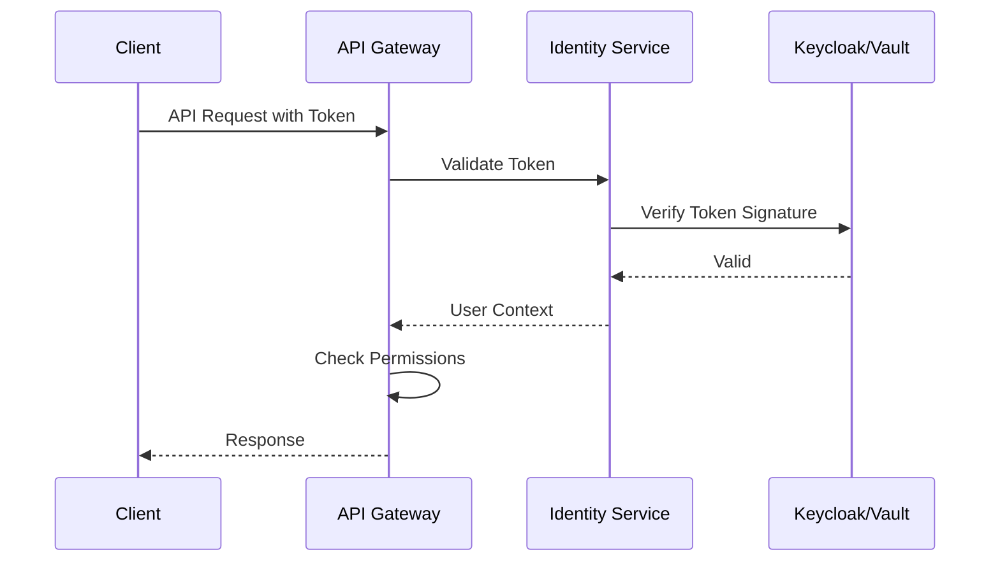
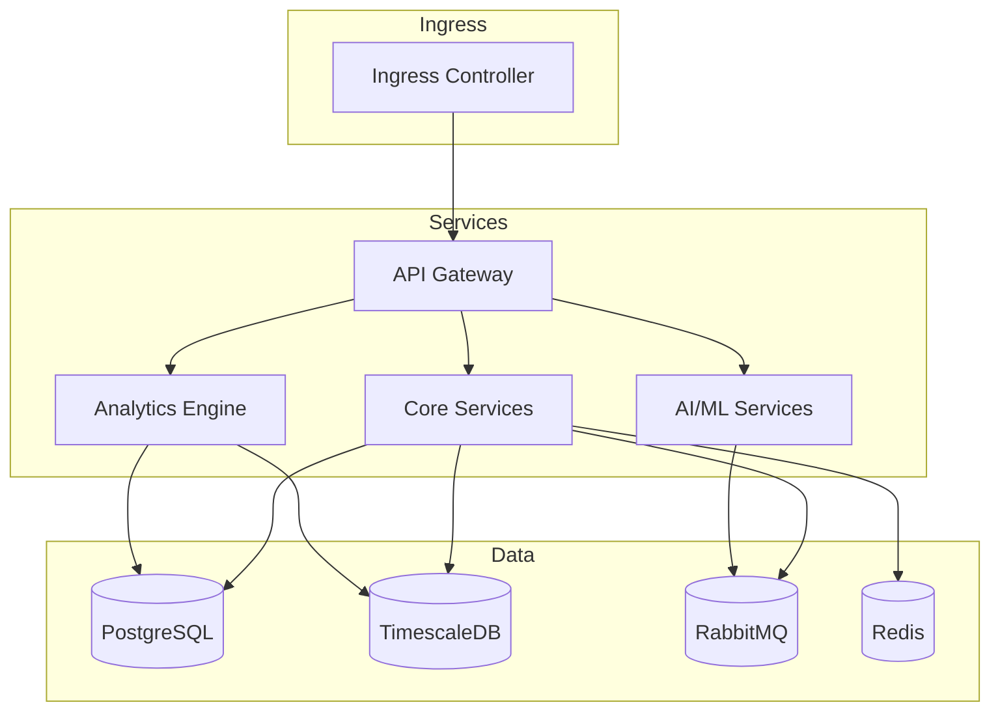

# FarmIQ Architecture Documentation

**Version**: 1.0.0
**Last Updated**: 2025-01-26
**Audience**: Architects, Developers, DevOps

---

## Table of Contents

- [Overview](#overview)
- [System Architecture](#system-architecture)
- [Components](#components)
- [Data Architecture](#data-architecture)
- [Security Architecture](#security-architecture)
- [Deployment Architecture](#deployment-architecture)
- [Technology Stack](#technology-stack)
- [Architecture Decision Records](#architecture-decision-records)

---

## Overview

### Three-Layer Architecture

FarmIQ follows a three-layer architecture designed for scalability, reliability, and edge computing capabilities:

```
┌─────────────────────────────────────────────────────────────┐
│                      Cloud Layer                            │
│  ┌──────────┐ ┌──────────┐ ┌──────────┐ ┌──────────┐      │
│  │   API    │ │  Core    │ │   AI/ML  │ │  Analytics│      │
│  │ Gateway  │ │ Services │ │ Services │ │  Engine  │      │
│  └──────────┘ └──────────┘ └──────────┘ └──────────┘      │
└─────────────────────────────────────────────────────────────┘
                            ↕ (MQTT/HTTPS)
┌─────────────────────────────────────────────────────────────┐
│                      Edge Layer                             │
│  ┌──────────┐ ┌──────────┐ ┌──────────┐ ┌──────────┐      │
│  │  Vision  │ │  Time    │ │  Sync    │ │  Retention│      │
│  │Inference │ │  Series  │ │ Forwarder│ │  Janitor  │      │
│  └──────────┘ └──────────┘ └──────────┘ └──────────┘      │
└─────────────────────────────────────────────────────────────┘
                            ↕ (MQTT/Modbus)
┌─────────────────────────────────────────────────────────────┐
│                      IoT Layer                              │
│  ┌──────────┐ ┌──────────┐ ┌──────────┐ ┌──────────┐      │
│  │  Sensor  │ │  Camera  │ │  Feed    │ │  Gateway  │      │
│  │  Agents  │ │  Agents  │ │  Systems │ │           │      │
│  └──────────┘ └──────────┘ └──────────┘ └──────────┘      │
└─────────────────────────────────────────────────────────────┘
```

### Design Principles

| Principle | Description |
|-----------|-------------|
| **Edge-First** | Process data at the edge when possible |
| **Event-Driven** | Use events for loose coupling |
| **Multi-Tenant** | Isolate tenant data and resources |
| **Zero Trust** | Verify every request |
| **Scalable** | Horizontal scaling capability |
| **Resilient** | Graceful degradation |

---

## System Architecture

### Component Interactions



### Service Communication

| Protocol | Use Case |
|----------|----------|
| **MQTT** | IoT telemetry, edge-to-cloud sync |
| **HTTPS/REST** | API calls, webhooks |
| **gRPC** | Internal service communication |
| **WebSocket** | Real-time updates |
| **AMQP** | Message queuing (RabbitMQ) |

---

## Components

### IoT Layer

#### Sensor Agent
- **Purpose**: Collect telemetry from sensors
- **Technology**: Python, MQTT
- **Features**:
  - Temperature, humidity, CO2 monitoring
  - Local data buffering
  - Automatic reconnection
  - Edge processing

#### Camera Agent
- **Purpose**: Capture and transmit video/images
- **Technology**: Python, RTSP, MQTT
- **Features**:
  - Video streaming
  - Image capture
  - Motion detection
  - Local storage

#### Gateway
- **Purpose**: Aggregate IoT data
- **Technology**: Python, MQTT Broker (Mosquitto)
- **Features**:
  - Message routing
  - Protocol translation
  - Local persistence
  - Edge compute coordination

### Edge Layer

#### Vision Inference Service
- **Purpose**: AI-powered weight estimation
- **Technology**: Python, TensorFlow Lite, OpenCV
- **Features**:
  - Real-time inference
  - Animal detection
  - Weight estimation
  - Model updates

#### Time Series Service
- **Purpose**: Store and query telemetry data
- **Technology**: Python, TimescaleDB
- **Features**:
  - High-throughput writes
  - Time-based queries
  - Data aggregation
  - Downsampling

#### Sync Forwarder
- **Purpose**: Sync edge data to cloud
- **Technology**: Python, MQTT, HTTPS
- **Features**:
  - Batch uploads
  - Conflict resolution
  - Retry logic
  - Delta sync

#### Retention Janitor
- **Purpose**: Manage data retention at edge
- **Technology**: Python
- **Features**:
  - TTL-based deletion
  - Archive to cloud
  - Storage management

### Cloud Layer

#### API Gateway
- **Purpose**: Single entry point for all API calls
- **Technology**: Kong/Nginx, TypeScript
- **Features**:
  - Request routing
  - Authentication/Authorization
  - Rate limiting
  - Request/response transformation

#### Core Services
- **Purpose**: Business logic and data management
- **Technology**: TypeScript, NestJS, Prisma
- **Services**:
  - Tenant Registry
  - User Management
  - Farm/Barn Management
  - Telemetry Service
  - Feeding Service
  - WeighVision Service

#### AI/ML Services
- **Purpose**: Machine learning model serving
- **Technology**: Python, FastAPI, MLflow
- **Services**:
  - Model Registry
  - Inference Server
  - Feature Store
  - Drift Detection

#### Analytics Engine
- **Purpose**: Generate reports and insights
- **Technology**: Python, dbt, Metabase
- **Features**:
  - Report generation
  - KPI calculation
  - Trend analysis
  - Dashboard data

---

## Data Architecture

### Data Flow Diagrams

#### Telemetry Data Flow

```
Sensor → MQTT → Edge TimeSeries → Sync Forwarder → Cloud API → TimescaleDB
```

#### WeighVision Data Flow

```
Camera → RTSP → Vision Inference → MQTT → Sync Forwarder → Cloud API → PostgreSQL
```

#### Event-Driven Patterns

FarmIQ uses event-driven architecture for loose coupling:



### Storage Strategy

| Data Type | Storage | Retention | Backup |
|-----------|---------|-----------|--------|
| Telemetry | TimescaleDB | 90 days | Daily |
| Weights | PostgreSQL | 7 years | Daily |
| Images | S3 | 30 days | Versioned |
| Videos | S3 | 7 days | Versioned |
| Logs | Elasticsearch | 30 days | Daily |
| Backups | S3 | 1 year | Versioned |

---

## Security Architecture

### Zero Trust Model

FarmIQ implements Zero Trust security principles:

```
┌─────────────────────────────────────────────────────────────┐
│                     Zero Trust Model                         │
│                                                              │
│  ┌──────────┐    ┌──────────┐    ┌──────────┐    ┌──────────┐│
│  │  Verify  │ →  │  Authorize│ →  │  Encrypt │ →  │  Audit   ││
│  │ Identity │    │  Access  │    │  Data    │    │  Actions ││
│  └──────────┘    └──────────┘    └──────────┘    └──────────┘│
│                                                              │
│  Every request is verified, authorized, encrypted, audited  │
└─────────────────────────────────────────────────────────────┘
```

### Authentication Flow



### Data Protection

| Protection | Implementation |
|------------|----------------|
| **Encryption at Rest** | AES-256 for all data |
| **Encryption in Transit** | TLS 1.3 for all communications |
| **Data Masking** | PII masked in logs |
| **Key Management** | HashiCorp Vault |
| **Secrets Rotation** | Automatic 90-day rotation |

---

## Deployment Architecture

### Kubernetes Architecture

FarmIQ cloud services run on Kubernetes:



### Network Topology

```
Internet
    ↓
Load Balancer (AWS ALB)
    ↓
Kubernetes Ingress
    ↓
Services (API Gateway, Core, AI/ML, Analytics)
    ↓
Data Layer (PostgreSQL, TimescaleDB, RabbitMQ, Redis)
```

### Scaling Strategy

| Component | Scaling Strategy |
|-----------|------------------|
| API Gateway | Horizontal (HPA) |
| Core Services | Horizontal (HPA) |
| AI/ML Services | Horizontal + GPU |
| TimescaleDB | Vertical + Replication |
| PostgreSQL | Vertical + Replication |
| RabbitMQ | Cluster mode |

---

## Technology Stack

### Backend Technologies

| Layer | Technology |
|-------|------------|
| **API** | NestJS, TypeScript |
| **Database** | PostgreSQL, TimescaleDB |
| **Message Queue** | RabbitMQ |
| **Cache** | Redis |
| **Storage** | AWS S3 |
| **ML/AI** | TensorFlow, MLflow |
| **Analytics** | dbt, Metabase |

### Edge Technologies

| Component | Technology |
|-----------|------------|
| **Inference** | TensorFlow Lite |
| **Database** | SQLite, TimescaleDB |
| **Messaging** | MQTT (Mosquitto) |
| **Vision** | OpenCV |

### DevOps Technologies

| Category | Technology |
|----------|------------|
| **Container** | Docker |
| **Orchestration** | Kubernetes |
| **CI/CD** | GitHub Actions |
| **Infrastructure** | Terraform |
| **Monitoring** | Prometheus, Grafana |
| **Logging** | ELK Stack |
| **Tracing** | Jaeger |

---

## Architecture Decision Records

### ADR-001: Three-Layer Architecture

**Status**: Accepted

**Context**: Need to support edge computing while maintaining cloud capabilities.

**Decision**: Implement three-layer architecture (IoT, Edge, Cloud).

**Consequences**:
- **Positive**: Edge processing reduces latency, offline capability
- **Negative**: Increased complexity, need sync mechanism

### ADR-002: Event-Driven Architecture

**Status**: Accepted

**Context**: Need loose coupling between services.

**Decision**: Use RabbitMQ for event-driven communication.

**Consequences**:
- **Positive**: Services independent, scalable
- **Negative**: Event ordering complexity, debugging

### ADR-003: Multi-Tenant Database

**Status**: Accepted

**Context**: Need to isolate tenant data efficiently.

**Decision**: Use row-level security with tenant_id.

**Consequences**:
- **Positive**: Simple implementation, shared infrastructure
- **Negative**: No true isolation, potential performance impact

### ADR-004: Edge AI Inference

**Status**: Accepted

**Context**: Need real-time weight estimation without cloud dependency.

**Decision**: Deploy TensorFlow Lite models at edge.

**Consequences**:
- **Positive**: Low latency, offline capability
- **Negative**: Model management complexity

### ADR-005: Time-Series Database

**Status**: Accepted

**Context**: Need efficient storage and querying of telemetry data.

**Decision**: Use TimescaleDB extension for PostgreSQL.

**Consequences**:
- **Positive**: SQL interface, automatic partitioning
- **Negative**: PostgreSQL dependency

---

## Support

For architecture-related questions:

- **Email**: architecture@farmiq.example.com
- **Slack**: #architecture channel
- **Documentation**: [docs.farmiq.example.com/architecture](https://docs.farmiq.example.com/architecture)

---

**© 2025 FarmIQ. All rights reserved.**
