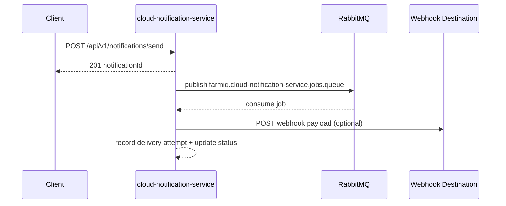

Purpose: Notification service for FarmIQ (cloud layer).
Scope: In-app notifications, RabbitMQ delivery jobs, webhook attempts, and history/inbox APIs.
Owner: Codex
Last updated: 2025-02-04

---

## Purpose + Architecture

cloud-notification-service stores notifications in Postgres and queues delivery jobs via RabbitMQ. In-app notifications are marked sent immediately; webhook/email/sms deliveries are handled by a worker that records delivery attempts.

## Flow Diagram



## Endpoints

| Method | Path | Auth | Roles |
|:--|:--|:--|:--|
| GET | /api/health | none | - |
| GET | /api/ready | none | - |
| GET | /api-docs | none | - |
| POST | /api/v1/notifications/send | JWT | tenant_admin, farm_manager |
| GET | /api/v1/notifications/history | JWT | tenant_admin, farm_manager, house_operator, viewer |
| GET | /api/v1/notifications/inbox | JWT | tenant_admin, farm_manager, house_operator, viewer |

## Configuration

Required:
- APP_PORT
- DATABASE_URL
- RABBITMQ_URL

Optional:
- WORKER_CONCURRENCY (default: 1)
- DD_SERVICE / DD_ENV / DD_VERSION / DD_AGENT_HOST / DD_TRACE_AGENT_PORT

## Database Schema

Tables:
- notifications
- notification_targets
- notification_delivery_attempts

Indexes:
- (tenant_id, created_at desc)
- (tenant_id, farm_id, barn_id, batch_id, created_at desc)
- unique (tenant_id, idempotency_key) when idempotency_key is not null
- unique (tenant_id, external_ref) when external_ref is not null

## Example Requests

Send notification:

```json
{
  "severity": "warning",
  "channel": "in_app",
  "title": "Feed system alert",
  "message": "Feed delivery delay detected",
  "farmId": "018f1a84-bb0e-7d3f-b2e4-9e8b5f8e0002",
  "targets": [{ "type": "role", "value": "farm_manager" }],
  "dedupeKey": "feed-delay-2025-02-04"
}
```

History query:

```
GET /api/v1/notifications/history?severity=warning&limit=25
```

## Worker Notes

- Queue: `farmiq.cloud-notification-service.jobs.queue`
- DLQ: `farmiq.cloud-notification-service.jobs.dlq`
- Max attempts: 3
- Webhook destination pulled from notification payload (`webhookUrl`, `url`, or `destination`)

## Evidence

Commands (PowerShell-friendly):

```powershell
# Install dependencies
npm --prefix cloud-layer/cloud-notification-service install

# Build + test
npm --prefix cloud-layer/cloud-notification-service run build
npm --prefix cloud-layer/cloud-notification-service test

# Docker build
docker build -t cloud-notification-service cloud-layer/cloud-notification-service

# Health check
curl http://localhost:5128/api/health

# Send notification
$body = @{
  severity = "info"
  channel = "in_app"
  title = "System Alert"
  message = "Test notification"
  farmId = "018f1a84-bb0e-7d3f-b2e4-9e8b5f8e0002"
} | ConvertTo-Json

Invoke-RestMethod -Method Post -Uri http://localhost:5128/api/v1/notifications/send -ContentType "application/json" -Headers @{ "x-tenant-id" = "018f1a84-bb0e-7d3f-b2e4-9e8b5f8e0001" } -Body $body

# History
Invoke-RestMethod -Method Get -Uri "http://localhost:5128/api/v1/notifications/history?limit=25" -Headers @{ "x-tenant-id" = "018f1a84-bb0e-7d3f-b2e4-9e8b5f8e0001" }
```
