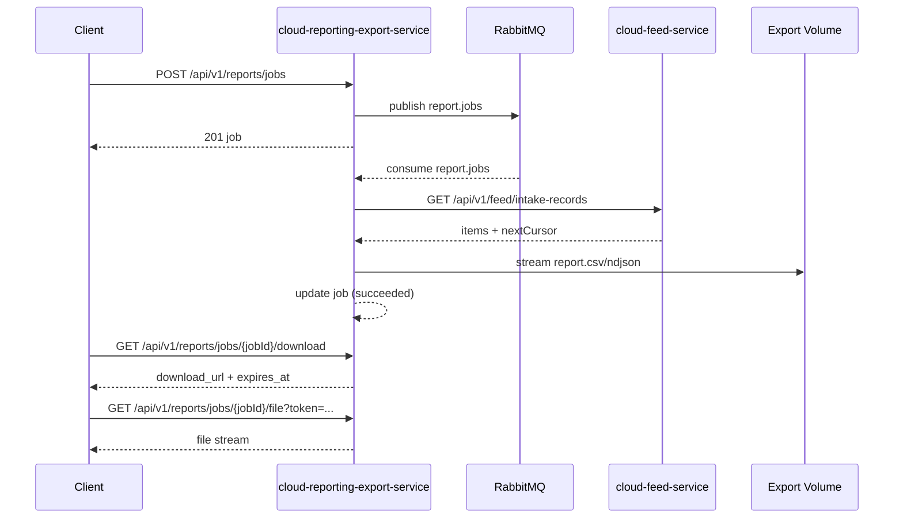

Purpose: Async export/report jobs service for FarmIQ (cloud layer).
Scope: API endpoints, job storage, RabbitMQ worker, and local export file delivery.
Owner: Codex
Last updated: 2025-02-04

---

## Purpose + Architecture

The cloud-reporting-export-service provides async export job creation, status tracking, and download URLs for report files. Jobs are persisted in Postgres, queued via RabbitMQ, and processed by a worker that streams export files to a local volume.

## Flow Diagram



## Endpoints

| Method | Path | Auth | Roles |
|:--|:--|:--|:--|
| GET | /api/health | none | - |
| GET | /api/ready | none | - |
| GET | /api-docs | none | - |
| GET | /api-docs/openapi.json | none | - |
| POST | /api/v1/reports/jobs | JWT | tenant_admin, farm_manager |
| GET | /api/v1/reports/jobs | JWT | tenant_admin, farm_manager, house_operator, viewer |
| GET | /api/v1/reports/jobs/:jobId | JWT | tenant_admin, farm_manager, house_operator, viewer |
| GET | /api/v1/reports/jobs/:jobId/download | JWT | tenant_admin, farm_manager, house_operator, viewer |
| GET | /api/v1/reports/jobs/:jobId/file | token | - |

## Configuration

Required:
- PORT or APP_PORT
- DATABASE_URL
- RABBITMQ_URL
- REPORT_DOWNLOAD_SECRET
- EXPORT_ROOT (default: /data/exports)
- WORKER_CONCURRENCY

Optional:
- CLOUD_FEED_SERVICE_URL / FEED_SERVICE_URL / FEED_BASE_URL
- INTERNAL_SERVICE_TOKEN
- REPORT_DOWNLOAD_TTL_SEC (default: 900)

## Database Schema

Table: `report_jobs`

| Column | Type | Notes |
|:--|:--|:--|
| id | text | PK, UUID value |
| tenant_id | text | Tenant scope |
| requested_by | text | JWT subject |
| job_type | enum | FEED_INTAKE_EXPORT, KPI_FEEDING_EXPORT, TELEMETRY_EXPORT, WEIGHVISION_EXPORT |
| format | enum | csv, json (NDJSON output) |
| farm_id | text | optional scope |
| barn_id | text | optional scope |
| batch_id | text | optional scope |
| start_date | date | optional scope |
| end_date | date | optional scope |
| filters | jsonb | optional |
| status | enum | queued, running, succeeded, failed, cancelled |
| progress_pct | int | default 0 |
| file_path | text | optional |
| file_name | text | optional |
| mime_type | text | optional |
| size_bytes | bigint | optional |
| sha256 | text | optional |
| expires_at | timestamptz | optional |
| error_code | text | optional |
| error_message | text | optional |
| idempotency_key | text | optional, unique per tenant |
| created_at | timestamptz | default now() |
| updated_at | timestamptz | auto-updated |

Indexes:
- (tenant_id, created_at desc)
- unique (tenant_id, idempotency_key) when idempotency_key is not null

## Example Requests/Responses

Create job (201):

```json
{
  "job_type": "FEED_INTAKE_EXPORT",
  "format": "csv",
  "farm_id": "018f1a84-bb0e-7d3f-b2e4-9e8b5f8e0002",
  "start_date": "2025-01-01",
  "end_date": "2025-01-31",
  "filters": { "source": "MANUAL" },
  "idempotency_key": "export-jan-2025"
}
```

```json
{
  "id": "018f1a84-bb0e-7d3f-b2e4-9e8b5f8e1010",
  "tenant_id": "018f1a84-bb0e-7d3f-b2e4-9e8b5f8e0001",
  "requested_by": "user-123",
  "job_type": "FEED_INTAKE_EXPORT",
  "format": "csv",
  "farm_id": "018f1a84-bb0e-7d3f-b2e4-9e8b5f8e0002",
  "barn_id": null,
  "batch_id": null,
  "start_date": "2025-01-01",
  "end_date": "2025-01-31",
  "filters": { "source": "MANUAL" },
  "status": "queued",
  "progress_pct": 0,
  "file_path": null,
  "file_name": null,
  "mime_type": null,
  "size_bytes": null,
  "sha256": null,
  "expires_at": null,
  "error_code": null,
  "error_message": null,
  "idempotency_key": "export-jan-2025",
  "created_at": "2025-02-04T12:00:00.000Z",
  "updated_at": "2025-02-04T12:00:00.000Z"
}
```

Get job (200):

```json
{
  "id": "018f1a84-bb0e-7d3f-b2e4-9e8b5f8e1010",
  "tenant_id": "018f1a84-bb0e-7d3f-b2e4-9e8b5f8e0001",
  "requested_by": "user-123",
  "job_type": "FEED_INTAKE_EXPORT",
  "format": "csv",
  "status": "succeeded",
  "progress_pct": 100,
  "file_name": "report.csv",
  "mime_type": "text/csv",
  "size_bytes": 10240,
  "sha256": "...",
  "expires_at": null,
  "created_at": "2025-02-04T12:00:00.000Z",
  "updated_at": "2025-02-04T12:05:00.000Z"
}
```

Download URL (200):

```json
{
  "download_url": "/api/v1/reports/jobs/018f1a84-bb0e-7d3f-b2e4-9e8b5f8e1010/file?token=...",
  "expires_at": "2025-02-04T12:20:00.000Z"
}
```

Not ready (409):

```json
{
  "error": {
    "code": "REPORT_NOT_READY",
    "message": "Report is not ready",
    "traceId": "trace-id-123"
  }
}
```

Validation error (400):

```json
{
  "error": {
    "code": "VALIDATION_ERROR",
    "message": "end_date must be on or after start_date",
    "traceId": "trace-id-123"
  }
}
```

## Evidence

Commands (PowerShell-friendly):

```powershell
# Install dependencies
npm --prefix cloud-layer/cloud-reporting-export-service install

# Build + test
npm --prefix cloud-layer/cloud-reporting-export-service run build
npm --prefix cloud-layer/cloud-reporting-export-service test

# Docker build
docker build -t cloud-reporting-export-service cloud-layer/cloud-reporting-export-service

# Health check
curl http://localhost:5129/api/health

# Create job (example; use valid JWT and tenant_id in dev)
$body = @{
  job_type = "FEED_INTAKE_EXPORT"
  format = "csv"
  farm_id = "018f1a84-bb0e-7d3f-b2e4-9e8b5f8e0002"
  start_date = "2025-01-01"
  end_date = "2025-01-31"
  idempotency_key = "export-jan-2025"
  tenant_id = "018f1a84-bb0e-7d3f-b2e4-9e8b5f8e0001"
} | ConvertTo-Json

Invoke-RestMethod -Method Post -Uri http://localhost:5129/api/v1/reports/jobs -ContentType "application/json" -Body $body
```
