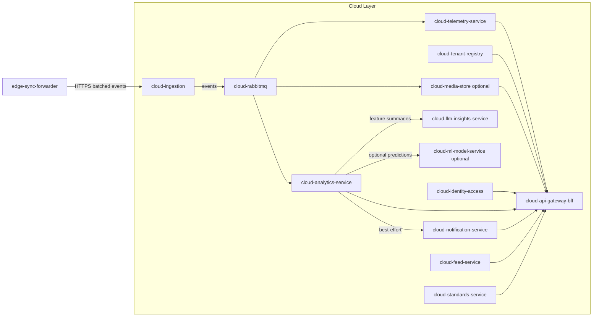
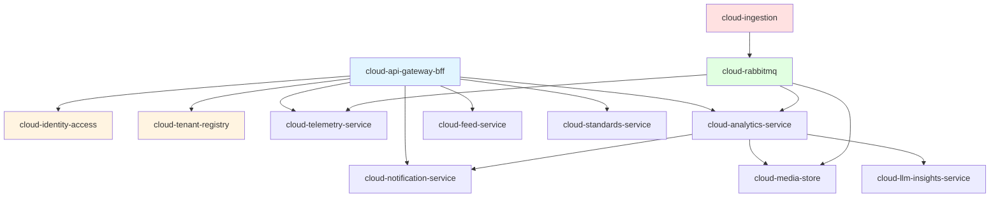

# Cloud-Layer Requirements

**Purpose**: Summarize the requirements for the FarmIQ cloud-layer based on documentation analysis.  
**Scope**: All cloud-layer services, APIs, data models, and non-functional requirements.  
**Owner**: FarmIQ Architecture Team  
**Last updated**: 2025-12-27

---

## Table of Contents

1. [Overview](#1-overview)
2. [Architecture](#2-architecture)
3. [Service Requirements](#3-service-requirements)
4. [API Standards](#4-api-standards)
5. [Security & RBAC](#5-security--rbac)
6. [Data Requirements](#6-data-requirements)
7. [Non-Functional Requirements](#7-non-functional-requirements)
8. [Integration Requirements](#8-integration-requirements)

---

## 1. Overview

### 1.1 Purpose

The cloud layer is the central, multi-tenant platform for FarmIQ that provides:
- Public APIs for dashboards and integrations
- Multi-tenant master data management (tenant/farm/barn/batch/device)
- Durable telemetry storage and query
- Analytics and derived KPIs
- Optional cloud media retention (PVC-based, not object storage)

### 1.2 Key Characteristics

- Kubernetes-based, horizontally scalable stateless services
- **RabbitMQ** is the cloud event bus (`cloud-rabbitmq`) for internal events
- Strong security posture via OIDC/JWT + RBAC
- All services must be stateless and HPA-friendly

### 1.3 Canonical Cloud Services (MVP)

**Infrastructure:**
- `cloud-rabbitmq` - Central message broker for cloud events

**Business Services:**
- `cloud-api-gateway-bff` (Node) - Single public API entrypoint and BFF for React dashboard
- `cloud-identity-access` (Node) - Authentication and authorization service
- `cloud-tenant-registry` (Node) - Master data owner (tenant/farm/barn/batch/device)
- `cloud-standards-service` (Node) - Reference/standard/target master data
- `cloud-ingestion` (Node) - Cloud ingress owner (single entry from edge)
- `cloud-telemetry-service` (Node) - Telemetry storage and query
- `cloud-analytics-service` (Python) - Anomaly/forecast/KPI + insights orchestration
- `cloud-llm-insights-service` (Python) - Generates structured insights from feature summaries
- `cloud-notification-service` (Node) - In-app notifications and delivery jobs
- `cloud-feed-service` (Node) - Feed master data and intake records
- `cloud-barn-records-service` (Node) - Barn records management
- `cloud-ml-model-service` (optional; Python) - Hosts prediction/forecast models
- `cloud-media-store` (optional; Node) - PVC-based cloud image storage

**Ownership Guards (Non-negotiable):**
- **Cloud ingress owner**: `cloud-ingestion` ONLY
- **Multi-tenant master data owner**: `cloud-tenant-registry`

---

## 2. Architecture

### 2.1 Cloud Message Flow

```
1. edge-sync-forwarder sends batched events to cloud-ingestion over HTTPS
2. cloud-ingestion validates and deduplicates by (tenant_id, event_id)
3. cloud-ingestion publishes events to cloud-rabbitmq
4. Consumers (cloud-telemetry-service, cloud-analytics-service, optional cloud-media-store) 
   process events idempotently and write to their owned stores
```

### 2.2 Synchronous Insight Flow (dashboard → orchestrator → ML/LLM)

This flow is **synchronous** and **user-driven**:

```
1. dashboard-web calls cloud-api-gateway-bff
2. cloud-api-gateway-bff calls cloud-analytics-service orchestrator endpoints
3. cloud-analytics-service aggregates feature summaries (KPIs/anomalies/forecasts) and:
   - optionally calls cloud-ml-model-service (predictions/forecasts), and
   - calls cloud-llm-insights-service to generate the final structured insight
4. cloud-analytics-service returns a combined response to the BFF
```

**Important guardrails:**
- `cloud-llm-insights-service` MUST NOT receive raw telemetry; it only receives **feature summaries**
- All requests enforce tenant scope + RBAC and propagate `x-request-id` end-to-end

### 2.3 In-App Notification Flow (MVP)

- **Inbox listing (dashboard)**: dashboard-web → BFF → cloud-notification-service
- **Insight → Notification creation (best-effort)**: After successful LLM insight generation, analytics-service calls notification-service to create an in-app notification
- Notification creation is **best-effort** and MUST NOT block the main insight response

### 2.4 Architecture Diagram



---

## 3. Service Requirements

### 3.1 cloud-rabbitmq

**Purpose**: Cloud event bus for FarmIQ

**Requirements:**
- AMQP endpoints (internal)
- Hosts exchanges and queues for telemetry, analytics, and media
- No DB tables owned
- High availability configuration

### 3.2 cloud-api-gateway-bff (Node)

**Purpose**: Single public API entrypoint and BFF for the React dashboard

**API Requirements:**
- Base path: `/api`
- Health: `GET /api/health`, `GET /api/ready`
- Docs: `GET /api-docs`
- Dashboard endpoints:
  - `GET /api/v1/dashboard/overview`
  - `GET /api/v1/dashboard/farms/{farmId}`
  - `GET /api/v1/dashboard/barns/{barnId}`
  - `GET /api/v1/dashboard/alerts`
- Notifications endpoints:
  - `GET /api/v1/notifications/inbox`
  - `GET /api/v1/notifications/history`
  - `POST /api/v1/notifications/send`
- Insights endpoints:
  - `POST /api/v1/dashboard/insights/generate`
  - `GET /api/v1/dashboard/insights`
  - `GET /api/v1/dashboard/insights/:insightId`

**Data Requirements:**
- No DB tables owned (aggregation layer)

**Integration Requirements:**
- Proxies/aggregates data from downstream services
- Enforces auth + tenant scoping for dashboard features
- Implements BFF patterns for dashboard UI

**Boilerplate**: `boilerplates/Backend-node`

### 3.3 cloud-identity-access (Node)

**Purpose**: Authentication and authorization service. MVP: Password-based authentication; Production: OIDC integration support

**API Requirements:**
- Base path: `/api`
- Health: `GET /api/health`, `GET /api/ready`
- Docs: `GET /api-docs`
- Auth endpoints:
  - `POST /api/v1/auth/login` (MVP: email/password; Future: OIDC redirect)
  - `POST /api/v1/auth/refresh` (refresh token exchange)
  - `GET /api/v1/users/me` (current user profile with roles)

**Data Requirements:**
- DB tables owned:
  - `user` - id, email, password, tenant_id, created_at, updated_at
  - `role` - id, name
  - `user_role` - many-to-many join table
  - `audit_log` (optional)

**Security Requirements:**
- Issues/validates JWTs with tenant and role claims
- Enforces RBAC per endpoint
- Password hashing (bcrypt or similar)

**Boilerplate**: `boilerplates/Backend-node`

### 3.4 cloud-tenant-registry (Node) - Master data owner

**Purpose**: Own tenant/farm/barn/batch/device canonical data for multi-tenant isolation

**API Requirements:**
- Base path: `/api`
- Health: `GET /api/health`, `GET /api/ready`
- Docs: `GET /api-docs`
- Resource collections:
  - `/api/v1/tenants`
  - `/api/v1/farms`
  - `/api/v1/barns`
  - `/api/v1/batches`
  - `/api/v1/devices`
- Topology view: `GET /api/v1/topology`

**Data Requirements:**
- DB tables owned:
  - `tenant` - id, name, status, created_at, updated_at
  - `farm` - id, tenant_id, name, location, status, created_at, updated_at
  - `barn` - id, tenant_id, farm_id, name, animal_type, status, created_at, updated_at
  - `batch` - id, tenant_id, farm_id, barn_id, species, start_date, end_date, status
  - `device` - id, tenant_id, farm_id, barn_id, batch_id, device_type, serial_no, status, metadata
  - `station` - id, tenant_id, farm_id, barn_id, name, station_type, status
- Sensor Module (Phase 1) tables:
  - `sensors` - id, tenant_id, sensor_id, type, unit, label, barn_id, zone, enabled
  - `sensor_bindings` - id, tenant_id, binding_id, sensor_id, device_id, protocol, channel, sampling_rate, effective_from, effective_to, enabled
  - `sensor_calibrations` - id, tenant_id, calibration_id, sensor_id, method, offset, gain, performed_at, performed_by, notes

**Ownership Requirements:**
- Multi-tenant master data owner
- Enforces tenant isolation
- Provides lookups by IDs

**Boilerplate**: `boilerplates/Backend-node`

### 3.5 cloud-standards-service (Node) - Standards owner

**Purpose**: Store and serve reference/standard/target master data (growth, ventilation, lighting, environmental limits) with scope precedence resolution

**API Requirements:**
- Base path: `/api`
- Health: `GET /api/health`, `GET /api/ready`
- Docs: `GET /api-docs`
- Read endpoints:
  - `GET /api/v1/standards/sets`
  - `GET /api/v1/standards/sets/{setId}`
  - `GET /api/v1/standards/sets/{setId}/rows`
  - `GET /api/v1/standards/resolve`
- Write (admin) endpoints:
  - `POST /sets`
  - `PATCH /sets/{setId}`
  - `PUT /sets/{setId}/rows`
  - `POST /imports/csv`
  - `POST /sets/{setId}/clone`
  - `POST /sets/{setId}/adjust`

**Data Requirements:**
- DB tables owned:
  - `standard_sets`
  - `standard_rows`
  - `source_documents`
  - `import_jobs`

**Boilerplate**: `boilerplates/Backend-node`

### 3.6 cloud-ingestion (Node) - Cloud ingress owner

**Purpose**: The only entrypoint for edge-to-cloud sync traffic; validates, deduplicates, and publishes to RabbitMQ

**API Requirements:**
- Base path: `/api`
- Health: `GET /api/health`, `GET /api/ready`
- Docs: `GET /api-docs`
- Ingestion endpoint:
  - `POST /api/v1/edge/batch` - Accepts array of standard event envelopes, performs idempotent insert using (tenant_id, event_id)

**Data Requirements:**
- DB tables owned:
  - `ingestion_dedupe` or `ingested_event` - tenant_id, event_id, first_seen_at
- Dedupe key: `(tenant_id, event_id)` (mandatory safety net)

**RabbitMQ Requirements:**
- Producer: publishes to domain exchanges (telemetry, weighvision, media, inference, sync)

**Boilerplate**: `boilerplates/Backend-node`

### 3.7 cloud-telemetry-service (Node)

**Purpose**: Consume telemetry-related events and provide query APIs

**API Requirements:**
- Base path: `/api`
- Health: `GET /api/health`, `GET /api/ready`
- Docs: `GET /api-docs`
- Query endpoints:
  - `/api/v1/telemetry/readings`
  - `/api/v1/telemetry/aggregates`
  - `/api/v1/telemetry/metrics`
  - `/api/v1/weighvision/sessions`

**Data Requirements:**
- DB tables owned:
  - `telemetry_raw` - tenant_id, farm_id, barn_id, device_id, batch_id, metric, value, unit, occurred_at, event_id
  - `telemetry_agg` - tenant_id, farm_id, barn_id, device_id, metric, bucket_start, bucket_size, avg/min/max/count
  - `consumer_offset` (optional for idempotent consumption)

**RabbitMQ Consumers:**
- Routing keys: `telemetry.ingested`, `telemetry.aggregated`, `weighvision.session.finalized`

**Boilerplate**: `boilerplates/Backend-node`

### 3.8 cloud-analytics-service (Python)

**Purpose**: Consume events and compute anomalies/forecasts/KPIs; also acts as the orchestrator for synchronous "insights generation"

**API Requirements:**
- Base path: `/api`
- Health: `GET /api/health`, `GET /api/ready`
- Docs: `GET /api-docs`
- Analytics read:
  - `GET /api/v1/analytics/kpis`
  - `GET /api/v1/analytics/anomalies`
  - `GET /api/v1/analytics/forecasts`
- Orchestrator (MVP):
  - `POST /api/v1/analytics/insights/generate`
  - `GET /api/v1/analytics/insights`
  - `GET /api/v1/analytics/insights/{insightId}`

**Data Requirements:**
- DB tables owned:
  - `analytics_results` - kpi/anomaly/forecast materialization
  - `analytics_anomaly`
  - `analytics_insight` (optional; combined response cache/history)
  - `analytics_insight_run` (optional; audit of downstream calls)
  - `analytics_event_dedupe` - tenant_id, event_id, first_seen_at

**RabbitMQ Consumers:**
- Routing keys: `telemetry.ingested`, `telemetry.aggregated`, `inference.completed`, `weighvision.session.finalized`

**Sync Dependencies:**
- Calls `cloud-llm-insights-service` with **feature summaries only** (no raw telemetry payloads)
- Optionally calls `cloud-ml-model-service` for prediction/forecast

**Boilerplate**: `boilerplates/Backend-python`

### 3.9 cloud-llm-insights-service (Python)

**Purpose**: Generate structured "insights" (summary/findings/causes/actions/confidence/references) from analytics feature summaries

**API Requirements:**
- Base path: `/api`
- Health: `GET /api/health`, `GET /api/ready`
- Docs: `GET /api-docs`
- Insight endpoints:
  - `POST /api/v1/llm-insights/analyze`
  - `GET /api/v1/llm-insights/history`
  - `GET /api/v1/llm-insights/{insightId}`
  - `GET /api/v1/llm-insights/templates` (optional)

**Data Requirements:**
- DB tables owned:
  - `llm_insight`
  - `llm_insight_run` (audit)
  - `llm_prompt_template` (optional)

**RabbitMQ**: None for MVP (synchronous)

**Boilerplate**: `boilerplates/Backend-python`

### 3.10 cloud-ml-model-service (optional; Python)

**Purpose**: Host and version ML models (regression, time-series, forecasting) and serve predictions

**API Requirements:**
- Base path: `/api`
- Health: `GET /api/health`, `GET /api/ready`
- Docs: `GET /api-docs`
- ML endpoints:
  - `POST /api/v1/ml/predict`
  - `POST /api/v1/ml/forecast`
  - `GET /api/v1/ml/models`
  - `GET /api/v1/ml/models/{modelKey}`

**Data Requirements:**
- DB tables owned (optional):
  - `ml_model_registry` (optional)
  - `ml_prediction_log` (optional)

**RabbitMQ**: None for MVP (synchronous)

**Boilerplate**: `boilerplates/Backend-python`

### 3.11 cloud-notification-service (Node)

**Purpose**: Store and serve notifications (in-app) and manage delivery attempts for non-in-app channels (queue-backed)

**API Requirements:**
- Base path: `/api`
- Health: `GET /api/health`, `GET /api/ready`
- Docs: `GET /api-docs`
- Notification endpoints:
  - `POST /api/v1/notifications/send`
  - `GET /api/v1/notifications/history`
  - `GET /api/v1/notifications/inbox`

**Data Requirements:**
- DB tables owned:
  - `notifications`
  - `notification_targets`
  - `notification_delivery_attempts`

**RBAC Requirements:**
- Send: `tenant_admin`, `farm_manager`
- History/Inbox: `tenant_admin`, `farm_manager`, `house_operator`, `viewer`

**Severity Levels**: `info` | `warning` | `critical`

**Idempotency & Dedupe:**
- `Idempotency-Key` header is stored as `idempotency_key` and unique per tenant
- `externalRef` is unique per tenant (recommended for entity-based de-duplication)
- `dedupeKey` is stored for additional grouping but is not the unique idempotency mechanism

**Async:**
- Non-`in_app` channels are enqueued via RabbitMQ jobs
- `in_app` channel is stored with status `sent` immediately (no queue)

**Boilerplate**: `boilerplates/Backend-node`

### 3.12 cloud-feed-service (Node)

**Purpose**: Define the cloud service that owns feed master data and authoritative feed intake records

**API Requirements:**
- Base path: `/api`
- Health: `GET /api/health`, `GET /api/ready`
- Docs: `GET /api-docs`
- Feed management endpoints (see contract for full list)

**Data Requirements:**
- DB tables owned:
  - `feed_formula` - id, tenant_id, name, species, phase, energy_kcal_per_kg, protein_pct, fiber_pct, fat_pct, status
  - `feed_lot` - id, tenant_id, farm_id, supplier_name, lot_code, feed_formula_id, manufacture_date, received_date, quantity_kg, remaining_kg, status
  - `feed_delivery` - id, tenant_id, farm_id, barn_id, feed_lot_id, delivery_ref, delivered_at, quantity_kg, unit_cost, currency
  - `feed_quality_result` - id, tenant_id, feed_lot_id, sampled_at, metric, value, unit, method, status
  - `feed_intake_record` - id, tenant_id, farm_id, barn_id, batch_id, device_id, source, feed_formula_id, feed_lot_id, quantity_kg, occurred_at, event_id, idempotency_key, sequence, notes, created_by_user_id
  - `feed_program` (optional)
  - `feed_inventory_snapshot` (optional)

**Idempotency Requirements:**
- `event_id` + `tenant_id` for edge events
- `Idempotency-Key` for HTTP writes

**Boilerplate**: `boilerplates/Backend-node`

### 3.13 cloud-barn-records-service (Node)

**Purpose**: Barn records management service

**API Requirements:**
- Base path: `/api`
- Health: `GET /api/health`, `GET /api/ready`
- Docs: `GET /api-docs`
- Barn records endpoints (see contract for full list)

**Data Requirements:**
- DB tables owned (see schema for full list)

**Boilerplate**: `boilerplates/Backend-node`

### 3.14 cloud-media-store (optional; Node)

**Purpose**: Store and serve media in the cloud on PVC (if cloud retention required)

**API Requirements:**
- Base path: `/api`
- Health: `GET /api/health`, `GET /api/ready`
- Docs: `GET /api-docs`
- Media endpoints:
  - `POST /api/v1/media/images`
  - `GET /api/v1/media/objects/{objectId}`
  - `GET /api/v1/media/objects/{objectId}/meta`

**Data Requirements:**
- DB tables owned:
  - `media_object_cloud`

**RabbitMQ Consumers:**
- Routing keys: `media.stored`, `weighvision.session.finalized`

**PVC Usage:**
- Mount: `/data/media`
- No object storage

**Boilerplate**: `boilerplates/Backend-node`

---

## 4. API Standards

### 4.1 Required Endpoints

Every HTTP service must expose:
- **Health**: `GET /api/health`
  - Response: `200 OK` with a simple payload (or `OK` text)
- **Ready** (recommended): `GET /api/ready`
  - Response: `200 OK` when service is ready to serve traffic
- **OpenAPI docs**: `GET /api-docs`
  - Swagger UI backed by OpenAPI definition
  - OpenAPI spec at `GET /api-docs/openapi.json`

### 4.2 Base Path and Routing Conventions

- Base path for APIs: **`/api`**
- Business endpoints MUST be under: **`/api/v1/...`**
- Resource naming:
  - Use nouns and plural resources: `/api/devices`, `/api/sessions`
  - Use path params for identifiers: `/api/devices/{device_id}`
  - Use `GET` for reads, `POST` for create/actions, `PATCH` for partial update

### 4.3 Correlation and Tracing Headers

**Required headers (request):**
- **`x-request-id`**: Unique ID for request correlation across logs
- **`x-trace-id`**: Trace correlation header

**Required fields (logs):**
- `requestId` (from `x-request-id`)
- `traceId` (from tracer / `x-trace-id`)
- `service`, `env`, and `version` (recommended)

### 4.4 Standard Error Response Format

All APIs must return errors in this JSON shape:

```json
{
  "error": {
    "code": "VALIDATION_ERROR",
    "message": "farm_id is invalid",
    "traceId": "trace-id-123"
  }
}
```

**Suggested error codes:**
- `VALIDATION_ERROR` (400)
- `UNAUTHORIZED` (401)
- `FORBIDDEN` (403)
- `NOT_FOUND` (404)
- `CONFLICT` (409)
- `RATE_LIMITED` (429)
- `INTERNAL_ERROR` (500)

### 4.5 Request Validation

- Node services should validate payloads with Zod
- Python services should validate with Pydantic (FastAPI)
- Reject invalid payloads with `400` and `VALIDATION_ERROR`

### 4.6 List Endpoint Standards

All list endpoints MUST support:
- `page`: Integer, 1-based index (Default: 1)
- `limit`: Integer (Default: 20 or 25)
- `sort_by`: String (Field name)
- `sort_dir`: String (`asc` | `desc`)
- `q`: String (Search query)
- `start_time` / `end_time`: ISO 8601 Strings (for time-series)

**Response format:**
```json
{
  "data": [ ... ],
  "meta": {
    "page": 1,
    "limit": 25,
    "total": 120,
    "hasNext": true
  }
}
```

### 4.7 Multi-Tenant Headers

All requests MUST include:
1. `Authorization`: `Bearer <token>`
2. `x-request-id`: UUID v4 (Generated by FE for tracing)
3. `tenant_id`: Query param (BFF validation)

---

## 5. Security & RBAC

### 5.1 Roles

| Role | Description | Key Permissions |
| :--- | :--- | :--- |
| **platform_admin** | System Owner | Manage Tenants, provisioning, global system health |
| **tenant_admin** | Farm Owner | Manage Farms, Users, Devices, Billing. Full access to own tenant |
| **farm_manager** | Vet / Manager | View all farm data, acknowledge alerts, edit thresholds. No user management |
| **house_operator** | Farm Hand | View telemetry, alerts, and sessions. Read-only mostly |
| **viewer** | Auditor / Guest | Read-only access to specific dashboard pages |
| **device_agent** | Machine identity | Used by edge services and IoT agents (no human UI permissions) |

### 5.2 RBAC Authorization Matrix

| Role | Tenant registry (R) | Tenant registry (W) | Telemetry (R) | Telemetry (W) | WeighVision (R) | WeighVision (W) | Media (R) | Media (W) | Analytics (R) | Analytics (W) |
|---|---:|---:|---:|---:|---:|---:|---:|---:|---:|---:|
| `platform_admin` | ✅ | ✅ | ✅ | ✅ | ✅ | ✅ | ✅ | ✅ | ✅ | ✅ |
| `tenant_admin` | ✅ | ✅ | ✅ | ✅ | ✅ | ✅ | ✅ | ✅ | ✅ | ✅ |
| `farm_manager` | ✅ | ⚠️ | ✅ | ❌ | ✅ | ⚠️ | ✅ | ⚠️ | ✅ | ⚠️ |
| `house_operator` | ✅ | ❌ | ✅ | ❌ | ✅ | ⚠️ | ✅ | ⚠️ | ✅ | ❌ |
| `viewer` | ✅ | ❌ | ✅ | ❌ | ✅ | ❌ | ✅ | ❌ | ✅ | ❌ |
| `device_agent` | ❌ | ❌ | ❌ | ✅ | ❌ | ✅ | ❌ | ⚠️ | ❌ | ❌ |

### 5.3 Permission Matrix (Quick Reference)

| Action | Platform Admin | Tenant Admin | Farm Manager | House Operator | Viewer |
| :--- | :---: | :---: | :---: | :---: | :---: |
| **Create Tenant** | ✅ | ❌ | ❌ | ❌ | ❌ |
| **Create Farm** | ✅ | ✅ | ❌ | ❌ | ❌ |
| **Provision Device**| ✅ | ✅ | ❌ | ❌ | ❌ |
| **Acknowledge Alert**| ✅ | ✅ | ✅ | ❌ | ❌ |
| **View Telemetry** | ✅ | ✅ | ✅ | ✅ | ✅ |
| **Manage Users** | ✅ | ✅ | ❌ | ❌ | ❌ |

### 5.4 Scope Constraints

- **`farm_manager`** write scope is limited to **assigned farms/barns**
- **`house_operator`** write scope is limited to **assigned barns/houses** and only operational actions
- **`device_agent`**:
  - Device → edge ingestion is **MQTT-only**
  - The only allowed device HTTP calls are for **media upload via presigned URL**
  - May request a presigned upload URL and upload media bytes, but must not list arbitrary media objects

### 5.5 Enforcement Guidance

- Enforce tenant and farm/barn scope in the authorization middleware
- All write operations SHOULD be audited (actor id, role, tenant, resource id, action, trace id)
- Prefer explicit permissions (domain + action) over implicit role checks when implementing new APIs

### 5.6 Auth Implementation Rules

1. **Source of Truth**: The permissions source is the `/api/v1/users/me` endpoint, which returns a `roles: string[]` array
2. **Route Guards**:
   - **Level 1**: Check `isAuthenticated`. Redirect to `/login` if false
   - **Level 2**: Check `hasRole`. Redirect to `/403` if false
3. **Feature Flags**: Hide/Disable buttons if the user lacks the role

### 5.7 Token Storage (Dashboard)

- **Access Tokens**: Store in **Memory** (React Context / Redux state)
- **Refresh Token**: Store in `httpOnly` cookie (preferred) or `localStorage`

### 5.8 XSS Prevention

- **Rule**: Never use `dangerouslySetInnerHTML`
- **Sanitization**: If rich text is absolutely required, use `DOMPurify` before rendering

---

## 6. Data Requirements

### 6.1 Database Landscape

- **Primary RDBMS**: PostgreSQL (Prisma-managed schemas per service)
- **Time-series**: TimescaleDB (if enabled) for high-volume telemetry tables
- **File storage**: PVC-backed media storage for edge and optional cloud media
- **Schema separation**: Prefer separate databases or schemas per service for isolation

### 6.2 Core Domain Entities

Required identifiers:
- `tenant_id`, `farm_id`, `barn_id`, `device_id`
- Optional: `batch_id`, `session_id`

### 6.3 Data Ownership Map

**Cloud:**
- auth, tenant registry, ingestion dedupe, telemetry, analytics, media

**Edge:**
- ingress dedupe, telemetry, weigh sessions, media objects, inference, sync outbox/state

### 6.4 Table Categories

- **Master data**: tenants, farms, barns, batches, devices, stations
- **Operational**: sessions, media objects, inference results, device status
- **Telemetry/time-series**: raw readings, aggregates, rollups
- **Idempotency**: dedupe tables for ingress/ingestion/analytics
- **Integration**: outbox tables for reliable sync

### 6.5 Keys, Constraints, and Naming

- **Primary keys**: UUID v7 for high-write tables
- **Foreign keys**: enforce tenant-scoped relationships where relations exist
- **Naming**: snake_case tables/columns; consistent suffixes (e.g., `_id`, `_at`)
- **Unique constraints**:
  - Master data: `(tenant_id, name)` on farms/barns/stations where appropriate
  - Dedupe: `(tenant_id, event_id)` in ingress/ingestion/analytics
  - Telemetry agg: `(tenant_id, farm_id, barn_id, device_id, metric, bucket_start, bucket_size)`

### 6.6 Indexing and Partitioning

- **Telemetry raw**: `(tenant_id, occurred_at DESC)` and `(tenant_id, device_id, metric, occurred_at DESC)`
- **Telemetry agg**: `(tenant_id, bucket_start DESC)` and `(tenant_id, device_id, metric, bucket_start DESC)`
- **Ingress dedupe**: `(expires_at)` for TTL cleanup
- **Partitioning**: range partition by time for large telemetry tables

### 6.7 Retention, Archiving, and Cleanup

**Edge telemetry:**
- `telemetry_raw`: 30–90 days
- `telemetry_agg`: 6–12 months

**Edge media:**
- `media_objects` + PVC files: 30–90 days by default

**Outbox:**
- `sync_outbox`: keep acked rows 7–30 days for audit
- `ingress_dedupe`: TTL 24–72 hours

**Cloud telemetry:**
- Retain raw telemetry per compliance (2–7 years typical)
- Archive to datalake if required

### 6.8 Idempotency and Event Consistency

- **Ingress/ingestion**: `(tenant_id, event_id)` enforced in `ingress_dedupe` and `CloudDedupe`
- **Telemetry**: `telemetry_raw` unique on `(tenant_id, event_id)` (cloud)
- **Analytics**: `analytics_event_dedupe` + unique `(tenant_id, type, source_event_id, metric)` in `analytics_results`
- **Outbox**: edge services write to `sync_outbox`; `edge-sync-forwarder` batches and retries

### 6.9 Migrations and Schema Management

- **Node services**: Prisma migrations per service (migration files tracked in Git)
- **Python analytics**: DDL created in `cloud-layer/cloud-analytics-service/app/db.py`
- **Edge shared DB**: ensure a single migration source for shared tables
- **Deployment order**: apply migrations before service rollout

### 6.10 Backup and DR

- **RPO**: 15 minutes (cloud), 60 minutes (edge)
- **RTO**: 2–4 hours for cloud services; 2 hours for a single edge site
- **Coverage**: cloud DBs (schema + data + roles), edge DBs (outbox + dedupe + minimal metadata)
- **Non-goal**: raw media bytes on PVCs are not primary backup targets

### 6.11 Security and Compliance

- **Access control**: least-privilege DB users per service
- **Encryption**: TLS in transit; at-rest encryption per platform policy
- **PII**: avoid storing sensitive fields in telemetry or media metadata; audit access paths

---

## 7. Non-Functional Requirements

### 7.1 Scalability

- All cloud and edge services are stateless (except DBs and PVC-backed storage)
- Horizontally scalable under Kubernetes
- HPA should be configured per service

### 7.2 Offline and Intermittent Connectivity

- Edge services must operate when cloud is unreachable
- `edge-telemetry-timeseries`, `edge-weighvision-session`, and `edge-media-store` provide sufficient local buffering until sync resumes
- `edge-sync-forwarder` maintains `sync_state` for retrying batches

### 7.3 Observability

- Node services: Winston JSON logs → stdout; `dd-trace` for distributed tracing
- Python services: JSON structured logs → stdout; `ddtrace` for tracing
- Datadog Agent runs as a DaemonSet, collecting logs, metrics, and traces

### 7.4 Performance

- **Telemetry query latency**: < 500ms for typical queries
- **Insight generation**: 8–12s timeout for LLM calls
- **API response time**: < 200ms for simple queries

### 7.5 Availability

- **Cloud services**: 99.5% uptime target
- **Edge services**: Operate offline with sync when connectivity restored

### 7.6 Rate Limiting

- Enforce per-user limits; return 429 on breach
- Different limits per role (e.g., higher for service accounts)

### 7.7 Retry Policy

- **Permitted**: Network Failure, 502, 503, 504. (Max 3 retries, exponential backoff)
- **Forbidden**: 400, 401, 403, 404. (Do not retry logic errors)

### 7.8 Polling Policy (Dashboard MVP)

- **Global Interval**: No global polling
- **Dashboard Overview**: Poll every **60s**
- **Barn/Device Detail**: Poll every **30s**
- **Alerts**: Poll every **60s**
- Polling MUST pause when `document.visibilityState === 'hidden'`

---

## 8. Integration Requirements

### 8.1 Edge to Cloud Integration

**Message Flow:**
1. `edge-sync-forwarder` sends batched events to `cloud-ingestion` over HTTPS
2. `cloud-ingestion` validates and deduplicates by `(tenant_id, event_id)`
3. `cloud-ingestion` publishes events to `cloud-rabbitmq`
4. Consumers process events idempotently

**Idempotency:**
- Edge dedupes at `edge-ingress-gateway` level
- Cloud dedupes at `cloud-ingestion` level (safety net)
- Both use `(tenant_id, event_id)` as dedupe key

### 8.2 Dashboard Integration

**Rule**: `dashboard-web` MUST call **only** the `cloud-api-gateway-bff` for all data requirements

**Exception**: Auth endpoints (`/auth/login`) may be called directly if the Gateway proxies them transparently

### 8.3 Insights Integration

**Rule**: `dashboard-web` MUST call **only** `cloud-api-gateway-bff` for insights generation (no direct calls to analytics/LLM/ML services)

**BFF Endpoints:**
- `POST /api/v1/dashboard/insights/generate`
- `GET /api/v1/dashboard/insights?tenant_id=...&farm_id=...&barn_id=...&start_time=...&end_time=...&page=...&limit=...`
- `GET /api/v1/dashboard/insights/:insightId?tenant_id=...`

### 8.4 Notifications Integration

**Rule**: `dashboard-web` MUST call **only** `cloud-api-gateway-bff` for in-app notifications

**BFF Endpoints:**
- `GET /api/v1/notifications/inbox?tenantId=...&topic=&cursor=&limit=`
- `GET /api/v1/notifications/history?tenantId=...&farmId=&barnId=&batchId=&severity=&channel=&status=&startDate=&endDate=&cursor=&limit=`
- `POST /api/v1/notifications/send` (optional; admin only)

**UX Requirements:**
- Polling: refresh inbox every 60s; pause when `document.visibilityState === 'hidden'`
- Required headers: `Authorization: Bearer <jwt>`, `x-request-id: <uuid>`

---

## Appendix A: Service Dependencies



---

## Appendix B: References

- `docs/cloud-layer/00-overview.md`
- `docs/cloud-layer/01-cloud-services.md`
- `docs/cloud-layer/02-dashboard.md`
- `docs/01-architecture.md`
- `docs/shared/01-api-standards.md`
- `docs/06-rbac-authorization-matrix.md`
- `docs/04-database-design.md`
- `docs/contracts/cloud-api-gateway-bff.contract.md`
- `docs/contracts/cloud-analytics-service.contract.md`
