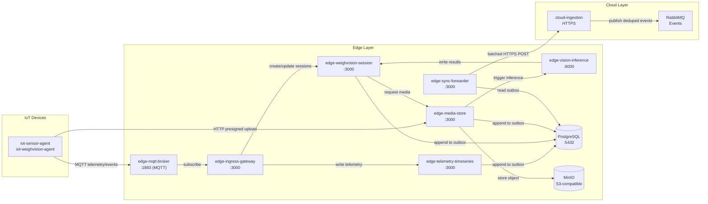
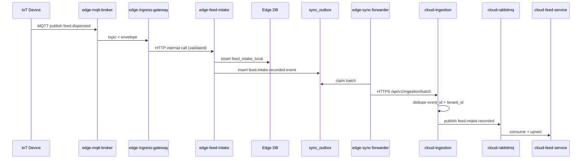
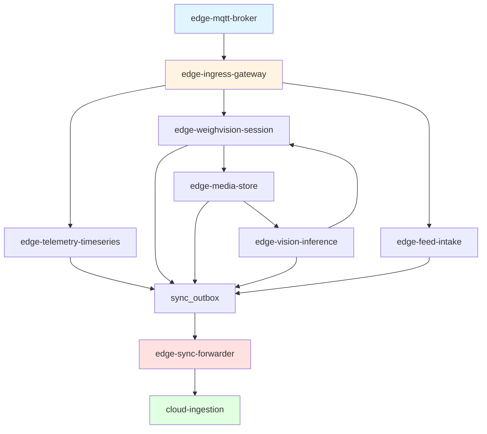

# Edge-Layer Requirements

**Purpose**: Summarize requirements for FarmIQ edge-layer based on documentation analysis.  
**Scope**: All edge-layer services, APIs, data models, and non-functional requirements.  
**Owner**: FarmIQ Architecture Team  
**Last updated**: 2025-12-31

---

## Table of Contents

1. [Overview](#1-overview)
2. [Architecture](#2-architecture)
3. [Service Requirements](#3-service-requirements)
4. [Data Requirements](#4-data-requirements)
5. [Sync & Outbox Requirements](#5-sync--outbox-requirements)
6. [MQTT & IoT Integration](#6-mqtt--iot-integration)
7. [Inference Pipeline](#7-inference-pipeline)
8. [Feed Intake](#8-feed-intake)
9. [Non-Functional Requirements](#9-non-functional-requirements)
10. [Security & Compliance](#10-security--compliance)
11. [Operations & Observability](#11-operations--observability)
12. [Backup & Recovery](#12-backup--recovery)

---

## 1. Overview

### 1.1 Purpose

The edge layer runs on k3s/Kubernetes clusters deployed close to barns. It provides:
- **Local buffering** of telemetry and media when cloud is unreachable
- **Real-time inference** on WeighVision sessions for immediate feedback
- **Reliable synchronization** to cloud using outbox pattern with idempotent delivery
- **Offline-first operation** for critical barn operations

### 1.2 Key Characteristics

- Runs on Kubernetes/k3s clusters deployed near barns
- Single PostgreSQL DB instance per edge cluster
- S3-compatible object storage (MinIO for local/edge, AWS S3 for cloud)
- Offline-first design with reliable sync to cloud
- No external in-memory cache/session store for cache/session/streams

### 1.3 Canonical Edge Services (MVP)

**Business Services:**
- `edge-mqtt-broker` (EMQX/Mosquitto) - MQTT message bus for IoT devices
- `edge-ingress-gateway` (Node) - MQTT normalizer, routes to internal services
- `edge-telemetry-timeseries` (Node) - Telemetry persistence and aggregation
- `edge-weighvision-session` (Node) - Session lifecycle owner
- `edge-media-store` (Node) - Media owner (S3-compatible storage)
- `edge-vision-inference` (Python) - ML inference owner
- `edge-sync-forwarder` (Node) - Sync owner (outbox → cloud)
- `edge-feed-intake` (Node) - Local feed intake management

**Ops/Support Services:**
- `edge-policy-sync` (Node) - Cache cloud config offline
- `edge-retention-janitor` (Node) - Enforce media retention policies
- `edge-observability-agent` (Node) - Aggregate health/status for ops
- `edge-ops-web` (UI + proxy) - UI for edge operations

**Infrastructure Components:**
- PostgreSQL (single DB for edge services)
- MinIO (S3-compatible object storage)
- Edge RabbitMQ (optional; internal broker for async processing)
- cloud-ingestion-mock (internal only; mock endpoint for testing)

### 1.4 Ownership Guards (Non-negotiable)

| Domain | Owner Service | Tables Owned |
|---------|--------------|--------------|
| Sessions | `edge-weighvision-session` | `weight_sessions` |
| Media | `edge-media-store` | `media_objects` (metadata), S3 objects |
| Inference | `edge-vision-inference` | `inference_results` |
| Sync | `edge-sync-forwarder` | `sync_outbox`, `sync_state`, `sync_outbox_dlq` |
| Telemetry | `edge-telemetry-timeseries` | `telemetry_raw`, `telemetry_agg` |

**Cross-cutting concerns:**
- `edge-ingress-gateway`: Stateless router, writes `ingress_dedupe` table only
- `edge-observability-agent`: Aggregator only, no data ownership
- `edge-ops-web`: UI/proxy layer, no direct DB access

---

## 2. Architecture

### 2.1 Canonical Data Flow

**Primary Flow: MQTT → Ingress → DB → Outbox → Sync → Cloud**



### 2.2 Flow Details

**1. Telemetry Ingestion**
- IoT devices publish to MQTT topics: `iot/telemetry/{tenantId}/{farmId}/{barnId}/{deviceId}/{metric}`
- `edge-mqtt-broker` receives messages and forwards to `edge-ingress-gateway`
- `edge-ingress-gateway` validates envelope, deduplicates, and writes to `edge-telemetry-timeseries`
- `edge-telemetry-timeseries` stores in PostgreSQL and appends to `sync_outbox`

**2. WeighVision Session Flow**
- Device captures weight + image, publishes session events to MQTT
- `edge-ingress-gateway` creates/updates session via `edge-weighvision-session`
- Device uploads image via presigned URL to `edge-media-store` (bypasses ingress gateway)
- `edge-media-store` stores in MinIO and triggers `edge-vision-inference`
- `edge-vision-inference` runs ML model and writes results back to session
- Session finalized, events appended to `sync_outbox`

**3. Cloud Synchronization**
- `edge-sync-forwarder` reads `sync_outbox` (pending rows) with `SELECT FOR UPDATE SKIP LOCKED`
- Batches events by tenant_id to optimize cloud processing
- Sends to `cloud-ingestion` via HTTPS (idempotent via event_id)
- Cloud validates, deduplicates by `(tenant_id, event_id)`, publishes to RabbitMQ
- Edge retries with exponential backoff on failure; after 10 attempts, moves to DLQ

### 2.3 Communication Patterns

**External → Edge**
- **MQTT:** All device telemetry via `edge-mqtt-broker` (port 1883, TLS 8883 in production)
- **HTTP Presigned Uploads:** Media uploads go directly to `edge-media-store` (bypasses ingress gateway)

**Internal Edge**
- **HTTP:** All inter-service communication via HTTP/gRPC
- **DB:** Shared PostgreSQL for structured data and outbox
- **Message Queue:** Optional edge RabbitMQ for async inference jobs (not yet implemented)

**Edge → Cloud**
- **HTTPS Batched:** `edge-sync-forwarder` batches events to `cloud-ingestion`
- **Idempotency:** Cloud deduplicates by `(tenant_id, event_id)`
- **Offline Buffering:** Outbox stores events until connectivity restored

---

## 3. Service Requirements

### 3.1 edge-mqtt-broker (EMQX/Mosquitto)

**Purpose**: Receive MQTT telemetry from IoT devices and forward to `edge-ingress-gateway`

**APIs:**
- MQTT TCP/TLS ports as per cluster configuration

**Security:**
- TLS 1.2+ REQUIRED in production
- Device authentication: per-device username/password + ACL OR mTLS client certificates

**DB tables owned**: None

**Outbox events**: None

**PVC usage**: Optional (broker persistence), but avoid heavy retention

**Resource Requirements (K8s):**
- CPU: requests 200m, limits 500m
- Memory: requests 256Mi, limits 512Mi

**Ops Requirements:**
- Health: Broker-native health check (e.g., `mosquitto_sub` test)
- Alerts: Connection count, message throughput, TLS handshake failures

### 3.2 edge-ingress-gateway (Node)

**Purpose**: Single device-facing MQTT normalizer; validates and routes device data to internal edge services. Does NOT proxy media uploads.

**Does / does not:**
- **Does**: Consume MQTT topics, validate standard MQTT envelope, enrich `trace_id` if missing, and route to internal edge services
- **Does**: Expose operational and admin HTTP endpoints only
- **Does not**: Own domain tables (routes to owners)
- **Does not**: Receive or proxy image bytes (devices upload directly via presigned URLs)

**MQTT topics consumed (authoritative patterns):**
- Telemetry: `iot/telemetry/{tenantId}/{farmId}/{barnId}/{deviceId}/{metric}`
- Generic events: `iot/event/{tenantId}/{farmId}/{barnId}/{deviceId}/{eventType}`
- WeighVision: `iot/weighvision/{tenantId}/{farmId}/{barnId}/{stationId}/session/{sessionId}/{eventType}`
- Status (retained): `iot/status/{tenantId}/{farmId}/{barnId}/{deviceId}`

**Idempotency / duplicate handling (mandatory):**
- Treat MQTT as at-least-once delivery
- Dedupe by `(tenant_id, event_id)` using an Edge DB TTL cache
- Table: `ingress_dedupe(event_id, tenant_id, first_seen_at)`
- Cleanup job drops rows older than TTL (24-72 hours)
- If duplicate detected: skip downstream processing and log lightweight dedupe message

**Validation and security:**
- Validate envelope contains `event_id`, `trace_id`, `tenant_id`, `device_id`, `event_type`, `ts`, `payload`
- Validate required topic segments are present and consistent with provisioning
- If `trace_id` missing, generate and attach before routing
- Never log full payload; log `event_type`, ids, `trace_id`, and payload size only

**Public APIs (device-facing):**
- `GET /api/health`
- `GET /api/ready` (checks DB connectivity for dedupe)
- `GET /api-docs`
- `GET /api-docs/openapi.json`

**Business/ops APIs:**
- `GET /api/v1/ingress/stats`
- `POST /api/v1/devices/config/publish` (optional admin; publish config to MQTT)

**Internal calls:**
- Writes telemetry to `edge-telemetry-timeseries` (HTTP/gRPC)
- Creates/finalizes sessions via `edge-weighvision-session`
- Does NOT upload media (devices call `edge-media-store` directly)

**DB tables owned**: None (stateless gateway, but uses `ingress_dedupe` table)

**Outbox events**: None (do not emit business events here; route to owners)

**PVC usage**: None

**Boilerplate**: `boilerplates/Backend-node`

**Resource Requirements (K8s):**
- CPU: requests 200m, limits 1 CPU
- Memory: requests 256Mi, limits 512Mi

**Ops Requirements:**
- Health: `/api/health` returns 200 if process alive
- Ready: `/api/ready` checks DB connectivity for dedupe table access
- Alerts: Message processing rate, dedupe hit rate, validation error rate

### 3.3 edge-telemetry-timeseries (Node)

**Purpose**: Own telemetry persistence and aggregation on edge; provide local telemetry query endpoints

**APIs (internal edge):**
- `GET /api/health`
- `GET /api/ready` (checks DB connectivity)
- `GET /api-docs`
- `GET /api-docs/openapi.json`
- `POST /api/v1/telemetry/readings`
- `GET /api/v1/telemetry/readings`
- `GET /api/v1/telemetry/aggregates`
- `GET /api/v1/telemetry/metrics`

**DB tables owned:**
- `telemetry_raw`
- `telemetry_agg`

**Outbox events written:**
- `telemetry.ingested`
- `telemetry.aggregated` (optional on edge; cloud can also aggregate)

**PVC usage:**
- Uses DB storage on `edge-db-volume` (if DB is hosted locally on PVC)

**Boilerplate**: `boilerplates/Backend-node`

**Resource Requirements (K8s):**
- CPU: requests 500m, limits 2 CPU
- Memory: requests 512Mi, limits 2Gi

**Ops Requirements:**
- Health: `/api/health` returns 200 if process alive
- Ready: `/api/ready` checks DB connectivity
- Alerts: Ingestion rate, aggregation job failures, DB write errors

### 3.4 edge-weighvision-session (Node) — Session owner

**Purpose**: Own WeighVision session lifecycle and binding between weights, media, and inference results

**APIs (internal edge):**
- `GET /api/health`
- `GET /api/ready` (checks DB connectivity)
- `GET /api-docs`
- `GET /api-docs/openapi.json`
- `POST /api/v1/weighvision/sessions` (internal; created from MQTT events)
- `GET /api/v1/weighvision/sessions/{sessionId}` (internal)
- `POST /api/v1/weighvision/sessions/{sessionId}/attach` (internal; bind media/inference)
- `POST /api/v1/weighvision/sessions/{sessionId}/finalize` (internal)

**DB tables owned:**
- `weight_sessions`
- `session_weights`
- `session_media_bindings`
- `outbox` (events written by this service)

**Outbox events written:**
- `weighvision.session.created`
- `weighvision.session.finalized`

**PVC usage**: None directly (media stored via `edge-media-store`)

**Boilerplate**: `boilerplates/Backend-node`

**Resource Requirements (K8s):**
- CPU: requests 200m, limits 1 CPU
- Memory: requests 256Mi, limits 512Mi

**Ops Requirements:**
- Health: `/api/health` returns 200 if process alive
- Ready: `/api/ready` checks DB connectivity
- Alerts: Session creation failures, finalization errors, outbox write failures

### 3.5 edge-media-store (Node) — Media owner

**Purpose**: Store images in S3-compatible object storage (MinIO or AWS S3) and maintain metadata; expose presigned upload URLs for devices and read APIs for internal services

**Storage**: Uses S3-compatible storage (MinIO recommended for local/edge deployments, AWS S3 for cloud)

**Object key pattern:**
```
tenants/{tenant_id}/farms/{farm_id}/barns/{barn_id}/devices/{device_id}/images/{year}/{month}/{day}/{id}.{ext}
```

**APIs (device-facing for upload, internal for read):**
- `GET /api/health`
- `GET /api/ready` (checks S3 bucket configuration)
- `GET /api-docs`
- `GET /api-docs/openapi.json`
- `POST /api/v1/media/images/presign` (device-facing; authenticated)
  - Request body: `tenant_id`, `farm_id`, `barn_id`, `device_id`, `content_type`, `filename`
  - Response: `{ object_key: string, upload_url: string, expires_in: number, method: "PUT", headers: { "Content-Type": string } }`
  - Auth: Validates `x-tenant-id` header matches request body tenant_id
- `PUT {upload_url}` (device-facing; S3 presigned URL, no auth header needed)
  - Binary JPEG/PNG/WebP body
  - Rate limit: 10 MB per upload, 10 presign requests per device per minute
- `POST /api/v1/media/images/complete` (device-facing; confirms upload; emits `media.stored`)
- `GET /api/v1/media/objects/{mediaId}` (internal; returns file bytes from S3; requires `x-tenant-id`)
- `GET /api/v1/media/objects/{mediaId}/meta` (internal; returns metadata JSON; requires `x-tenant-id`)

**Environment Variables:**
- `MEDIA_BUCKET` (required): S3 bucket name
- `MEDIA_ENDPOINT` (required): S3 endpoint URL (e.g., `http://minio:9000`)
- `MEDIA_ACCESS_KEY` (required): S3 access key
- `MEDIA_SECRET_KEY` (required): S3 secret key
- `MEDIA_REGION` (optional, default: `us-east-1`): S3 region
- `MEDIA_PRESIGN_EXPIRES_IN` (optional, default: 900): Presign URL expiration in seconds
- `MEDIA_MAX_UPLOAD_BYTES` (optional, default: 10485760): Max upload size in bytes (10 MB)

**DB tables owned:**
- `media_objects` (metadata only; actual files stored in S3)

**Outbox events written:**
- `media.stored`

**Storage**: S3-compatible object storage (not PVC filesystem)

**Boilerplate**: `boilerplates/Backend-node`

**Resource Requirements (K8s):**
- CPU: requests 500m, limits 2 CPU
- Memory: requests 512Mi, limits 1Gi

**Ops Requirements:**
- Health: `/api/health` returns 200 if process alive
- Ready: `/api/ready` checks S3 bucket configuration (returns 503 if `MEDIA_BUCKET` not set)
- Alerts: Upload failures, S3 storage quota > 75% (warning) / > 90% (critical), presign rate limit violations

### 3.6 edge-vision-inference (Python) — Inference owner

**Purpose**: Run ML inference on images and write results to edge DB

**APIs:**
- `GET /api/health`
- `GET /api/ready` (checks DB connectivity)
- `GET /api-docs`
- `GET /api-docs/openapi.json`
- `POST /api/v1/inference/jobs` ✅ **Currently implemented** - Synchronous inference via HTTP POST
- `GET /api/v1/inference/jobs/{jobId}`
- `GET /api/v1/inference/results`
- `GET /api/v1/inference/models`

**Current Implementation (Mode B - Synchronous HTTP POST):**
- ✅ **IMPLEMENTED**: `edge-media-store` calls `POST /api/v1/inference/jobs` synchronously after storing media
- Service processes job inline and returns result
- Fetches media from `edge-media-store` (internal HTTP) and writes results to DB
- Checks for duplicate `event_id` before processing (idempotency)
- Writes `inference.completed` event to `sync_outbox`

**Future Enhancement (Mode A - RabbitMQ):**
- **Not currently implemented** - Planned for future enhancement
- When implemented, will consume inference jobs from **Edge RabbitMQ** queue
- Mode selection would be via environment variable (e.g., `EDGE_RABBITMQ_ENABLED=true/false`)

**DB tables owned:**
- `inference_results`

**Outbox events written:**
- `inference.completed`

**PVC usage**: None directly (reads images via `edge-media-store`)

**Boilerplate**: `boilerplates/Backend-python`

**Resource Requirements (K8s):**
- CPU: requests 1 CPU, limits 4 CPU (or GPU requests if GPU inference enabled)
- Memory: requests 1Gi, limits 4Gi (model-dependent)
- Node affinity: MUST schedule to GPU nodes if GPU inference enabled

**Ops Requirements:**
- Health: `/api/health` returns 200 if process alive
- Ready: `/api/ready` checks DB connectivity and (if RabbitMQ enabled) queue connectivity
- Alerts: Inference job failures, queue depth > 1000 (warning) / > 10000 (critical), model load errors, inference latency > 15s (p95)

### 3.7 edge-sync-forwarder (Node) — Sync owner

**Purpose**: Reliably send outbox events to cloud using HTTPS with idempotency. Supports horizontal scaling via claim/lease strategy

**APIs (internal edge):**
- `GET /api/health`
- `GET /api/ready` (checks DB connectivity and cloud endpoint reachability)
- `GET /api-docs`
- `GET /api-docs/openapi.json`
- `GET /api/v1/sync/state`
- `POST /api/v1/sync/trigger` (admin/debug)
- `GET /api/v1/sync/outbox` (admin/debug)

**DB tables owned:**
- `sync_outbox` (read/claim/update)
- `sync_state`

**Outbox events written:**
- `sync.batch.sent`
- `sync.batch.acked`

**Claim/Lease Strategy (for horizontal scaling):**
- Use `SELECT ... FOR UPDATE SKIP LOCKED` (PostgreSQL) or equivalent when claiming pending rows
- Add columns to `sync_outbox`:
  - `claimed_by` (pod/instance identifier)
  - `claimed_at` (timestamp)
  - `lease_expires_at` (timestamp; default: claimed_at + 5 minutes)
- **Claiming process**:
  1. Select rows with `status = 'pending'` AND (`claimed_at IS NULL` OR `lease_expires_at < NOW()`) using `FOR UPDATE SKIP LOCKED`
  2. Update selected rows: set `status = 'claimed'`, `claimed_by = <instance_id>`, `claimed_at = NOW()`, `lease_expires_at = NOW() + 5 minutes`
  3. Process batch and send to cloud
  4. On success: update `status = 'sent'` (or `acked` after cloud confirms)
  5. On failure: update `status = 'pending'`, clear `claimed_by`, increment `attempt_count`
- **Lease renewal**: If processing takes longer than lease, renew lease by updating `lease_expires_at` before it expires
- **Ordering Rule**: Per-tenant ordering (best-effort); global ordering not required
- **Failure Policy**:
  - **Max attempts**: 10 retries per event (configurable)
  - **Backoff**: Exponential backoff with jitter: `min(2^attempt_count * 1s + jitter(0-1s), 300s)`
  - **Mark failed**: After max attempts, set `status = 'failed'` and log alert
  - **Re-drive failed rows**: Admin can manually set `status = 'pending'` and clear `claimed_by` to retry failed events
- **Cloud Idempotency Key**: Cloud deduplicates by `(tenant_id, event_id)` (where `event_id` is `sync_outbox.id`)

**PVC usage:**
- Uses DB storage on `edge-db-volume` (if DB is hosted locally on PVC)

**Boilerplate**: `boilerplates/Backend-node`

**Resource Requirements (K8s):**
- CPU: requests 200m, limits 1 CPU
- Memory: requests 256Mi, limits 512Mi
- HPA: Can scale horizontally (2-10 replicas recommended based on backlog)

**Ops Requirements:**
- Health: `/api/health` returns 200 if process alive
- Ready: `/api/ready` checks DB connectivity AND cloud endpoint reachability (timeout: 5s)
- Alerts:
  - Outbox backlog > 1000 pending rows (warning) / > 10000 (critical)
  - Oldest pending age > 1 hour (warning) / > 24 hours (critical)
  - Last successful sync > 5 minutes ago (warning) / > 1 hour ago (critical)
  - Consecutive failures > 5 (warning) / > 10 (critical)

### 3.8 edge-feed-intake (Node)

**Purpose**: Define the edge-side intake service that captures SILO_AUTO feed events and local manual/import entries, stores them locally, and syncs them to the cloud via outbox

**Scope:**
- Intake sources: MANUAL, API_IMPORT, SILO_AUTO
- Local validation and dedupe
- Outbox sync to cloud-ingestion

**Non-goals:**
- Feed master data management (cloud-owned)
- KPI computation (cloud-owned)
- Device firmware changes

**Data Model (Edge DB):**

**Table: feed_intake_local**
| column | type | null | default | constraints | index | description |
|---|---|---|---|---|---|
| id | uuid | no | generated | pk | Local intake record id |
| tenant_id | text | no | none | idx (tenant_id, barn_id, occurred_at desc) | Tenant scope |
| farm_id | text | yes | null | none | Farm scope (optional) |
| barn_id | text | no | none | idx (tenant_id, barn_id, occurred_at desc) | Barn scope |
| batch_id | text | yes | null | none | Batch scope (optional) |
| device_id | text | yes | null | idx (tenant_id, device_id, occurred_at desc) | Device scope (SILO / device events) |
| source | text | no | none | none | Intake source (MANUAL, API_IMPORT, SILO_AUTO, MQTT_DISPENSED) |
| feed_formula_id | text | yes | null | none | Formula reference (optional) |
| feed_lot_id | text | yes | null | none | Lot reference (optional) |
| quantity_kg | numeric(10,3) | no | none | check >= 0 | Intake quantity in kg |
| occurred_at | timestamptz | no | none | idx (tenant_id, barn_id, occurred_at desc) | When intake occurred |
| ingested_at | timestamptz | no | now() | none | When ingested into edge DB |
| event_id | text | yes | null | unique (tenant_id, event_id) | Event id (when available) |
| external_ref | text | yes | null | unique (tenant_id, external_ref) | External import id (when available) |
| sequence | int | yes | null | none | Optional sequence to preserve ordering |
| notes | text | yes | null | none | Optional human/system notes |
| created_at | timestamptz | no | now() | none | Local insert time |
| updated_at | timestamptz | no | now() | none | Updated time |

**Table: feed_intake_dedupe**
| column | type | null | default | constraints | index | description |
|---|---|---|---|---|---|
| id | uuid | no | generated | pk | Row id |
| tenant_id | text | no | none | unique(tenant_id, event_id) | Tenant scope |
| event_id | text | no | none | unique(tenant_id, event_id) | Dedup key (event id) |
| external_ref | text | yes | null | idx (tenant_id, external_ref) | Optional external import ref |
| device_id | text | yes | null | none | Optional device scope |
| processed_at | timestamptz | no | now() | none | When this event/ref was processed |
| expires_at | timestamptz | no | none | idx (expires_at) | TTL cleanup |

**Table: silo_weight_snapshot**
| column | type | null | default | constraints | index | description |
|---|---|---|---|---|---|
| id | uuid | no | generated | pk | Row id |
| tenant_id | text | no | none | unique(tenant_id, device_id) | Tenant scope |
| device_id | text | no | none | unique(tenant_id, device_id) | Device scope |
| weight_kg | numeric(10,3) | no | none | check >= 0 | Latest known silo weight |
| recorded_at | timestamptz | no | none | idx (tenant_id, device_id, recorded_at desc) | Source timestamp |
| created_at | timestamptz | no | now() | none | Local insert time |
| updated_at | timestamptz | no | now() | none | Updated time |

**API / Contracts Summary:**
- Event contract: `../contracts/events-feed-and-barn.contract.md`
- Feed service contract: `../contracts/feed-service.contract.md`

**Edge / Cloud Responsibilities:**
- Edge: Validate and store intake locally; no cloud dependencies. Emit outbox events with `event_id`, `occurred_at`, and `ingested_at` fields
- Cloud: `cloud-ingestion` dedupes events and publishes to RabbitMQ. `cloud-feed-service` upserts authoritative intake records

**Security, Compliance, Observability, Operations:**
- AuthN/AuthZ: device events via MQTT only; edge internal endpoints are cluster-internal
- Idempotency: `feed_intake_dedupe` and `sync_outbox` ensure at-least-once delivery
- Audit: log actor as `device_agent` for SILO_AUTO; `user_id` for manual/import
- Observability: track dedupe hit rate, outbox backlog, intake rate per source
- Rate limiting: enforce per-device limits on MQTT if configured in broker ACLs
- GDPR/PDPA: no PII; only operational farm data

**Testing and Verification:**
- Simulate duplicate MQTT publish with same `event_id` and verify dedupe
- Verify `sync_outbox` batch retries without duplicating records in cloud

### 3.9 edge-ops-web (UI + service proxy)

**Purpose**: Provide an ops/FE-friendly UI and a single browser-friendly origin that proxies internal services via `/svc/*`

**Primary UX path (local compose):**
- UI: `GET /`
- Proxy: `/{svc}/{path...}` where `svc` is one of:
  - `svc/ingress/*` → `edge-ingress-gateway`
  - `svc/telemetry/*` → `edge-telemetry-timeseries`
  - `svc/weighvision/*` → `edge-weighvision-session`
  - `svc/media/*` → `edge-media-store`
  - `svc/vision/*` → `edge-vision-inference`
  - `svc/sync/*` → `edge-sync-forwarder`
  - `svc/ops/*` → `edge-observability-agent`
  - `svc/policy/*` → `edge-policy-sync`
  - `svc/janitor/*` → `edge-retention-janitor`
  - `svc/feed/*` → `edge-feed-intake`

### 3.10 edge-policy-sync (Node)

**Purpose**: Cache cloud config offline

### 3.11 edge-retention-janitor (Node)

**Purpose**: Enforce media retention policies

### 3.12 edge-observability-agent (Node)

**Purpose**: Aggregate health/status for ops

---

## 4. Data Requirements

### 4.1 Database (PostgreSQL)

Single DB instance per edge cluster with tables:
- `telemetry_raw`, `telemetry_agg` - Telemetry storage
- `weight_sessions` - WeighVision sessions
- `media_objects` - Media metadata
- `inference_results` - ML inference results
- `sync_outbox` - Events pending sync
- `sync_outbox_dlq` - Failed sync events
- `ingress_dedupe` - MQTT duplicate prevention

### 4.2 Object Storage (MinIO / S3)

Media storage with path structure:
```
tenants/{tenant_id}/farms/{farm_id}/barns/{barn_id}/devices/{device_id}/images/{year}/{month}/{day}/{id}.{ext}
```

**Note:** Media stored in MinIO, not on PVC filesystem. `edge-media-store` maintains metadata only.

### 4.3 Table Categories

- **Master data**: tenants, farms, barns, batches, devices, stations
- **Operational**: sessions, media objects, inference results, device status
- **Telemetry/time-series**: raw readings, aggregates, rollups
- **Idempotency**: dedupe tables for ingress/ingestion/analytics
- **Integration**: outbox tables for reliable sync

---

## 5. Sync & Outbox Requirements

### 5.1 sync_outbox State Machine + Retry/DLQ

**State Transitions:**

| From State | To State | Condition |
|------------|----------|-----------|
| `pending` | `claimed` | Row is claimed by a forwarder instance |
| `pending` | `pending` | Retry after failure (attempt_count < max) |
| `pending` | `dlq` | Max attempts exceeded (attempt_count >= max) |
| `claimed` | `sending` | Optional intermediate state during HTTP send |
| `claimed` | `acked` | Cloud acknowledged batch successfully |
| `claimed` | `pending` | Retry after failure (attempt_count < max) |
| `claimed` | `dlq` | Max attempts exceeded |
| `sending` | `acked` | Cloud acknowledged batch successfully |
| `sending` | `pending` | Retry after failure (attempt_count < max) |
| `sending` | `dlq` | Max attempts exceeded |

**Terminal States**: `acked`, `dlq`, `failed` (no transitions out).

### 5.2 Eligibility Predicate

A row is eligible for claiming if **ALL** of the following are true:

```sql
status IN ('pending', 'claimed')
AND next_attempt_at <= NOW()
AND (claimed_by IS NULL OR lease_expires_at < NOW())
```

**Processing Order**: Rows are processed in `(priority DESC, occurred_at ASC)` order.

**Per-Tenant Ordering**: Best-effort ordering within each tenant (global ordering not guaranteed).

### 5.3 Retry & Backoff Policy

**Backoff Calculation:**
```
delay_ms = min(2^attempt_count * base_seconds * 1000 + jitter(0..1s), max_seconds * 1000)
next_attempt_at = NOW() + delay_ms
```

Default: `base_seconds = 1`, `max_seconds = 300` (5 minutes).

**On Send Failure:**
1. `attempt_count += 1`
2. `last_attempt_at = NOW()`
3. `next_attempt_at = NOW() + backoff(attempt_count)`
4. `last_error_code` and `last_error_message` set
5. If `attempt_count < max_attempts` (default: 10):
   - `status = 'pending'` (eligible for retry)
   - Clear lease fields (`claimed_by`, `claimed_at`, `lease_expires_at`)
6. If `attempt_count >= max_attempts`:
   - `status = 'dlq'`
   - `failed_at = NOW()`
   - `dlq_reason = 'max_attempts_exceeded'`
   - Clear lease fields

**DLQ Recovery**: Admin can redrive DLQ entries back to `pending` via `POST /api/v1/sync/redrive` (resets `attempt_count`, clears error fields).

### 5.4 Claim/Lease Algorithm (Multi-Replica Safe)

The forwarder uses PostgreSQL `FOR UPDATE SKIP LOCKED` for safe concurrent claiming:

```sql
WITH candidates AS (
  SELECT id
  FROM sync_outbox
  WHERE
    status IN ('pending', 'claimed')
    AND next_attempt_at <= NOW()
    AND (claimed_by IS NULL OR lease_expires_at < NOW())
  ORDER BY priority DESC, occurred_at ASC
  LIMIT $batchSize
  FOR UPDATE SKIP LOCKED
)
UPDATE sync_outbox o
SET
  status = 'claimed',
  claimed_by = $instanceId,
  claimed_at = NOW(),
  lease_expires_at = NOW() + ($leaseSeconds || ' seconds')::interval
FROM candidates c
WHERE o.id = c.id
RETURNING o.*;
```

**Lease Renewal**: If processing a batch takes longer than 60% of lease time, renew lease to prevent expiry during processing.

**Stuck Lease Recovery**: Admin can unclaim stuck rows (lease expired) via `POST /api/v1/sync/unclaim-stuck`.

---

## 6. MQTT & IoT Integration

### 6.1 Canonical MQTT Topic Patterns (authoritative)

**Telemetry:**
`iot/telemetry/{tenantId}/{farmId}/{barnId}/{deviceId}/{metric}`

**Generic events:**
`iot/event/{tenantId}/{farmId}/{barnId}/{deviceId}/{eventType}`

**WeighVision session events:**
`iot/weighvision/{tenantId}/{farmId}/{barnId}/{stationId}/session/{sessionId}/{eventType}`

**Status (retained):**
`iot/status/{tenantId}/{farmId}/{barnId}/{deviceId}`

### 6.2 Event Types List (authoritative)

- `telemetry.reading` - One telemetry sample for a specific metric
- `sensor.heartbeat` (optional) - Device heartbeat event
- `device.status` - Latest device status payload (retained on `iot/status/...`)
- `weighvision.session.created` - WeighVision session started
- `weighvision.weight.recorded` - A scale weight measurement associated with a session
- `weighvision.image.captured` - Image capture notification (image is uploaded via HTTP presigned URL)
- `weighvision.inference.completed` - Inference result computed
- `weighvision.session.finalized` - Session ended/finalized

### 6.3 Standard MQTT Envelope Schema (JSON)

All MQTT messages MUST use this envelope:

```json
{
  "schema_version": "1.0",
  "event_id": "uuid",
  "trace_id": "string",
  "tenant_id": "uuid-v7",
  "device_id": "string",
  "event_type": "string",
  "ts": "ISO-8601",
  "payload": {},
  "content_hash": "string",
  "retry_count": 0,
  "produced_at": "ISO-8601"
}
```

### 6.4 QoS + Retained + LWT Rules

**Telemetry:**
- QoS: **1** (at-least-once)
- Retained: **NO**

**WeighVision events:**
- QoS: **1**
- Retained: **NO**

**Status topic:**
- Topic: `iot/status/{tenantId}/{farmId}/{barnId}/{deviceId}`
- QoS: **1**
- Retained: **YES**
- LWT (Last Will and Testament): publish an "offline" status when device disconnects unexpectedly

Status payload must include:
- `last_seen_at`
- `firmware_version`
- `ip` (optional)
- `signal_strength` (optional)
- health flags (e.g., `camera_ok`, `scale_ok`, `disk_ok`)

### 6.5 Offline Rules

**Local buffering (store-and-forward; must persist across reboot):**

If MQTT is disconnected, buffer locally:
- **Telemetry**: up to configurable limits (guidance: 6 hours OR 360 messages; drop oldest first)
- **WeighVision events**: up to configurable limits (guidance: 72 hours OR 10,000 events; preserve created/finalized, drop non-critical first)

**Replay strategy (when connection restored):**
- Publish buffered messages in chronological order by `ts`
- Backoff + retry with jitter (0–200ms) to prevent thundering herd
- Preserve ordering per device/session

**Dedup strategy:**
- `event_id` is mandatory
- `edge-ingress-gateway` dedupes by `(tenant_id, event_id)` using a TTL cache in **edge DB**
- Cloud also dedupes by `(tenant_id, event_id)` for defense in depth

---

## 7. Inference Pipeline

### 7.1 Pipeline Overview

The edge inference pipeline connects these owners:
- **Media owner**: `edge-media-store`
- **Inference owner**: `edge-vision-inference`
- **Session owner**: `edge-weighvision-session`
- **Sync owner**: `edge-sync-forwarder`

High-level flow:
- Media stored in S3-compatible object storage → inference job queued → inference result persisted → session finalized → outbox event → synced to cloud.

### 7.2 Pipeline Steps

**1) Media storage (S3)**
- `iot-weighvision-agent` uploads images directly to `edge-media-store` via presigned URL flow
- `edge-media-store` stores in MinIO and triggers `edge-vision-inference`

**2) Inference job dispatch**
- **Mode B (Synchronous HTTP POST)**: Currently implemented
  - `edge-media-store` calls `POST /api/v1/inference/jobs` synchronously
  - Request body: Same payload structure as RabbitMQ message
  - Response: `{ job_id: string, status: "processing" | "completed" }`

**3) Inference execution**
- `edge-vision-inference` receives jobs via `POST /api/v1/inference/jobs` HTTP endpoint
- Fetches media file through `edge-media-store` internal API
- Runs ML model and stores outputs into `inference_results` table
- Checks for duplicate `event_id` before processing (idempotency)
- Writes `inference.completed` event to `sync_outbox`

**4) Session update and finalization**
- `edge-weighvision-session` associates `inference_results` to `weight_sessions`
- On explicit finalize from device or policy-based finalize:
  - Updates session status and final weight
  - Writes `weighvision.session.finalized` event to `sync_outbox`

**5) Sync to cloud (Outbox → HTTPS)**
- `edge-sync-forwarder` batches `sync_outbox` rows and posts to `cloud-ingestion`
- Cloud side dedupes using `event_id + tenant_id`

### 7.3 Offline Mode Behavior

When cloud connectivity is down:
- Media continues to be stored in S3-compatible object storage
- Telemetry and session state continues to be stored in edge DB
- Inference continues to run locally
- `edge-sync-forwarder` pauses cloud sync but continues retrying with backoff and retains events in `sync_outbox`

When connectivity returns:
- `edge-sync-forwarder` resumes batching and sends events in order (or by priority, per-tenant ordering)

### 7.4 Latency Targets (guidance)

- **Phase 1 (interactive)**:
  - End-to-end from image upload to inference complete: **≤ 5–15 seconds**
  - Session finalize acknowledgement to device: **≤ 1–3 seconds**
- **Phase 2 (scheduled)**:
  - Inference completion: **≤ 1–5 minutes** acceptable

### 7.5 Retry Strategy and Failure Modes

**Failures and mitigations:**

- **Media storage quota exceeded (S3)**
  - Symptom: upload failures, `edge-media-store` S3 errors (403/507)
  - Mitigation:
    - Alert on S3 storage quota via Datadog (warning > 75%, critical > 90%)
    - Enforce retention cleanup jobs or S3 lifecycle policies
    - Backpressure image capture (agent-side) if needed

- **Inference failures (model/runtime)**
  - Symptom: repeated job failures, HTTP 500 errors
  - Mitigation:
    - Return HTTP error, let caller retry (with exponential backoff)

---

## 8. Feed Intake

### 8.1 Architecture and Data Flow



### 8.2 Data Model

See section 3.8 for detailed table schemas.

---

## 9. Non-Functional Requirements

### 9.1 Scalability

- All edge services are stateless (except DBs and PVC-backed storage)
- Horizontally scalable under Kubernetes
- HPA should be configured per service

### 9.2 Offline and Intermittent Connectivity

- Edge services must operate when cloud is unreachable
- `edge-telemetry-timeseries`, `edge-weighvision-session`, and `edge-media-store` provide sufficient local buffering until sync resumes
- `edge-sync-forwarder` maintains `sync_state` for retrying batches

### 9.3 Observability

- Node services: Winston JSON logs → stdout; `dd-trace` for distributed tracing
- Python services: JSON structured logs → stdout; `ddtrace` for tracing
- Datadog Agent runs as a DaemonSet, collecting logs, metrics, and traces

### 9.4 Performance

- **Telemetry ingestion**: < 100ms per message processing
- **Inference latency**: ≤ 15s (p95) for Phase 1
- **Sync batch size**: Configurable (default: 100 events per batch)
- **Outbox claim**: Process eligible rows within 5 seconds

### 9.5 Availability

- **Edge services**: Operate offline with sync when connectivity restored
- **Critical services**: Deploy with 2+ replicas for HA

---

## 10. Security & Compliance

### 10.1 MQTT Security

- TLS 1.2+ REQUIRED in production
- Device authentication: per-device username/password + ACL OR mTLS client certificates
- Device provisioning via allowlist in `edge-ingress-gateway`

### 10.2 HTTP Security

- Media upload via presigned URLs (no auth header needed for PUT)
- Internal HTTP calls between services (cluster-internal)
- `x-tenant-id` header for tenant scoping

### 10.3 Data Privacy

- No PII in telemetry, media metadata, or logs
- GDPR/PDPA compliant (only operational farm data)

### 10.4 Audit Logging

- Log actor as `device_agent` for SILO_AUTO
- Log `user_id` for manual/import operations
- Trace ID propagation across all services

---

## 11. Operations & Observability

### 11.1 Required Alerts

- Outbox backlog size and oldest pending age
- Disk usage thresholds (MinIO + DB volumes)
- Last successful sync timestamp
- S3 storage quota > 75% (warning) / > 90% (critical)
- Inference job failures
- Message processing rate, dedupe hit rate, validation error rate

### 11.2 Health Checks

All services must expose:
- `GET /api/health` - Process alive check
- `GET /api/ready` - Dependency checks (DB, S3, cloud endpoint)

### 11.3 Logging Standards

- JSON structured logging to stdout
- Include `requestId`, `traceId`, `service`, `env`, `version`
- No sensitive PII in logs

---

## 12. Backup & Recovery

### 12.1 Database Backup

**Snapshot Frequency:**
- **Production**: Daily full backups + continuous WAL archiving if available
- **Development/Staging**: Weekly snapshots sufficient

**Backup Storage:**
- Store backups in external durable storage (S3-compatible, NFS, or cloud-provider storage)
- Retain backups for **30 days** (minimum), **90 days** (recommended)

**Restore Drill:**
- Test restore procedure quarterly to validate backup integrity
- RTO target: ≤ 5.4 hours per GT&D standards

### 12.2 Media Object Storage Backup

**Snapshot Strategy:**
- Option A (Recommended): Snapshot/backup object storage backend (e.g., MinIO PV snapshots) daily
- Option B: File-level backup to external storage (rsync, tar)

**Retention**: **7-30 days** of snapshots

### 12.3 Multi-day Cloud Outage Recovery

**What is Recoverable:**
- Telemetry data: Fully recoverable (stored in edge DB, synced to cloud when connectivity restored)
- WeighVision sessions: Fully recoverable (sessions in DB, images in object storage, synced to cloud)
- Media files: Fully recoverable (in object storage, synced to cloud via outbox events)

**Recovery Process:**
1. When cloud connectivity restored, `edge-sync-forwarder` automatically resumes batching and sending events
2. Cloud deduplicates by `(tenant_id, event_id)` so duplicate sends are safe
3. Monitor outbox backlog reduction and sync success rate
4. Alert if backlog does not decrease after connectivity restored

**Data Loss Scenarios:**
- Edge cluster destroyed without backup: Data loss occurs (edge is not permanent storage; cloud is source of truth for long-term retention)
- Object storage corruption: Restore from snapshot if available
- DB corruption: Restore from backup; may lose data since last backup

---

## Appendix A: Service Dependencies



---

## Appendix B: References

- `docs/edge-layer/00-overview.md`
- `docs/edge-layer/01-edge-services.md`
- `docs/edge-layer/02-edge-storage-buffering.md`
- `docs/edge-layer/03-edge-inference-pipeline.md`
- `docs/edge-layer/edge-feed-intake.md`
- `docs/iot-layer/03-mqtt-topic-map.md`
