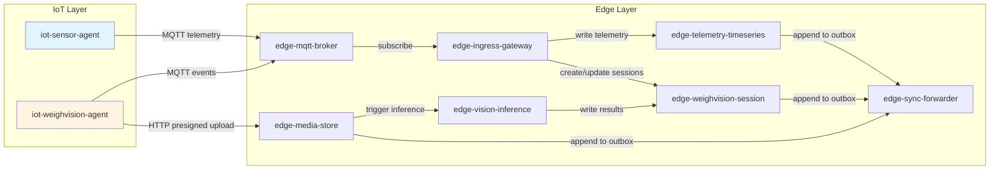

# IoT-Layer Requirements

**Purpose**: Summarize requirements for FarmIQ IoT-layer based on documentation analysis.  
**Scope**: All IoT-layer agents, communication patterns, and integration with edge layer.  
**Owner**: FarmIQ Architecture Team  
**Last updated**: 2025-12-17

---

## Table of Contents

1. [Overview](#1-overview)
2. [Agent Requirements](#2-agent-requirements)
3. [Communication Protocols](#3-communication-protocols)
4. [MQTT & Event Standards](#4-mqtt--event-standards)
5. [Offline Behavior](#5-offline-behavior)
6. [Security & Provisioning](#6-security--provisioning)
7. [Non-Functional Requirements](#7-non-functional-requirements)

---

## 1. Overview

### 1.1 Purpose

The IoT-layer consists of **lightweight agents** that run on or near physical devices and gateways:
- **`iot-sensor-agent`**: Periodically reads sensor data (weight, temperature, humidity, etc.) and publishes telemetry every minute to `edge-ingress-gateway` via MQTT
- **`iot-weighvision-agent`**: Runs on WeighVision devices (camera + scale), manages session-based image + weight capture, then sends results to edge

### 1.2 Key Characteristics

- Stateless where possible; no long-term persistence beyond required offline outbox/buffer
- Resilient to extended connectivity loss via **store-and-forward buffering that persists across reboot** (multi-hour windows)
- Use authenticated connections (e.g., mutual TLS or token-based auth) to edge
- Lightweight logic; delegate heavy logic to edge

### 1.3 Canonical IoT Agents

| Agent | Purpose | Platform |
|---------|---------|----------|
| `iot-sensor-agent` | Sensor data collection and telemetry publishing | Embedded C/C++/Rust or lightweight Python/Node |
| `iot-weighvision-agent` | WeighVision session management with image + weight capture | Embedded C/C++/Rust or lightweight Python/Node |

---

## 2. Agent Requirements

### 2.1 iot-sensor-agent

**Purpose**: Run on sensor gateways or devices located in barns, collect telemetry every minute, and push telemetry to edge using **MQTT only**

**Data Collection and Scheduling:**
- Sampling interval: default **60 seconds** per device, overridable by configuration
- Typical metrics:
  - `temperature_c`
  - `humidity_percent`
  - `weight_kg` (if scale data is available separate from WeighVision)
  - `co2_ppm` or other environmental metrics (extensible)
- Agent should:
  - Read from attached sensors (driver-level details are device-specific)
  - Validate data ranges locally (e.g., drop obviously invalid readings)
  - Tag each reading with:
    - `tenant_id`, `farm_id`, `barn_id`, `device_id` (from configuration)
    - `ts` (device or gateway UTC timestamp)

**MQTT Publishing (Mandatory):**
- Broker: `edge-mqtt-broker` on edge cluster
- Topic convention (authoritative): `iot/telemetry/{tenantId}/{farmId}/{barnId}/{deviceId}/{metric}`
- QoS/retain (authoritative): See `iot-layer/03-mqtt-topic-map.md` for complete rules
  - **QoS**: **1** (at-least-once)
  - **Retain**: **NO**

**Example Payload:**
```json
{
  "schema_version": "1.0",
  "event_id": "018f1a84-bb0e-7d3f-b2e4-9e8b5f8e0001",
  "trace_id": "trace-id-123",
  "event_type": "telemetry.reading",
  "tenant_id": "018f1a84-bb0e-7d3f-b2e4-9e8b5f8e0002",
  "device_id": "device-sensor-001",
  "ts": "2025-01-01T10:00:00Z",
  "payload": {
    "metric": "temperature",
    "value": 26.4,
    "unit": "C"
  }
}
```

**Failure Handling:**
- Implement basic retry with exponential backoff for network failures
- Implement **offline buffering (must persist across reboot)**:
  - Buffer up to configurable limits (guidance: **6 hours** OR **360 messages**; drop oldest first
  - Store as JSONL (append-only) or SQLite depending on device capability
- Replay when MQTT connection is restored:
  - Publish buffered messages in chronological order by `ts`
  - Backoff + retry with jitter (**0–200ms**) to prevent thundering herd
  - Throttle: max **5 msgs/sec** per device
  - On successful publish, mark as ACKed locally and safely delete/compact
- Do not introduce additional message brokers or external in-memory cache/session stores at device level

**Implementation Notes:**
- Keep configuration in a simple file (e.g., YAML/JSON) specifying IDs, endpoints, and credentials
- Ensure TLS is used for all HTTP calls and secure MQTT is used where available
- Agent logging should be lightweight but structured where possible to allow troubleshooting on device

### 2.2 iot-weighvision-agent

**Purpose**: Run on WeighVision devices (camera + scale), manage weigh sessions that bind image frames with scale weights, and publish all session events to edge via **MQTT only**

**Two Phases:**
- **Phase 1**: Session-based capture (image + weight at the same time)
- **Phase 2**: Scheduled image capture (for continuous monitoring) with optional weights

**Connectivity and Protocol Choices:**
FarmIQ enforces **MQTT-only** device→edge ingestion:
- **MQTT (100%)** for all telemetry and session events to edge broker
- **HTTP (only)** for **media upload** via **presigned URL** issued by `edge-media-store`

**Authoritative Topic:**
`iot/weighvision/{tenantId}/{farmId}/{barnId}/{stationId}/session/{sessionId}/{eventType}`

**Phase 1: Session-based Capture**

**Flow:**
1. Agent starts a session when an animal is detected on the scale
2. Capture a reference image and a stable weight from the scale
3. Publish a **session created** event to MQTT
4. Upload associated images (one or more frames) to `edge-media-store` via presigned URL (presign request + `PUT` upload), including `sessionId` and `traceId`
5. Publish a **weight recorded** event to MQTT (one or more times)
6. Publish a **session finalized** event to MQTT (including image count)

**Session Created Event:**
```json
{
  "schema_version": "1.0",
  "event_id": "018f1a84-bb0e-7d3f-b2e4-9e8b5f8e0200",
  "trace_id": "trace-id-789",
  "event_type": "weighvision.session.created",
  "tenant_id": "018f1a84-bb0e-7d3f-b2e4-9e8b5f8e0002",
  "device_id": "weighvision-device-001",
  "ts": "2025-01-01T10:05:00Z",
  "payload": {
    "batch_id": "018f1a84-bb0e-7d3f-b2e4-9e8b5f8e0400"
  }
}
```

**Weight Recorded Event:**
```json
{
  "schema_version": "1.0",
  "event_id": "018f1a84-bb0e-7d3f-b2e4-9e8b5f8e0201",
  "trace_id": "trace-id-789",
  "event_type": "weighvision.weight.recorded",
  "tenant_id": "018f1a84-bb0e-7d3f-b2e4-9e8b5f8e0002",
  "device_id": "weighvision-device-001",
  "ts": "2025-01-01T10:05:10Z",
  "payload": {
    "weight_kg": 120.5
  }
}
```

**Session Finalized Event:**
```json
{
  "schema_version": "1.0",
  "event_id": "018f1a84-bb0e-7d3f-b2e4-9e8b5f8e0202",
  "trace_id": "trace-id-789",
  "event_type": "weighvision.session.finalized",
  "tenant_id": "018f1a84-bb0e-7d3f-b2e4-9e8b5f8e0002",
  "device_id": "weighvision-device-001",
  "ts": "2025-01-01T10:07:00Z",
  "payload": {
    "image_count": 3
  }
}
```

**Image Upload (Only HTTP Call):**

**Step 1 (presign)**: `POST /api/v1/media/images/presign` on `edge-media-store`
- Request body (JSON): `tenantId`, `farmId`, `barnId`, `deviceId`, `stationId` (optional), `sessionId` (optional), `traceId`, `capturedAt`, `contentType`, `contentLength` (optional)
- Response: `upload_url`, `media_id`, `expires_at` (+ optional required headers)

**Step 2 (upload)**: `PUT {upload_url}` (binary JPEG/PNG)
- Use the returned URL until `expires_at`

**Step 3 (notify)**: publish `weighvision.image.captured` via MQTT with a `payload` that includes `media_id` (and optional `content_type`, `size_bytes`, `sha256`)

**Phase 2: Scheduled Images and Monitoring**

In Phase 2, device captures images on a **fixed schedule** (e.g., every 5–10 minutes) to support group behavior analysis and continuous monitoring.

**Flow:**
1. Agent captures images on schedule (with or without scale readings)
2. Upload images via presigned URL (presign request + `PUT` upload), optionally without `sessionId` for monitoring captures
3. Publish any relevant events via MQTT (e.g., `weighvision.image.captured`) using the standard envelope

**Scheduled Monitoring Upload:**
- Use the same presign+upload flow as Phase 1, but omit `sessionId` when capture is not part of a session
- Publish `weighvision.image.captured` on the generic events topic or a WeighVision topic depending on whether a `sessionId` exists

**Session Consistency Rules (Phase 1):**

Minimum required event set for a valid Phase 1 session:
- `weighvision.session.created`
- `weighvision.weight.recorded`
- At least 1 image uploaded (HTTP presigned URL) and referenced by `media_id` (correlated to session via topic `sessionId` and media metadata)

**Reconciliation Rules at Edge:**
- If an image arrives before `session.created`:
  - Store as **unbound media** and bind later by `sessionId` from media metadata + MQTT topic
- If session events arrive without images for > configurable timeout (default guidance: **10 minutes**):
  - Mark session as **INCOMPLETE** and raise an ops alert
- If images are uploaded while MQTT is offline:
  - Device may still upload images via HTTP if network allows
  - Session events must be replayed later with same topic `sessionId` and `event_id` integrity

**Error Handling and Retries:**
- All HTTP requests:
  - Send `x-request-id` (UUID) and `x-trace-id` if the agent is trace-aware (and include `traceId` in the presign request body)
  - Expect standard error format on failure
- MQTT events:
  - Must include `trace_id` in the envelope
  - Use QoS 1 for at-least-once delivery (idempotency is handled on edge/cloud)
- The agent should:
  - Retry MQTT publishes and image uploads with exponential backoff on network errors
  - Avoid infinite retries; after a configurable limit, fail local session and surface error in device logs / UI

**Implementation Notes:**
- Ensure timestamps are in UTC and synchronized (NTP where possible) to reduce clock skew with edge
- Compression and downscaling of images should be applied conservatively to balance quality and bandwidth
- The agent must not introduce object storage systems or external in-memory cache/session stores; all durable storage is handled at edge via PVCs

---

## 3. Communication Protocols

### 3.1 Protocol Requirements

FarmIQ enforces **MQTT-only** device→edge ingestion:
- **MQTT (100%)** for all telemetry and session events to edge broker
- **HTTP (only)** for **media upload** via **presigned URL** issued by `edge-media-store`

**No HTTP fallback** for telemetry or events; devices must use MQTT with offline buffering.

### 3.2 API Expectations (for HTTP media upload only)

- Base path: `/api`
- Health: `GET /api/health`
- Error format: `{"error": {"code": "...", "message": "...", "traceId": "..."}}`
- Request correlation: send/propagate `x-request-id` and `x-trace-id` headers when available

---

## 4. MQTT & Event Standards

### 4.1 Standard MQTT Envelope Schema (Authoritative)

All MQTT messages MUST use this envelope:

```json
{
  "schema_version": "1.0",
  "event_id": "uuid",
  "trace_id": "string",
  "tenant_id": "uuid-v7",
  "device_id": "string",
  "event_type": "string",
  "ts": "ISO-8601",
  "payload": {},
  "content_hash": "string",
  "retry_count": 0,
  "produced_at": "ISO-8601"
}
```

**Required fields:**
- `event_id`, `trace_id`, `tenant_id`, `device_id`, `event_type`, `ts`, `payload`

**Optional fields:**
- `schema_version`: defaults to `"1.0"` if omitted by the device (edge may add/normalize)
- `content_hash`: optional hash of `payload` for integrity/debugging (do not treat as security control)
- `retry_count`: optional number of local publish retries (for diagnostics only)
- `produced_at`: optional timestamp when message was produced (if different from `ts`)

**Notes:**
- `trace_id` must be present; if missing, `edge-ingress-gateway` enriches it
- Topic segments carry routing context (e.g., `farmId`, `barnId`, `stationId`, `sessionId`) and MUST match what the device is provisioned for

### 4.2 Canonical MQTT Topic Patterns (Authoritative)

**Telemetry:**
`iot/telemetry/{tenantId}/{farmId}/{barnId}/{deviceId}/{metric}`

**Generic events:**
`iot/event/{tenantId}/{farmId}/{barnId}/{deviceId}/{eventType}`

**WeighVision session events:**
`iot/weighvision/{tenantId}/{farmId}/{barnId}/{stationId}/session/{sessionId}/{eventType}`

**Status (retained):**
`iot/status/{tenantId}/{farmId}/{barnId}/{deviceId}`

### 4.3 Event Types List (Authoritative)

- **`telemetry.reading`**: One telemetry sample for a specific metric
- **`sensor.heartbeat`** (optional): Device heartbeat event (in addition to retained status)
- **`device.status`**: Latest device status payload (retained on `iot/status/...`)
- **`weighvision.session.created`**: WeighVision session started
- **`weighvision.weight.recorded`**: A scale weight measurement associated with a session
- **`weighvision.image.captured`**: Image capture notification (image is uploaded via HTTP presigned URL)
- **`weighvision.inference.completed`**: Inference result computed (usually produced by edge inference, may be forwarded to cloud)
- **`weighvision.session.finalized`**: Session ended/finalized

### 4.4 QoS + Retained + LWT Rules (Authoritative)

**Telemetry readings (every ~1 minute):**
- **QoS**: **1** (at-least-once)
- **Retain**: **NO**
- **Event type**: `telemetry.reading`

**WeighVision session events (must not be lost):**
- **QoS**: **1**
- **Retain**: **NO**
- **Events**:
  - `weighvision.session.created`
  - `weighvision.weight.recorded`
  - `weighvision.image.captured`
  - `weighvision.inference.completed`
  - `weighvision.session.finalized`

**Device status/heartbeat (latest state only):**
- **Topic**: `iot/status/{tenantId}/{farmId}/{barnId}/{deviceId}`
- **QoS**: **1**
- **Retain**: **YES**
- **LWT (Last Will and Testament)**: Publish an "offline" status when the device disconnects unexpectedly

**Status payload must include:**
- `last_seen_at`
- `firmware_version`
- `ip` (optional)
- `signal_strength` (optional)
- Health flags (e.g., `camera_ok`, `scale_ok`, `disk_ok`)

### 4.5 Duplicate Delivery and Idempotency (Mandatory)

- Every MQTT message MUST include: `event_id` (UUID), `ts`, `trace_id`
- Edge must treat MQTT delivery as **at-least-once**
- Edge must dedupe on `(tenant_id, event_id)` using an **Edge DB TTL cache**
- Cloud ingestion must also dedupe on `(tenant_id, event_id)` for safety

---

## 5. Offline Behavior

### 5.1 Local Buffering (Store-and-Forward; Must Persist Across Reboot)

If MQTT is disconnected, buffer locally (file queue JSONL or SQLite):

**Telemetry:**
- Up to configurable limits (guidance: **6 hours** OR **360 messages**; drop oldest first)

**WeighVision events:**
- Up to configurable limits (guidance: **72 hours** OR **10,000 events**; preserve created/finalized, drop non-critical first)

**Storage options (device dependent):**
- Append-only JSONL file queue, or
- Embedded DB (SQLite)

### 5.2 Replay Strategy (When Connection Restored)

- Publish buffered messages in chronological order by `ts`
- Backoff + retry with jitter (**0–200ms**) to prevent thundering herd
- Preserve ordering per device/session

**Throttle guidance:**
- **Telemetry**: max **5 msgs/sec** per device
- **WeighVision**: max **20 msgs/sec** per station
- On successful publish, mark as ACKed locally and safely delete/compact

---

## 6. Security & Provisioning

### 6.1 Device Identity and Provisioning (Basics)

Each IoT agent/device must be provisioned with:
- `tenant_id`, `farm_id`, `barn_id`, `device_id`
- Edge connection settings (MQTT broker host/port, and `edge-media-store` base URL for presign/upload)
- Credentials (recommended: per-device certificate for mTLS, or signed device token)

**Provisioning principles:**
- Unique identity per device (no shared credentials across devices)
- Rotation and revocation supported operationally
- Time sync (NTP) recommended to keep timestamps consistent (UTC at the payload level)

### 6.2 MQTT Security

- TLS 1.2+ REQUIRED in production
- Device authentication: per-device username/password + ACL OR mTLS client certificates
- Device provisioning via allowlist in `edge-ingress-gateway`

### 6.3 HTTP Security

- Media upload via presigned URLs (no auth header needed for PUT)
- Internal HTTP calls between services (cluster-internal)
- `x-tenant-id` header for tenant scoping

### 6.4 Data Privacy

- No PII in telemetry, media metadata, or logs
- GDPR/PDPA compliant (only operational farm data)

### 6.5 Audit Logging

- Log actor as `device_agent` for SILO_AUTO
- Log `user_id` for manual/import operations
- Trace ID propagation across all services

---

## 7. Non-Functional Requirements

### 7.1 Performance

- **Telemetry sampling**: Default 60 seconds per device (configurable)
- **MQTT publish latency**: < 100ms typical
- **Image upload**: Support up to 10 MB per upload
- **Presign URL expiration**: Default 900 seconds (15 minutes)

### 7.2 Resource Constraints

- **Memory**: Lightweight agents should run on devices with limited RAM (e.g., < 256MB)
- **Storage**: Minimal local storage for offline buffering (JSONL or SQLite)
- **Network**: Support intermittent connectivity with store-and-forward buffering

### 7.3 Reliability

- **Offline buffering**: Support 6 hours for telemetry, 72 hours for WeighVision events
- **Replay**: Preserve chronological ordering on connection restoration
- **Idempotency**: Include `event_id` in all messages for deduplication

### 7.4 Observability

- Device logs should be structured (JSON where feasible)
- Include `trace_id` in all events for correlation
- Log errors with appropriate severity and context

### 7.5 Compatibility

- Support TLS 1.2+ for MQTT connections
- Support standard MQTT 3.1.1+ protocol
- Support HTTP/1.1+ for media uploads

---

## Appendix A: Architecture Diagram



---

## Appendix B: References

- `docs/iot-layer/00-overview.md`
- `docs/iot-layer/01-iot-sensor-agent.md`
- `docs/iot-layer/02-iot-weighvision-agent.md`
- `docs/iot-layer/03-mqtt-topic-map.md`
- `docs/shared/01-api-standards.md`
