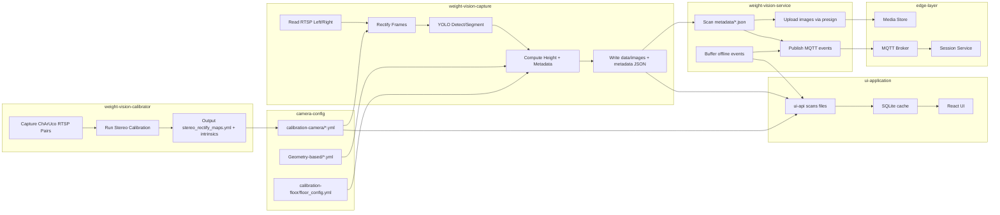

# IoT_Layer - Weight Vision System Architecture

## Overview
Stereo-vision system for object height measurement using Hikvision RTSP cameras, ChArUco calibration, stereo rectification, YOLOv12 detection/segmentation, and depth/height computation.

## Constraints (from README)
- Python only
- OpenCV
- YAML for config
- Modular scripts (no monolithic flow)
- Designed for real factory usage

## System Context
**Inputs**
- Hikvision stereo RTSP streams (Left/Right)
- ChArUco board images for calibration
- Factory floor as reference plane

**Outputs**
- Rectified image pairs
- Calibration artifacts: `stereo_rectify_maps.yml`, `floor_config.yml`
- YOLOv12 model weights
- Height results in millimeters (mm)

## Pipeline (follow README steps only)

### Step 1: Camera Calibration
- Scripts:
  - `weight-vision-calibrator/01_generate_board.py`
  - `weight-vision-calibrator/02_capture_pairs.py`
  - `weight-vision-calibrator/03_run_calibration.py`
- Mono calibration per camera for intrinsics (`fx, fy, cx, cy`).
- Stereo calibration to compute `R, T`.
- Output: `stereo_rectify_maps.yml` in `run_YYYYMMDD_HHMMSS` and copied to `camera-config/calibration-camera/`.
- Target: RMS stereo < 1.0.

### Step 2: Floor Height Calibration
- Script: `weight-vision-calibrator/05_live_rectify_rtsp.py` (file header refers to weight-vision-capture).
- Use rectification maps from `camera-config/calibration-camera/stereo_rectify_maps.yml` (or pass `--maps`).
- Clear floor, press `c` once to compute `Z_floor` (initialized from `camera-config/Geometry-based/board_reference.yml` when available).
- Output: `camera-config/calibration-floor/floor_config.yml`.
- Height formula: `Height = Z_floor - Z_object`.

### Step 3: Rectified Image Capture
- Script: `weight-vision-calibrator/06_capture_rectified_rtsp.py` (file header refers to weight-vision-capture).
- Rectify RTSP frames and save aligned left/right images for training.

### Step 4: Train Model (YOLOv12)
- Location: `weight-vision-train-model`
- Train using rectified images from Step 3 (detection or segmentation).

### Step 5: Service - Detection & Height
- Location (current implementation): `weight-vision-capture` (run_service/geometry/yolo_infer).
- Detection/Segmentation: run YOLOv12 on left rectified image to get bounding boxes and optional masks.
- ROI: filter detections to the blue board area derived from `board_reference.yml` (size + distance + fx).
- Coordinate mapping: use center or top point of the box (depth sampling).
- Depth: read disparity `d` at mapped point and compute `Z`.
- Height: compute `Z_floor - Z_object`.

## Data & Config Artifacts
- `run_YYYYMMDD_HHMMSS/`
  - `stereo_rectify_maps.yml`
- `camera-config/calibration-camera/`
  - `intrinsics_left.yml`
  - `intrinsics_right.yml`
  - `intrinsics_stereo.yml`
  - `stereo_charuco.yml`
  - `stereo_rectify_maps.yml`
  - `diagnostics.json`
  - `report.txt`
- `camera-config/calibration-floor/floor_config.yml`
- `camera-config/Geometry-based/board_reference.yml`
- `camera-config/model/best.pt` (YOLO model for service)
- Rectified image pairs (from Step 3)
- Trained YOLOv12 weights (from Step 4)
- Capture outputs: metadata JSON + optional segmentation masks (PNG)

## Module Responsibilities
- `weight-vision-calibrator`: ChArUco data capture and stereo calibration.
- `weight-vision-capture`: Live preview, detection/segmentation overlay, manual capture + metadata/masks.
- `weight-vision-train-model`: YOLOv12 training (detect/segment).
- `weight-vision-service`: Folder present; README does not specify implementation details yet.

## Data Flow (Mermaid)
```mermaid
flowchart LR
  A[Hikvision RTSP Left/Right] --> B[Rectify using stereo_rectify_maps.yml]
  B --> C[Rectified Image Pairs]
  C --> D[YOLOv12 Training]
  C --> E[YOLOv12 Detection/Segmentation on Left]
  E --> F[Pick Center/Top Point]
  F --> G[Disparity Map d]
  G --> H[Depth Z]
  H --> I[Height = Z_floor - Z_object]
  B --> J[05_live_rectify_rtsp.py]
  J --> K[floor_config.yml (Z_floor)]
  K --> I
```

## IoT Layer Flow (Mermaid)


## Related Docs
- `iot-layer/docs/06-application.md` (UI application spec + implementation notes)
- `iot-layer/docs/07-docker-compose.md` (Runbook for docker compose)
